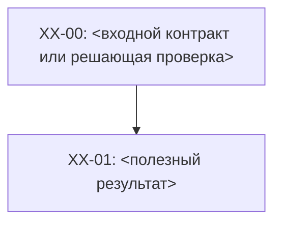

# <Трек> — r<N>

**Diátaxis:** reference. Эта роль задаётся классом `plans/<track>/rN.md` в `plans/README.md`; план — точный исполнимый контракт, а не tutorial/how-to/history.

**Evidence cutoff:** `<ISO-8601 момент, после которого факты могли устареть>`

Нормативный профиль качества: `plans/STRATEGY.md` от корня репозитория.
Формат и право исполнения определяет действующий `plans/SPEC.md`; ссылка на
профиль не меняет lifecycle, permissions или действующий admission.

## 0. Delta
<!-- Только для r2+. Для r1 напиши: «нет — первая ревизия». -->
<!-- Обязательно явно объяви supersession: «r<N> supersede r<N-1>;
     r<N-1> больше не используется как текущее состояние». -->
<!-- До смены ACTIVE.md просканируй входящие <track>/<NODE-ID> только в
     authoritative-ревизиях; новая ревизия и все изменения ссылок — один
     коммит. -->
<!-- Что изменилось против прошлой ревизии. Если триггер — инвалидация
     допущения, назови его: «ASM-02 инвалидировано: <доказательство>».
     Сохрани или явно замени прежние product/science/security/численные
     обязательства с доказательством эквивалентности. Новый краткий текст
     не разрешает выбросить неудобное ограничение или corpus. -->

| Факт | Fresh evidence | Decision |
|---|---|---|
| | | |

## 1. Objective and acceptance

<!-- Одна полезная цель, потребитель, первый законченный release и граница
     всего трека. Зафиксируй выбранный подход, сильнейшую допустимую
     альтернативу, полную стоимость, non-goals и условие пересмотра.
     Неизвестный выбор — конечный различающий эксперимент с критериями
     исходов, не «исполнитель сам решит». -->

Готово только когда:

1. <проверяемое потребительское свойство, область, единицы и конкретный artifact>;
2. <свойства соседей, отказов, данных и восстановления>;

## 2. Facts / Evidence

<!-- Только подтверждённое. Гипотезы и непроверенное — в Unknowns (§9).
     Каждый факт имеет источник, exact version/время и actual evidence.
     Название команды или чужой отчёт не означает выполненный здесь тест.
     Наблюдаемое поведение отдельно от нормативного требования. -->

| Факт | Evidence | Вывод |
|---|---|---|
| | | |

## 3. Assumptions

<!-- Фальсифицируемые условия, на которых стоит план. Формат:
     условие + различающая проверка + affected outcome + безопасный следующий шаг.
     Инвалидация ASM = пересмотр зависимой стратегии, не молчаливая правка. -->

- **ASM-01:** <условие>. Фальсификация: <как проверить>; затрагивает <что>; действие <какое>.

## 4. Invariants

<!-- Условия ВСЕХ переходов: one writer, ownership, совместимость,
     concurrency/idempotency/partial failure/recovery/observability и соседи.
     Формулировка проверяемая, не пожелание. Узлы и гейты ссылаются по ID.
     Общие инварианты — ссылкой, не копией; доменные свойства задай явно. -->

- **INV-01:** <условие>.

## 5. DAG

<!-- Ребро = необходимый predecessor, не приоритет или удобство.
     Для каждого edge/group: required output, kind, witness ошибки без ребра,
     условие снятия, independent work и invalidation. Нужный контракт не
     равен целиком готовому сервису. Полные AND-joins — в Node status;
     внутренние рёбра Mermaid согласованы с ними. OR сначала разрешает
     decision node, а не свободный выбор исполнителя.
     Детализируй текущую волну: owner, read/write/effect scopes, входные
     contracts, proof/recovery и stop condition. Дальним узлам запрещена
     реализация без достаточного конкретного packet/принятого допуска.
     Пересмотр плана — узел REVIEW-NN с критериями входа. -->

### Node status

<!-- done ТОЛЬКО с конкретным exit evidence. В authoritative-ревизии здесь
     мутируют только ячейки Status и Exit evidence существующих строк;
     второй mutable-участок — содержимое Unknowns. -->
<!-- Cross-track identity: пока producer не завершён, blocked by <track>/<NODE-ID>;
     после trusted completion та же identity сохраняется как
     `; satisfied by <track>/<NODE-ID>`. Если других blockers нет:
     `ready; satisfied by other-track/REMOTE-01`; если есть:
     `blocked by XX-00; satisfied by other-track/REMOTE-01`.
     Для AND перечисли ВСЕ active blockers. Satisfaction снимает blocking state,
     но не causal edge; удаление identity — отдельное изменение consumer contract.
     ready означает отсутствие незакрытых обязательных predecessors, но не обходит
     lifecycle/admission. Forward invalidation producer атомарно возвращает
     satisfied identity в blocked by во всех зависимых authoritative plans. -->

| Node | Status | Exit evidence |
|---|---|---|
| XX-00 | pending | <конечный вопрос/контракт, источники, предзаданные исходы и достаточное доказательство> |
| XX-01 | blocked by XX-00 | <property/domain/environment/oracle/falsifier и actual artifact/readback> |

## 6. Gates

<!-- Применимость proof-классов задаётся риском: static/schema/type,
     unit/property/metamorphic, model/concurrency, real integration,
     E2E, security/abuse, performance/economics, fault/restore, visual/a11y,
     mutation. N/A требует конкретного основания и independent review.
     Содержательный срез требует независимой проверки; отсутствие средства
     не даёт PASS. Используй другой эквивалентный независимый путь либо
     сохраняй гейт незавершённым. Reviewer — не автор своего доказательства.
     Для каждой проверки: proposition, domain/assumptions, authoritative
     environment, independent oracle, method, pass/fail и target falsifier.
     Hash/count/build полезны для своих свойств, не для semantic truth. -->

- <гейт>: применяется к <узлы/классы узлов>; <критерий, метод и контрпример>.

## 7. Rollback

<!-- Для внешнего effect: exact preimage/совместимость, recovery command,
     проверенные предпосылки и выполненный restore/readback до apply.
     Будущая команда не объявляется исполненным восстановлением.
     Unknown effect сначала reconciles; source revert не backup данных;
     возврат уязвимого или несовместимого writer запрещён. -->

- **XX-01:** <preimage + команда/reconcile + проверка восстановления>.

## 8. Smells / CAPA

<!-- Классы достижимых ошибок/ложного успеха, owner закона и целевой regression.
     Исторический incident не заменяет operational how-to. Если записей нет:
     «нет — <почему>». Не создавай ритуалы без защищаемого свойства. -->

| Severity | Finding | CAPA |
|---|---|---|
| | | |

## 9. Unknowns

<!-- Непроверенное на cutoff, владелец, следующее различающее действие,
     affected scope и независимая работа. Не называй future tests/deploy
     выполненными; не передавай пользователю выводимый технический выбор. -->

- <неизвестность>: <owner>, <следующее действие>, <что действительно блокирует>.