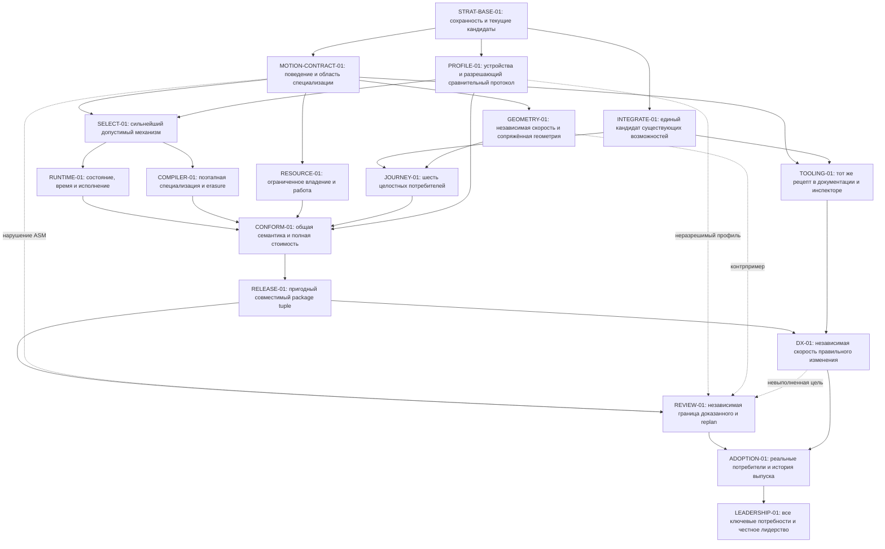

# lab-motion-production — r11

**Evidence cutoff:** `2026-09-13T17:30:18Z`.
Норма формата: [SPEC](../SPEC.md); взаимодействие владельцев: [PARALLEL](../PARALLEL.md).
Стратегический профиль: [STRATEGY](../STRATEGY.md), [PORTFOLIO](../PORTFOLIO.md) §7 «Lab Motion»,
[сохранение обязательств](../PORTFOLIO-ACCEPTANCE.md) §2.
Этот документ — единственный план исполнения трека. [Roadmap #106](https://github.com/Labpics-Team/lab-motion/issues/106)
остаётся единственной продуктовой картой; связанные issues/PR владеют живыми результатами кандидатов.
[Исследовательское основание](reference/leadership-evidence.md) не имеет lifecycle или собственного backlog.

## 0. Delta

r11 supersedes r10. r1–r10 остаются неизменяемой историей, а их применимые продуктовые,
численные, ресурсные, совместимые и выпускные обязательства включены по ссылке.
Исторические SHA, статусы, CLAIM-процедуры и очередность не становятся сегодняшними фактами.
Новая редакция не переобъявляет накопленную инженерную работу будущим изобретением.

| Факт | Fresh evidence | Decision |
|---|---|---|
| r10 оставался draft с исходным cutoff 4 сентября | `ACTIVE.md`, r10 blob `e97449c8f0ed75cf5afc151a6ca239536837a81e` на agents-config `4f824920b11f04992550e8064d80a25493e693af` | Актуализировать стратегию и отдельно активировать проверенную редакцию; не присваивать done из истории чата |
| Compiler-first, малые исполнители, serialized pickup, общий spring basis и сопряжённая геометрия уже существуют | lab-motion `93278bf9b540f93521c7bd4c02f68db458e5db7a`; точные пути в §2 | Новое удобство должно использовать и специализировать эти механизмы, а не накрывать их универсальным runtime |
| Одного progress недостаточно для всех независимых скоростей при изменении направления projection | Документированный контракт `src/projection/driver.ts`; воспроизводимый witness в reference | Исследовать недостающее представление состояния, сохраняя общий clock и solver; прежний контракт не объявлять ошибкой задним числом |
| Сильные возможности подготовлены в отдельных PR; combined artifact не доказан | #368/#371/#373/#374/#375/#377/#378/#379/#380/#382/#384; main на указанном SHA | Прежде нового слоя получить граф совместимости и интеграционный кандидат; не считать сумму зелёных PR одним продуктом |
| Запрос владельца — глубокое лидерство в полезном UI-motion, без потери эффективности | Согласованное 13 сентября позиционирование и явное поручение опубликовать/активировать план | Зафиксировать измеримую выразительность, качество, стоимость, DX и adoption; не расширять продукт до редактора/renderer «всё про всё» |

### Сохранение обязательств

В §4 r11 новые INV-номера действуют только в этой редакции; прежние ссылки разрешаются
как `rN.md, §X, INV-NN`, а не по совпадению номера. Каждый затронутый implementation packet
перечисляет inherited property, source locator, proof и disposition. Неназванное свойство
не считается отменённым; противоречие локализуется до изменения соответствующей поверхности.

| Источник и защищаемое обязательство | Disposition | Продолжение и различающий proof |
|---|---|---|
| r10 §1/§4: API, numerical precision, lifecycle, early bounds, end-to-end cost, независимая приёмка | preserved | MOTION-CONTRACT-01, RESOURCE-01, CONFORM-01; прежние corpus и budgets остаются обязательными |
| r9 §4/§6 и включённый r8: Nano/compiled execution, full/mixed graphs, private ABI, N/N−1, resource corpus | preserved | PROFILE-01 фиксирует все точные действующие ceilings и provenance; COMPILER-01/RELEASE-01 проверяют total graph, отказ lowering и mixed-version |
| r9 §4 INV-03: dedicated capability и union budgets; уменьшение base не покупает скрытый capability tax | preserved | Новый optional entry имеет собственный admission; relocation/double-count/hidden-chunk controls; общая сумма не компенсирует красную клетку |
| r10 §5: стабильные IDs STRAT-BASE-01 … REVIEW-01 | preserved | Все десять ID остаются с прежним классом результата; RELEASE-01 означает пригодный consumer artifact, не мировое лидерство |
| r1–r9: documentation/playground, smart/layout, behaviors, adapters, release/security/maintainability/adoption | preserved | JOURNEY-01, TOOLING-01, DX-01, RELEASE-01, ADOPTION-01 и LEADERSHIP-01; локальная волна не закрывает дальний результат |
| #106/#105: физические примитивы у Motion, semantic feel у дизайн-системы; без третьего runtime-tier | preserved | Один numeric owner; поведенческие модули и compiler targets не вводят animate/mini/native/lite; Lab UI остаётся владельцем визуального языка |
| #242 и другие специфичные research SSOT: GO/NO-GO/UNPROVEN и counterexamples | preserved | STRAT-BASE-01 связывает каждый retained candidate и семейный falsifier; SELECT-01 допускает reopen только с изменённой premise |
| Старые последовательные release-wave зависимости, устаревшие claimant/SHA и запреты из draft-подготовки | replaced-with-equivalence | Текущие SPEC/PARALLEL, причинный DAG §5, exact admission и исходные no-merge/product-release границы; защищаемые свойства сохранены без ложных блокировок |

Публикация плана и его активация разрешены владельцем. Активация допускает ready-работу
и подготовку продуктовых PR в действующей области; **не отменяет прежний запрет merge/auto-merge
в lab-motion** и не разрешает npm release, production deploy, платные сервисы, закупку устройств,
изменение Figma или чужие репозитории. Эти эффекты имеют отдельный адресный допуск.
Отсутствие допуска к выпуску не блокирует код, проверку tarball или изолированный consumer.

## 1. Objective and acceptance

**Цель:** стать лучшей в мире в проверенном классе продуктовых веб-интерфейсов системой,
которая превращает выразительное описание движения в минимально необходимое исполнение,
сохраняя управляемость, геометрическое качество и простоту изменения продукта.

Позиция — не ещё один проигрыватель и не коллекция эффектов. Движение продолжает действие
пользователя. Инженерное отличие — **рост полезной выразительности при сохранённой эффективности**:
богатая авторская модель не обязана оставаться универсальным слоем в браузере.
Сохранение старых быстрых потребителей и достижение новых продуктовых целей — одновременные условия.

### Область лидерства

Три семейства, по два независимых законченных потребителя в каждом:

1. **Живое преобразование представления:** карточка ↔ подробности и диалог/панель ↔ источник;
   изменение направления до settle, новые размеры контента, повторное открытие, родительская
   геометрия и сохраняемая интерактивность.
2. **Изменяемая коллекция:** фильтруемый/переставляемый список и сетка карточек;
   стабильная identity, вставка/уход, новая геометрия, keyboard/pointer, RTL, подтверждение
   изменения app-owned данных и отзыв устаревшего результата.
3. **Непосредственное управление:** sheet и pager/drag surface;
   поток целей, release→decay→spring→подходящий compositor, перехват новым вводом,
   изменяемые ограничения и эквивалентная клавиатурная операция.

Обычные state transitions, N-keyframes, per-property transitions, object targets и компактная
оркестрация — сохраняемая продуктовая база, не повод добавлять универсальную timeline VM.
Scope/presence/bindings/cascade должны составляться в эти сценарии без ручного второго протокола.
Canvas/game renderer, собственный layout engine, no-code редактор масштаба Rive, маркетинговое
scroll-hijacking, большой plugin marketplace и произвольный reactive store не являются целью.
Существующие capabilities вне флагманских сцен не удаляются и не теряют защиту.

### Готово только когда

1. Накопленные contracts, exact budgets, оптимизированные consumers и негативные исследования
   имеют полный preservation disposition; ни один пропуск не скрыт обновлением плана.
2. Шесть потребителей трёх семейств работают на одном интегрированном package tuple; прежние
   API остаются совместимыми. Demo-копия реализации, шесть вариантов одного toy и сумма
   независимых PR не являются этим результатом.
3. Применимый код можно использовать без compiler/editor/AI; доказанная статическая часть
   специализируется без потери runtime-семантики, а отказ объясняется. Старые Nano ≤1024 B gzip,
   compiled-nano executor ≤341 B и Surface executor ≤1024 B сохраняются в своих областях.
4. Каждая метрика M-01…M-10 ниже принята в своей области. Нельзя заменить их aggregate score,
   чужим размерным headline, benchmark одного solver или заявлением «лучше в целом».
5. Есть независимые сравнения с лучшими подходящими реализациями Motion, Anime Animatable/Layout
   и raw platform; Rive участвует только в совпадающих задачах authoring/handoff, а не как
   заведомо тяжёлый comparator DOM-кнопки. При содержательном превосходстве другой библиотеки
   в принятом сценарии она включается в roster независимо от нашей симпатии.
6. Выполнены ADOPTION-01 и условия 1.0 из #106: не менее трёх реальных production-приложений
   без внутренних форков, два независимых внешних потребителя, три последовательных minor
   release без аварийного breaking change, миграционная/security policy и отсутствие открытых
   P0/P1 публичного контракта. Неполученное полевое свидетельство остаётся открытым.
7. Exact-source independent review, authoritative CI graph, actual package readback и публично
   воспроизводимый bounded claim совпадают с принятым артефактом. Отдельно зелёный план не
   означает выполненную продуктовую приёмку.

### Метрики: обязательные цели, не уже измеренные результаты

Старые ceilings/семантика — абсолютные guards. Новые цели ниже принимаются только по заранее
зарегистрированному профилю §6. Неизвестные hardware/версии/выборка не разрешают запуск admission;
это точная работа PROFILE-01, не свобода выбрать удачный профиль после результата.

| ID | Цель и единица результата | Критерий приёмки |
|---|---|---|
| M-01 | Полезная выразительность при прежней стоимости | Все шесть сценариев без переписывания engine/второго store; существующие entry/consumer ceilings не растут. Во всех старых matched-workload клетках сохраняются precision, ownership и прежний non-inferiority допуск |
| M-02 | Остаточное исполнение | Для всех признанных статическими fixtures emitter удаляет solver/parser/full facade из reachable browser graph; старые 1024/341/1024 ceilings и common compiled initial+total ≤5000 B (точная, без дополнительного люфта трактовка цели 5 KB из #220) сохраняются. Generated CSS/data/lazy chunks входят в total; динамический full animate не объявляется 5 KB |
| M-03 | Нативная/покадровая работа | У выразимого нативного автономного участка после commit — 0 собственных frame callbacks/allocations; у покоя — 0 активных motion timers/frames. Изменение семантически прежней полной роли не перезапускает animator. Контроль изменённой роли обязан действовать |
| M-04 | Динамический frame envelope | 100 активных скалярных каналов на физическом устройстве зарегистрированного среднего класса: p99 собственного CPU-time Lab Motion ≤0,5 ms/frame; у полного выбранного 120 Hz сценария верхняя 95% граница доли пропущенных кадров ≤0,1%. OS/browser/render стоимость учитывается отдельно; стенд обязан различать deliberate extra work |
| M-05 | Значимый runtime выигрыш | В двух заранее выбранных тяжёлых сценах разных семейств верхняя 95% граница candidate/best-comparator для доминирующей устранимой стоимости ≤0,50; остальные protected клетки не хуже по своим допускам. Для raw control с нулевой стоимостью отношение не вычисляется: требуется совпадение границы и выигрыш другой содержательной метрики |
| M-06 | Реакция и непрерывность | Нет добавленного ожидания окончания предыдущей анимации; доступная цель учитывается до следующего доступного кадра. Ноль stale terminal effects; полный вектор скорости сохраняется на новом supported retarget-domain. Отклонение от независимого oracle в единицах выхода — в сохранённом принятом бюджете; цель 0,1 CSS px оценивается отдельно и не заменяет уже принятые 0,25 CSS px |
| M-07 | Жизненный цикл/память | 10 000 mount/update/interrupt/dispose циклов: после договорной terminal boundary нет motion-owned effects/listeners/queued jobs или reachable объектов уничтоженных компонентов; retained component-reference count равен 0, а retained bytes возвращаются в заранее зарегистрированную разрешаемую baseline-полосу без растущего по циклам превышения. Live-owner, dropped-owner и deliberate-retention controls обязательны; bounded cache и total heap/raster/GPU memory учитываются отдельно |
| M-08 | Время разработки/изменения | В каждом семействе верхняя 95% граница парного median time-to-correct-solution ratio ≤0,50 к лучшему подходящему конкуренту; change-task ratio ≤0,25. Ошибки/отказы/незавершённые задачи включены. Отдельные human и AI-assisted cohorts, одинаковые требования/доступ к инструментам; LOC не заменяет время и успешность |
| M-09 | Прикладная простота/диагностика | В стандартных рецептах 0 consumer generation counters, ручных velocity transfers, коллекций cancel-handles и барьеров Promise.all; одна lifecycle-граница компонента. Ни одного silent no-op при ошибке связи/неподдержанном path. Dev trace объясняет конкретные goal/owner/execution/refusal; диагностический код отсутствует в production graph без opt-in |
| M-10 | Визуальное качество и доступность | Во всех сценах нет unintentional stretch/tearing/stale hiding, сохраняются DOM semantics/focus/selection/IME/keyboard и reduced-motion. В preregistered слепом сравнении нижняя 95% граница предпочтения ≥70%, task success/latency не ухудшаются; частые действия имеют также no-motion control. Экспертная оценка и automated image diff не заменяют human preference |

Если цель не разрешается измерением, outcome `UNPROVEN`, не PASS и не NO-GO механизма.
Если bounded pilot показывает несовместимость цели с более сильным инвариантом/платформенным
нижним пределом, сохраняются доказательство и исходная цель; REVIEW-01 готовит новую редакцию
с адресным решением владельца. Пропуск сцены или ослабление метрики исполнителем запрещены.
Это замкнутый инженерный контур, а не обещание математически гарантировать выбор рынка.

## 2. Facts / Evidence

| Факт | Evidence | Вывод |
|---|---|---|
| Канонический плановый base | agents-config `4f824920b11f04992550e8064d80a25493e693af`, tree `2ce3cf4941faeb5f5396874e8bdecadb326278d5`; read-only run `34771766062`, plan-lint OK: 35 tracks, 4 active | Новая редакция не переписывает чужую незавершённую работу |
| Из authoritative-планов найдена входящая motion node-ссылка Lab UI → RELEASE-01 | Тот же run, `plans/lab-ui-production/r1.md`, SHA256 `1bfd64b1ad05613e54e5ce683599e88f7ff8fc6e58e87b680d085a99e2975967` | Сохранить ID и artifact/consumer смысл; не заставлять Lab UI ждать LEADERSHIP-01 |
| Канонический product base | lab-motion `93278bf9b540f93521c7bd4c02f68db458e5db7a`, tree `2f2257ab4a5a889517bd5e6aa2a66ae588fe2c65` | При сдвиге main пересобирается affected closure, а не забывается старый proof |
| Уже есть общая аналитическая основа и один update/render coordinator | `src/internal/solver.ts`, `src/animate/surface-batch.ts`, `test/spring-basis.test.ts` на product base | Один clock не требует одного progress; не создавать второй solver/loop |
| Serialized pickup и сопряжённая Surface уже реализованы | `src/compositor/sample.ts`, `src/future-layout/artifact.ts`, `src/compiler/core.ts`, `docs/future-layout.md` | Сохранять реальный serialized source и отношения P/Q/A; snapshot не равен живому hit-testing |
| Потолки конкретных старых исполнителей заданы кодом, не новыми оценками | `scripts/size-gate.mjs` на product base: Nano 1024, compiled runtime 341, Surface executor 1024 B gzip; full consumer 15600, mixed 17500 | Полный current vector снимает PROFILE-01; архивные «фактические размеры» не выдаются за новое измерение |
| Старый projection при новой цели сохраняет C¹ доминантного канала, не произвольного вектора | `src/projection/driver.ts`; source witness и 33 tests в reference | GEOMETRY-01 усиливает область, не удаляет старую корректность |
| Неполная transform-role способна остановить соседнюю ось | #384, `test/semantic-motion-binding-runtime.test.ts`, head `1ad3689f194a1d97d4d09171739acec9aaa4cf87` | Whole-role/physical-surface ownership обязателен в композиции |
| Конкуренты уже предлагают CSS generation, специализированный frequent-target API и data/scene separation | Первичные Motion CSS, Anime Animatable и Rive Data Binding источники, чтение 13 сентября; reference | Эти механизмы не объявляются нашей уникальностью; сравнение идёт по полному полезному поведению |
| Пользователи отмечают lifecycle fit, документацию, переносимость замысла и согласованность preview/runtime | Раздельно помеченные HN/Rive community/case-study источники в reference | Это качественные сигналы для задач DX, не репрезентативная статистика спроса |

### Интеграционный frontier: указатели, не второй реестр статусов

STRAT-BASE-01 перечитывает exact heads, code, reviews и фактически выполненные jobs, а не
доверяет следующим историческим описаниям. На cutoff ни один перечисленный PR не включён
в указанный product main.

| Связанная работа | Что сохранить/различить | Следующее доказательство у владельца |
|---|---|---|
| #368 compiler no-reparse; #371 continuous follow | Полезный compiler result и исправление временного контракта; независимость paths не равна совместимости artifacts | Свежая проверка exact head и affected combined consumer |
| #373 native timelines; #374 cascade/batch; #377 scope; #384 bindings | Компонентные семантика/ownership/типовые negative-controls | Совместный сценарий, не ещё один generic слой |
| #375 decay-rest и #374 | #374 включает связанную rest-projection delta: дважды переносить нельзя | Code-level overlap/disposition; preserve tests и первичное performance evidence |
| #378 reorder; #382 managed presence | Незавершённая remote/review приёмка не равна отсутствию реализации | Минимальный актуальный remaining gap; для #382 проверить terminal destroy→throw отдельно |
| #379/#205 N-keyframes | Сильная capability при красном size admission | Специализация/representation с соблюдением текущих ceilings, не их поднятие |
| #380 implicit identity | Доказанная память/семантика не закрывает неразрешённый latency control | Возобновлять с missing timing proof; не повторять уже доказанные memory samples |
| #365/#366; #232/#242 | Бенчмарковые пути и отрицательные механизмы имеют собственные SSOT | Не плодить второй стенд, не закрывать исходы по количеству NO-GO |

## 3. Assumptions

- **ASM-01:** пользовательские задачи и сохранённые свойства достижимы в принятом product envelope.
  Фальсификация: independent lower bound/контрпример показывает их несовместимость; REVIEW-01
  сохраняет обе стороны противоречия и блокирует только соответствующее действие.
- **ASM-02:** в существующем solver/basis достаточно общего закона для недостающего vector retarget.
  Фальсификация: independent ODE/coordinate witness расходится; не копировать физику в projection,
  а исправить или расширить доменный контракт до интеграции.
- **ASM-03:** семантический рецепт содержит полезную анализируемую статическую часть.
  Фальсификация: erasure/mixed-runtime controls показывают только перенос bytes или наблюдаемых
  эффектов; сохраняется dynamic path, candidate отклоняется без нового обязательного языка.
- **ASM-04:** выбранный измерительный профиль разрешает named non-inferiority margin.
  Фальсификация: A/A, positive control или source replay не проходят; A/B admission не выдаётся,
  чинится конкретный evidence path без удаления неудобных observations.
- **ASM-05:** six-journey контракт отражает принятую потребность, не удобную benchmark-игрушку.
  Фальсификация: независимые consumers вынуждены переписать engine/изобрести служебный lifecycle
  либо лучшие актуальные alternatives решают обязательную часть, исключённую нашим corpus.
- **ASM-06:** источник, package ABI, browser policy и provenance остаются применимыми к proof.
  Фальсификация: drift затронул read/effect set; пересчитать affected proof и candidate admission.
- **ASM-07:** нативный путь сохраняет необходимые controls/интерактивность, а не только endpoint.
  Фальсификация: queued вместо immediate, неверные currentTime/seek/range, snapshot hit-test или
  serialized error counterexample; native label не позволяет обходить контракт.

## 4. Invariants

- **INV-01 — Conservation:** применимые свойства/ограничения r1–r10 и текущего product contract
  сохраняются; historical implementation допускает замену только с equivalence proof.
- **INV-02 — Один закон/владелец:** numeric SSOT, time authority и owner каждой физической output
  surface единственны; не дублировать solver, бизнес-state, layout engine, scheduler или completion.
- **INV-03 — State ≠ event ≠ geometry:** неизменная цель может не уведомлять; повторное событие,
  история gesture velocity и новая геометрия не исчезают от такого сравнения. Batch не coalesces
  независимые события неявно; app collection и семантические токены остаются у своих владельцев.
- **INV-04 — Реальная непрерывность:** pickup относится к исполняемому артефакту и договорной шкале
  времени; новая фаза стартует до отмены donor при поддержанном handoff, commit/revoke исключают
  старые effects. Прежние hostile-host/reentry/terminal/finite/signed-zero contracts сохранены.
- **INV-05 — Полная стоимость:** raw/gzip/Brotli, initial+reachable total, CSS/data, compile/import/
  start/interrupt/frame/teardown, CPU/layout/paint/GC/GPU memory и retained ownership не подменяют
  друг друга. Нижние старые ratchets не финансируют рост другой protected клетки.
- **INV-06 — Bounded work:** caps проверяются до дорогого traversal/expansion/getter/host effects;
  malformed/sparse/hostile inputs, cancellation и ошибки не оставляют бесхозные ресурсы.
- **INV-07 — Native по семантике:** выбор execution/format не меняет обязательные pause/play/seek/
  retarget/cancel/reduced-motion/error/completion свойства. Unsupported — объяснённый исход или
  существующий эквивалентный dynamic path, не скрытая деградация и не третий runtime-tier.
- **INV-08 — Живой интерфейс:** DOM/CSS/focus/IME/selection/scroll принадлежат платформе/компоненту.
  Snapshot, DOM endpoint и видимый кадр различаются. Не делать фиктивный rollback внешних effects.
- **INV-09 — Без обязательного инструментария:** core и recipes работают без compiler/editor/AI;
  adapters тонкие, public types реального packed consumer; поддержка Solid не ухудшает React/Vue/Svelte.
- **INV-10 — Нефальшивая приёмка:** exact head+base+environment, независимый oracle/review, все реально
  применимые peers и raw receipts. Tests/thresholds/skip/allowlist не меняются ради зелёного результата.
- **INV-11 — Результат эксперимента:** GO требует Pareto в прежнем envelope; NO-GO требует реального
  falsifier; BLOCKED/UNPROVEN хранит минимальный remaining proof. Закрытие класса переносит
  контрпример/lower bound на класс, не считает число попыток. Незавершённый сильный кандидат не теряется.
- **INV-12 — Простота с ценой:** новая абстракция нужна двум независимым потребителям и делает
  прежний механизм ненужным либо имеет измеримо оплаченную цену. Неизвестный JS не объявляется
  статическим, data/типизация не доказывают pure execution. Сначала remove/reuse/specialize.

## 5. DAG

Сплошное ребро означает требуемый артефакт, не бизнес-приоритет. Единственный ready-корень
фиксирует общий exact-source/contract readset; выбор hardware и подготовка независимых
пользовательских задач доступны read-only до его завершения. Не вводится ожидание всех планов
Lab UI, Colors, Icons или Infra. На общих paths действует один integration owner.

### Node status

Ни одно новое done не присваивается публикацией/активацией. Exit evidence ниже задаёт
приёмочный артефакт; при завершении заменяется ссылкой на реально полученный exact result.

| Node | Status | Exit evidence |
|---|---|---|
| STRAT-BASE-01 | done | 7cac8d3ecb26e05acc4de10555a8e3ee6849edec |
| MOTION-CONTRACT-01 | done | 7fe1dd1c4c58d0bfa674fd1a10cd9705b8fa7947 |
| PROFILE-01 | in progress | До candidate samples закреплены device/browser/version/scene roster, старый полный cost vector, raw controls, статистика/MDE, observation policy и fail-closed calibration; missing hardware имеет отдельную affected cell |
| INTEGRATE-01 | done | 257d2b7b93397e79dcb2a2891fada4c39e8db15b |
| SELECT-01 | blocked by PROFILE-01 | Пререгистрированный mechanism decision: reuse/remove/staged representation; максимальный headroom и whole-system price, конкретный falsifier и выбранный bounded implementation packet |
| RUNTIME-01 | blocked by SELECT-01 | Сохранены старые lifecycle/clock/frame/callback/type контракты; новый runtime остаётся остаточной динамической частью, старый optimized consumer vector проходит |
| COMPILER-01 | blocked by SELECT-01 | Build/bind/intent/frame specialization доказана на static/mixed/dynamic-controls с total erasure, versioned ABI, resource bounds, source-map и отказами; старые исполнители укладываются в прежние ceilings |
| RESOURCE-01 | ready | Early-cap/hostile/model/fuzz/mutation и actual-package terminal retention proof; bounded caches и native/GPU ownership явно посчитаны |
| GEOMETRY-01 | done | 82249006ff37d01f823572c1b559e50de76f3e7f |
| JOURNEY-01 | ready | Два независимых consumers каждого из трёх семейств из настоящего package; interruption/content/resize/RTL/focus/reduced-motion и no-motion controls без app-side служебного протокола |
| CONFORM-01 | blocked by RUNTIME-01, COMPILER-01, RESOURCE-01, JOURNEY-01, PROFILE-01 | Combined exact package проходит semantic/numeric/browser/visual/resource и все применимые старые cost guards; зарегистрированный результат каждой M-01…M-07 различает достигнутое и frontier gap; ни одна регрессия не спрятана |
| RELEASE-01 | blocked by CONFORM-01 | Actual tarball/export/build/N/N−1/artifact/runtime tuple, compiler-consumer parity, tested docs; capability для Lab UI/Icons без ожидания общего лидерства и без автоматического release/deploy |
| REVIEW-01 | blocked by RELEASE-01 | Независимые numerical/API/performance/future-cost verdicts exact artifact; границы claims опубликованы, unresolved цель не закрыта; при invalid ASM — новая revision и affected reblock |
| TOOLING-01 | done | [Интеграция #440 → #441, точные деревья и CI до/после](evidence/source-integration-20260928.md) |
| DX-01 | blocked by RELEASE-01 | Пререгистрированные независимые human/AI cohorts и blind visual tasks подтверждают M-08…M-10; все failures, повторные задачи и no-motion control включены |
| ADOPTION-01 | blocked by REVIEW-01, DX-01 | Три реальные production apps, два внешних независимых consumers, три minor release и проверенные migration/security/rollback; запись содержит реальные releases и incident outcomes, не обещания |
| LEADERSHIP-01 | blocked by ADOPTION-01 | Все M-01…M-10 и критерии §1 одновременно доказаны на объявленном envelope; strongest-comparator и old-Lab controls пройдены, claims ограничены версиями/задачами |

RELEASE-01 сохраняет прежний смысл пригодного артефакта. Он не ждёт human study или
доказательства двукратного лидерства: эти цели остаются обязательными для LEADERSHIP-01.
Пригодный промежуточный пакет может иметь открытый frontier gap M-04/M-05, но не нарушение
принятого API, numerical/resource/cost guard или ложное заявление об этом выигрыше.
Это разделение допуска артефакта и итогового лидерства, не ослабление конечной цели.

### Текущая волна: исполнимые пакеты

**STRAT-BASE-01.** Read: оба repo main, AGENTS/архитектура/bench/size/CI, package exports,
r1–r10, #106 и специфичные исследовательские SSOT. Write: текущий статус/доказательство
в пределах плана и existing issues; product-code отсутствует. Для каждого открытого PR
восстановить изменённые symbols/physical surfaces, exact tuple и статус `ready-for-integration`,
`needs-proof`, `conflicts`, `contained` или `obsolete-with-equivalence`. Это классификация
кандидатов, не новый lifecycle трека. #374/#375 сравнить непосредственно по коду. Старые proofs
переиспользовать только в неизменной области; #380 не превращать в NO-GO из failed A/A.
Выход — минимальный wave graph и полный conservation matrix, без повторной переписи repo.
Отказ read-path проверяется альтернативным безопасным чтением; нет данных — названная unknown,
а не выдуманный отрицательный результат. Ни один PR не закрывается/force-push по возрасту.

**MOTION-CONTRACT-01.** Read: conservation output, текущие domain/adapter contracts и реальные
потребители. Write: их canonical docs/tests, не второй system-wide schema. Зафиксировать
полный outcome для каждого journey и два представления: допустимое и правдоподобное неверное.
State идемпотентен, event может повторяться, geometry инвалидирует соответствующую projection.
Whole-role включает связанные transform-оси. Для shared transitions различаются identity,
app membership, визуальная lifetime и focus lifetime. Определить public cancel/finish/revert,
ошибки регистрации/cleanup, reentrant callbacks и delivery order до implementation.
Старый scalar projection остаётся совместимым; новый vector-domain не выдаёт невозможную
C¹ для authored jumps или любой произвольной нелинейной CSS-геометрии.

**PROFILE-01.** Read: exact baseline и полный семантический контракт принятого опыта; пока
MOTION-CONTRACT-01 не завершён, разрешены inventory/null-controls, не admission кандидата
с иной семантикой. Write: существующий bench owner #95/#232 и воспроизводимые профили.
Roster до A/B: физический mid-range Android 60/120 Hz, физический iOS 60/120 Hz и desktop
Chromium/Firefox/WebKit; когда device не умеет 120 Hz, соответствующий 120 Hz target ему не
приписывается, но 60 Hz задача остаётся. Конкретные модели/OS/browser builds выбираются из
доступного репрезентативного inventory до candidate results; флагман не заменяет mid-range.
Фиксируются thermal/power/display state, workloads, backgrounds, viewport/DPR/content, clocks,
warm/cold режимы, sampling units, N/iterations/seed и все знаменатели. Порог M-04 не выводится
из быстрого сервера; CPU-throttle desktop — диагностический контроль, не mobile proof.
Выход даёт готовую исполнимую preregistration; нехватка устройства не останавливает unit/browser
подготовку и не оправдывает платную закупку без разрешения. A/A и extra-work controls проверяют
разрешимость; повтор того же опыта до green не допускается.

**INTEGRATE-01.** Read: свежий wave graph. Write: отдельный candidate branch/PR в lab-motion,
только принятые disjoint изменения и необходимый semantic conflict resolution. Сначала
закрыть минимальные gaps уже подготовленных #382/#378; пригодные #368/#371/#373/#374/#377/#384
сопоставить по shared paths/exports/errors/ABI, не cherry-pick всего подряд. Содержимая delta
#375 не дублируется. #379 остаётся отдельным size/semantics admission; нельзя встроить его
красный код под суммарный зелёный граф. Обязательный compiler proof не исчезает с #366.
После каждого содержательного объединения проверить affected closure; в конце — весь
authoritative graph и actual package. Старые archived receipts сохраняются. Откат — удалить
только непубликованный integration branch либо revert интеграционного коммита в этом branch;
чужие PR/refs и main не переписываются. Product merge требует отдельного действующего допуска.

**SELECT-01 / RUNTIME-01 / COMPILER-01.** Предпочтительный путь — усилить существующих владельцев:
общий solver/basis, SurfaceBatch, property registry, serialized artifact, compiler и adapters.
Порядок поиска: устранить действие → сократить независимую информацию → specialize → сменить
representation → локальная оптимизация. Не выбирается язык/WASM/worker по престижу.
Анализатор различает build-known, bind-known, intent-known и действительно frame-varying.
Отдельный новый IR/store/VM не нужен, пока existing MotionProgram/SurfaceProgram/private ABI
с их version/caps не показали конкретную недостаточность на двух consumers.
Static lowering обязан сохранять evaluation count/order, exceptions, target evaluation,
escaping controls, source maps и unknown/getter/sparse refusal. Динамические endpoints не
запрещают специализацию фиксированного закона; произвольный JS callback не становится pure.
Подходящий CSS/WAAPI/serialized программа и dynamic runtime сравниваются как разные
представления **одного controls-контракта**, включая interruption, не только одинаковое видео.
Результат «текущий путь уже на lower bound» закрывает локальную гипотезу, но не M-05/LEADERSHIP.
Для следующего опыта сохраняются best remaining candidate и ровно missing proof, не новое меню.

**GEOMETRY-01.** Первый discriminating slice: текущий 2D box/projection domain, одна физика и clock,
но независимые coefficient/state для полного вектора. Начать с сохранённого witness:
горизонтальное движение не получает новую вертикальную скорость от смены цели.
Модель `x_i=x_i0+Δ_i P+v_i0 Q` — существующий линейный закон, не заявленная новая теорема.
Independent ODE/integration oracle не импортирует production evaluator; velocity проверяется
на точной границе, а не ошибочно через следующий кадр. Родительское affine-пространство:
`y=M(t)x+b(t)`, `y'=M x'+M' x+b'`; один перенос local velocity недостаточен.
Сначала проверить capture/coordinates/bounds/correction; потом сериализацию и browser execution.
Два математических базиса **не** разрешают два retained native effects вместо одного.
Counterexamples: нулевой range, новый/исчезнувший key, parent scale/origin/scroll, resize во время
ухода, fractional DPR, clipping/radii/text и reentry. Сохраняется Surface P→serialized Q/A proof.
Цена новых степеней свободы в памяти/bytes/start/retarget/frame измеряется, а не объявляется нулём.
Неподдержанное nonlinear/3D не маскируется «точным C¹» и не ломает прежний разрешённый путь.

### Почему зависимости необходимы

| Рёбра | Требуемый output и falsifier при удалении | Что независимо до готовности |
|---|---|---|
| BASE → CONTRACT/PROFILE/INTEGRATE | Exact source/обязательства; без них stale proof или двойной перенос delta | Read-only demand/device discovery и изолированные probes |
| CONTRACT + PROFILE → SELECT | Сопоставимые semantics/cost; иначе выигрывает другая анимация или шум | Numeric characterizations, baseline calibration |
| SELECT → RUNTIME/COMPILER | Выбранное представление и missing proof; иначе два конкурирующих evaluator/ABI | Неизменные старые tests/consumer preparation |
| CONTRACT → RESOURCE/GEOMETRY/TOOLING | Известная граница outputs/limits; иначе cap/velocity/inspector доказывают другое свойство | Независимые hostile/coordinate witnesses |
| INTEGRATE + GEOMETRY → JOURNEY | Совместимые primitives и принятая геометрия; иначе toy adapter маскирует конфликт | Исходные сценарии и независимый reference renderer |
| RUNTIME/COMPILER/RESOURCE/JOURNEY/PROFILE → CONFORM | Один combined artifact и resolving protocol; отсутствие любого даёт неполную приёмку | Disjoint verification, но не общий GO |
| CONFORM → RELEASE → REVIEW/DX | Проверяемый package tuple и публичный contract; source-only proof не подтверждает импортируемый продукт | Подготовка cohort/instructions и review старого неизменного кода |
| TOOLING → DX; REVIEW + DX → ADOPTION → LEADERSHIP | Проверяемый способ авторства, независимая корректность/удобство и полевая зрелость | Документация/пилоты без присвоения законченного результата |

При invalid ASM подготовка новой редакции разрешена по SPEC/PARALLEL и не ждёт RELEASE-01;
пунктир — событие для REVIEW-01, не фиктивное снятие его prerequisite или ретроактивный done.
Rolling wave после REVIEW-01 уточняет дальние implementation packets новой редакцией,
не меняя §1 целей молча. Business-приоритет — закончить подготовленное, затем geometry/erasure;
это не запрет независимой работы и не новое причинное ребро.

## 6. Gates

### G-PLAN — публикация и активация

Сначала новая r11 и immutable `ACTIVATION.md` с SHA256 точных bytes редакции публикуются как
`draft` через PR; после source review и unchanged required CI — merge в agents-config/main.
Затем отдельный lifecycle-only PR меняет нормативно только `ACTIVE.md` на `active`;
revision/ready/owns не меняются. Generated systemmap обновляется штатным генератором в том же PR. Base-owned admission проверяет grant, prerequisites, independent exact-head
review и применимые CI. Если текущий установленный admission поддерживает иной эквивалентный
штатный путь, используется он, но не подмена source или отключение защиты.
Публикация через Git Data не обходит PR/CI/review. Исторические r1–r10 побайтно сохранены,
все incoming authoritative node references и смысл RELEASE-01 проверены до обоих merge.
Обновлять generated systemmap только штатным генератором, если `--check` требует это.

### G-CONTRACT — независимая функциональная истина

Каждому public outcome соответствует независимый characterization/property/model/oracle и
правдоподобный semantic mutant. RED отсутствующего API не заменяет реальный compositional
counterexample. Сохраняются здоровый контроль, terminal error включая `throw undefined`,
cleanup всех доступных siblings, shared-handle transfer, nested intent и stale callbacks.
Независимость — разные данные/формула/путь, не переименование production helper.
Число assertions, visual snapshots и hashes не доказывает математическую всеобщность.

### G-PERF — разрешимость, полная стоимость и границы утверждений

1. До изменения: exact base/head, build+lock+toolchain, scope/proposition/контракт, входы,
   устройство/OS/browser и позитивный/негативный controls; профили old-Lab и best-comparator.
2. Статистика: фиксированные единицы независимости и парный/блочный дизайн, warm/cold режимы,
   число выборок из заранее выбранных MDE/power и null-pilot, seed и правило остановки.
   Для нового admission family-wise 95% coverage либо заранее утверждённая multiplicity
   correction; dependency между каналами/кадрами не создаёт фиктивное число участников.
   Существующие более строгие valid gates и ранее зарегистрированные falsifiers сохраняются.
3. Калибровка: A/A различает отсутствие изменения в исходной non-inferiority полосе, deliberate
   2×work — положительный контроль. Для старого p95 admission upper ≤1,05 и остальные его
   условия не меняются. Invalid calibration → candidate admission не запускается; baseline-only
   RCA меняет метод лишь с конкретным дефектом/новой предпосылкой, независимо от A/B выгоды.
4. Все samples, failures, stalls, GC/JIT/context switches и malformed receipts сохраняются.
   Forced GC допустим в выделенном retention proof, не в timing. Initial, reachable total,
   cold-compile, warm-compile, startup, interruption, frame, teardown, import/build и peak/retained
   память имеют свои denominators. CPU/paint/compositor claims требуют trace, не API-name.
5. Simplification pass сравнивает с отсутствием механизма и самым простым working control.
   Кандидат может быть функционально полезным с явной новой optional ценой, но не ухудшает
   старый protected envelope. Performance-only GO требует хотя бы одного существенного
   улучшения и ни одного ухудшенного protected contract/metric, включая maintenance.
6. Evidence содержит команды, raw, метод/контроль и внешний digest, позволяет независимый
   replay и ловит согласованные по виду, но неверные elapsed/divisor/missing sample/source/order.
   Истечение Actions artifact не удаляет единственную копию proof: компактный стабильный
   witness/code хранится у research owner, raw — по approved durable artifact policy.
   Квота storage не разрешает удалять чужие/единственные доказательства или платить без допуска.

### G-COMPOSE — браузер и пользователь

Chromium/Firefox/WebKit — единая обязательная матрица применимых тестов. Hardware/feature-specific
ветвь имеет действующий положительный контроль и явно проверенный unsupported outcome;
обязательный peer не считается success из-за отсутствия регистрации. Frame clock и native
currentTime могут различаться; oracle использует реальную договорную шкалу, не convenient one.
Actual tarball, не source alias, питает vanilla/Solid и React lifecycle consumers; React StrictMode,
SSR/hydration, ShadowRoot, explicit reparent/resize и late cleanup проверяются соразмерно области.
Существующие Vue/Svelte contracts не деградируют. Literal recipes извлекаются из docs.
Небольшой визуальный corpus проверяет конкретные scale/origin/clip/radius/text ошибки при
зафиксированном renderer/DPR; pixel epsilon не повышается под screenshot drift.
WCAG reduced-motion/пауза, keyboard alternatives, focus restoration, IME и input latency имеют
отдельные assertions. Ни пользовательская задача, ни безопасность не компенсируются «красотой».

### G-DX — воспроизводимое удобство, не автопохвала

Перед primary study зарегистрировать независимые задачи трёх семейств, время обучения,
определение correct solution, task/counterbalanced order, sample-size/power, right-censoring,
failed-task rule и primary endpoints. Бизнес-логика и доступные исходные assets одинаковы;
инструменты каждого продукта разрешены на одинаковом основании и учтены в времени/цене.
Development/pilot и holdout task/participants разделены; observed cohort не становится новым
holdout после правок. У каждой библиотеки реализацию/инструкции проверяет её опытный пользователь
либо независимый компетентный reviewer. Измерять time-to-correct и time-to-change, не code golf.
Task failures и non-completion нельзя удалить: если successful-task time выглядит быстрым при
худшей успешности, M-08 не принят. AI-assisted эксперимент не выдаётся за человеческий.
Blind visual preference включает задачу и no-motion control; expert review не заменяет выборку.
Нет доступа к людям — открыт только этот field-proof, независимая инженерия продолжается.

### G-DELIVERY — фактический граф, reviewers, артефакт

До GO: exact head jobs/steps, а не badge; current base-owned workflows и immutable reviewed
artifact. В lab-motion проверяются verify + Chromium/Firefox/WebKit + packed Node22/24 +
fail-closed aggregate согласно текущему code graph; при изменении канона inventory обновляется,
не копируется устаревшее «7/7». CI в приватных repos — self-hosted; hosted billing failure
не разрешает перенести исполнение на платный путь/ослабить защиту. Независимый reviewer не автор
изменения; static review не объявляется выполненным тестом, rate-limit не означает PASS.
Actual package readback связывает измеренные bytes с доставленным tuple. Старый green допустим
только как доказанная неизменная часть, не как итог новой combined головы.

### G-FRONTIER — конечный результат каждого опыта

Каждый запуск содержит один существенный эксперимент с заранее выбранным falsifier.
GO → отдельный candidate/PR и доказательство; NO-GO → experimental production code убран,
полезный самостоятельный oracle сохранён у прежнего SSOT; UNPROVEN → named owner, доказанное,
минимальный недостающий proof и условие снятия. Сильный старый кандидат с узким gap приоритетен,
если main его не сделал stale. Повтор прежней premise запрещён; новое наблюдение может её менять.
Необходимость другого режима/сервиса блокирует только путь; автоматического перехода Chat→Work нет.
Нет фиксированного числа NO-GO для объявления класса исчерпанным и нет суммарного score,
позволяющего закрыть LEADERSHIP при невыполненном исходном свойстве.

## 7. Rollback

| Поверхность | Конкретный возврат | Проверка после возврата |
|---|---|---|
| Непринятый product experiment | `git restore --source=<base> -- <owned-paths>` в своей изолированной ветке; полезный oracle отдельно | exact diff/clean tree; старый healthy control; чужие changes сохранены |
| Combined candidate | `git revert <integration-commit>` только в candidate branch либо удалить только свою непубликованную ветку | package/tests affected closure; original PR heads неизменны |
| Разрешённый впоследствии main integration | `git revert <accepted-merge>` через PR; не force-push shared history | полный применимый CI и N/N−1 actual consumer; dependent статусы обновлены |
| Опубликованный пакет/compiled artifact | Вернуть потребителю прежний lock/package+compiler/runtime tuple, отдельно исправляющий release по действующей policy; не перепубликовывать существующую версию | старый artifact исполняется, новые несовместимые данные отвергаются, никаких silent ABI conversions |
| Ошибка authoritative плана/активации | Изолированно прекратить затронутые effects и отозвать применимый claim по SPEC; новая r12 с preserved obligations и reblocked affected nodes | Новый ACTIVE и ссылки атомарны, source grants/receipts проверены; не переводить ACTIVE назад на историческую r10 и не подделывать done |
| Ошибка инструмента/поддержки | Отключить только optional tooling path, исполнять прежний versioned recipe/CLI | результат и production graph не требуют редактора/ИИ; сохранён диагностический trace без секретов |

Rollback не меняет задним числом исход измерения. Для нестабильного host ошибка effects может
быть частичной/uncertain: проверить реальный owner/DOM/lifetime прежде повторного выполнения;
cleanup/revert без readback не объявлять полным восстановлением.

## 8. Smells / CAPA

| Severity | Finding | CAPA |
|---|---|---|
| critical | Новое удобство съело Nano/compiler/old-consumer результат | Двойная приёмка нового journey и прежнего optimized vector; erasure/total graph controls |
| critical | Нано-байты перенесены в data/CSS/lazy chunk и названы исчезнувшими | Union reachable accounting, отдельные executor и consumer limits |
| critical | Один progress объявлен точным C¹ для произвольной смены направлений | Independent vector witness, existing P/Q law и bounded coordinate-domain; цена независимой информации измерена |
| critical | Snapshot/native label скрыли другой controls/hit-testing contract | Live/snapshot differentiation, actual pause/seek/reentry/input controls и explicit refusal |
| critical | Resource guard срабатывает после дорогого getter/traversal/effect | RESOURCE early negative test плюс healthy boundary control |
| high | Generic quiet-tail повторно «ускоряет» уже немедленный native path | История #242; current router counterexample, новое premise до reopen |
| high | Аддитивный retarget увеличил retained effects, phase-shift восстановил утраченную информацию | One-owner/system-cost proof; не переносить GO локальной формулы в product GO |
| high | Новый store/IR/DSL/worker выбран ради новизны | Два независимых consumers, remove/reuse alternative и measured financing |
| high | Локальный microbenchmark заменил full UI cost | PROFILE/CONFORM; layout/paint/GC/start/teardown и platform controls |
| high | Failed A/A стал NO-GO идеи или поводом повторять до green | UNPROVEN, independent baseline RCA и immutable negative receipts |
| high | Уже исправленный чужой issue использован как текущий недостаток конкурента | Читать disposition и version/source; анекдот не prevalence и не benchmark |
| high | Красный shared PR потерян за новым API или список PR принят за release | Code-level integration graph, owned minimum gap и combined package proof |
| high | Rate-limited bot, отсутствие peer или старый SHA объявлены независимым final review | Actual jobs/reviewed paths/exact tuple; guard не отключать |
| high | Библиотека доказанна, но требует ручной обвязки/не используется | Независимые DX/change tasks, реальные consumers/releases; no-motion control |
| high | Новый план сослался только на predecessor и потерял точное обязательство | Per-packet conservation matrix и двунаправленная трассировка requirement→gate→source |

## 9. Unknowns

- **STRAT-BASE-01:** нынешние PR heads и review findings после cutoff, полная совместимость
  кандидатных changes и текущий publisher admission ещё не подтверждены этой редакцией.
  Следующее действие — свежий code-level graph и минимальные незакрытые proofs, не новый API.
- **PROFILE-01:** actual hardware roster, tail resolution, whole-page energy/GPU costs и
  cross-library measurements M-04/M-05 не получены. Только зарегистрированный hardware result
  закроет соответствующую клетку; серверные samples не называются мобильными.
- **GEOMETRY-01:** witness старого ограничения известен; безопасная интеграция независимых
  коэффициентов/parent velocity с сохранением bytes/state/latency и native semantics не доказана.
- **COMPILER-01:** расширение специализации на mixed/runtime endpoints и новые сцены — гипотеза;
  erasure нынешних статических форм не является proof будущего lowering.
- **DX-01:** время разработки, реальные предпочтения и репрезентативный спрос не измерены.
  Сообщества и vendor case studies дают только качественные hypotheses; человеческие данные
  не заменяются агентскими историями или собственными оценками красоты.
- **ADOPTION-01:** фактические три apps/два внешних потребителя/три minor release по всей новой
  поверхности не подтверждены; адресная авторизация будущих продуктовых merge/releases отдельна.
- **G-PLAN:** публикация/активация в main считается выполненной только после exact GitHub
  readback указателя и реального admission. Сам текст этой секции — не статус выполнения.
- При завершении/опровержении сохранять минимальную memory delta у специфичного research SSOT:
  source, premise, counterexample, proof gap, reopen condition. Не копировать сюда живой журнал PR.
