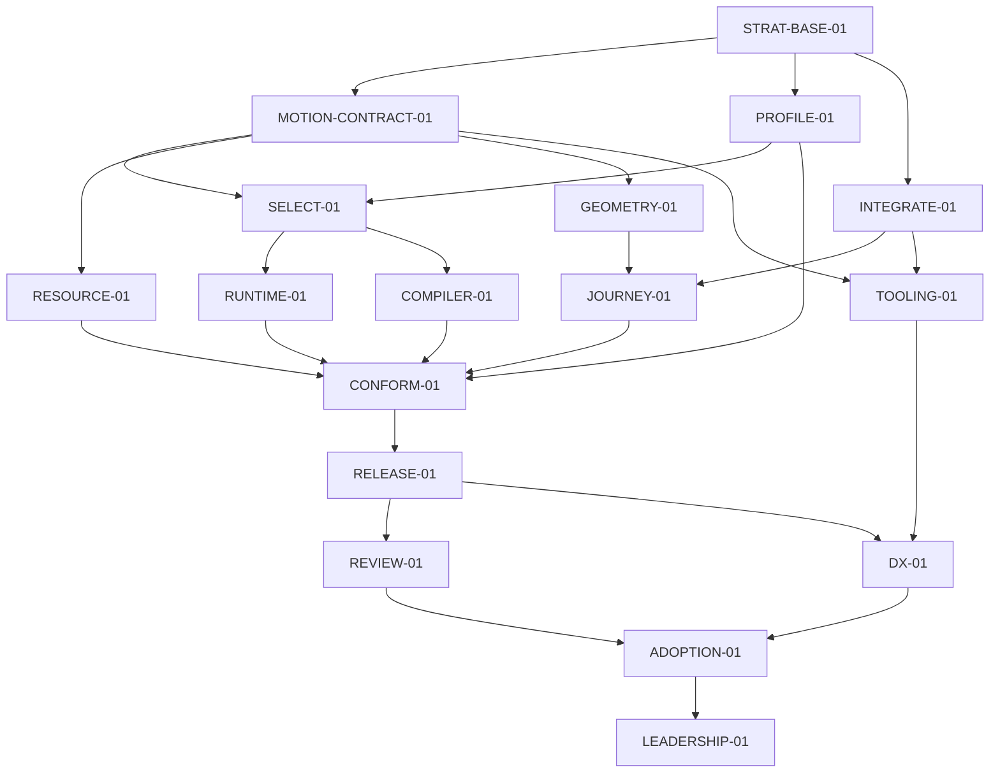

# Lab Motion — r12: воспроизводимая серверная приёмка

**Evidence cutoff:** `2026-10-01T02:18:39Z`; source identities перечислены в §2.

**Diátaxis:** справочник. Формат и допуск — [SPEC](../SPEC.md) и
[PARALLEL](../PARALLEL.md). Пока `ACTIVE.md` указывает r11, этот документ —
подготовленный преемник, не разрешение исполнения или свидетельство завершения.
Действующий CLAIM и активация r11 этим файлом не меняются.

## 0. Delta

Пользователь 2026-10-01 поручил полностью довести Lab Colors и Lab Motion по
планам до производственного качества и уточнил: Android недоступен, мощный
iPhone не представляет целевую нагрузку; нужен содержательный серверный аналог
проверки. r12 заменяет обязательный телефонный roster PROFILE-01 измерением
библиотеки и реальных браузерных потребителей на закреплённом Linux-сервере.
Покупка оборудования и использование телефона владельца не нужны этой приёмке.

Первый законченный результат — совместимый пакет для шести сценариев r11,
проверенные численные/ресурсные/размерные свойства и воспроизводимое сравнение
серверной стоимости. Полученные выводы относятся к зарегистрированным серверу,
браузерам, версиям и сценариям. Физическая частота экрана, автономность телефона,
тепловое поведение, человеческое предпочтение и рыночное лидерство не выводятся
из серверных результатов.

Выбран существующий путь: `bench/compare` владеет сравнением, статистикой,
семантическими controls и provenance; `bench/profile` связывает регистрацию,
калибровку и результат. Старый size gate остаётся владельцем пределов. Второй
стенд, runtime tier или параллельный solver не создаются. Сильная альтернатива —
телефонная лаборатория — полезна для будущего адресного mobile claim, но не
требуется серверной приёмке. Trigger пересмотра: нужен именно такой claim либо
зарегистрированный стенд не различает обязательное изменение стоимости.

### Сохранение обязательств

| Источник | Disposition | Защищаемое свойство и доказательство |
|---|---|---|
| r11 §0/§4 и включённые r1–r10 | preserved | Все применимые API, solver/time/ownership, compiler ABI, N/N−1, caps, hostile/reentrant/terminal и численные контракты; прежний корпус остаётся обязательным |
| r11 M-01/M-02/M-03/M-06/M-07 | preserved | Шесть независимых потребителей, прежняя стоимость, erasure, ноль собственного frame work нативного автономного участка, непрерывность и освобождение ресурсов |
| r11 M-04: физические Android/iOS и missed display frames | inapplicable-with-witness | Новый заказанный scope — серверный. Проверяется время работы на сервере и своевременность изменения состояния; display/energy claim остаётся неполученным и переоткрывается отдельным требованием |
| r11 M-05 и G-PERF | preserved | Сопоставимая семантика, strongest comparator, A/A, намеренное 2×work, run-level статистика, все raw, p95 upper ≤1,05; серверная область результата обозначается явно |
| r11 M-08…M-10, DX/ADOPTION/LEADERSHIP | preserved | Будущие человеческие и полевые claims сохраняют собственные proof; они не подменяются агентом или сервером и уже в r11 не блокируют пригодный промежуточный пакет |
| r11 §5: все 17 Node ID и RELEASE-01 | preserved | RELEASE-01 предоставляет совместимый артефакт Lab UI/Icons, не обещание мирового лидерства; входящая ссылка Lab UI сохраняет смысл |
| r11 G-PLAN/G-DELIVERY и запрет продуктового merge/release | preserved | Новый указатель, CLAIM и активация — штатные отдельные переходы с exact-head checks/review; этот кандидат не разрешает merge/auto-merge, npm release или deploy |

## 1. Objective and acceptance

Потребитель получает один настоящий package tuple и может применять движение
без compiler/editor/AI. Доменная логика приложения остаётся у приложения:
Motion владеет численным состоянием, временем и эффектом, а snap points, индекс,
business membership и semantic feel задаёт потребитель. Новый частный behavior
не подменяет общий закон передачи live/native управления.

Инженерная приёмка готова, когда выполнены условия:

1. Два независимых потребителя каждого семейства r11 работают с одним tarball:
   карточка/подробности и панель/источник; список и сетка; sheet и pager.
   Resize, смена направления, content, RTL, focus, keyboard, reduced-motion,
   ошибки host, reentry, interruption и terminal cleanup различаются проверками.
2. Прежние public API, tiny executors, total graph и numerical/resource guards
   сохранены. Nano ≤1024 B gzip, compiled runtime ≤341 B, Surface ≤1024 B,
   общий признанный compiled initial+total ≤5000 B. Все остальные действующие
   клетки берутся из `scripts/size-gate.mjs` и точного baseline, не из выбора
   меньшего удобного поднабора. CSS/data/lazy chunks входят в total.
3. PROFILE-01 фиксирует до A/B source/build/lock/toolchain/package identities,
   измерительную среду, matched workloads, независимые прогоны, числа samples,
   seed, порядок, stopping rule, multiplicity и пороги. Строка «N выберем позже»
   не готовый исполнимый профиль. Null pilot имеет отдельный исходный источник;
   его результат не меняет candidate threshold.
4. На тех же workloads стенд проходит A/A и обнаруживает deliberate 2×work.
   Он сохраняет ошибки и raw, отличает elapsed/per-call/divisor, stale source,
   missing samples и semantic mismatch. Invalid calibration даёт UNPROVEN
   соответствующей временной клетке, а не успешный допуск или NO-GO механизма.
5. Exact-source CI, независимое review, actual tarball/export/Node22/24,
   SSR/hydration и применимые framework consumers проходят. Завершение узла
   имеет конкретный evidence identity; локальный GREEN не подменяет доставку.

### Измерения с конкретным решением

| ID | Серверная область и исход |
|---|---|
| M-01 | Все шесть journeys и старые matched workloads проходят без второго store/engine и без роста защищённых клеток |
| M-02 | Static/mixed/dynamic controls доказывают erasure и ABI; tiny/compiled/union ceilings из условия 2 неизменны |
| M-03 | После native commit нет собственных callbacks/allocations; в idle нет motion timers/frames; изменённый semantic role действует, неизменный не перезапускается |
| M-04 | Реальная серверная работа 100 активных scalar channels и полных journeys: распределения start/retarget/update/teardown, стоимость library callbacks и отдельно browser/layout/paint. Цель собственного p99 ≤0,5 ms/update сохраняется как серверная цель. Если наблюдение не разрешает p99 или отделение собственной работы, соответствующий claim UNPROVEN. 60/120 Hz задают только условные бюджеты 16,67/8,33 ms, не частоту физического экрана |
| M-05 | Две тяжёлые сцены разных семейств заранее закреплены. Цель upper 95% candidate/best ≤0,50 по доминирующей устранимой стоимости; остальные protected p95 клетки upper ≤1,05. Zero-cost raw control не делится: сравниваются поведение и другая содержательная метрика |
| M-06 | Цель принимается до следующего доступного update; ноль stale terminal effects; поддержанный полный velocity vector и прежний независимый numerical oracle. Цель 0,1 CSS px не ослабляет прежний принятый 0,25 CSS px |
| M-07 | 10 000 mount/update/interrupt/dispose циклов: после terminal boundary ноль effects/listeners/jobs/component references; retained bytes в заранее закреплённой разрешимой области; GC только в отдельном retention proof |
| M-08…M-10 | Человеческие DX/change/preference endpoints r11 остаются будущей приёмкой DX/LEADERSHIP; сервер их не оценивает |

Невыполненная цель выигрыша M-04/M-05 записывается как frontier gap. Пригодный
пакет допускается по сохранённым contracts/guards как в r11; сравнительный
выигрыш и LEADERSHIP не объявляются. Регрессия защищённого свойства блокирует
пакет независимо от удобства API или других улучшений.

## 2. Facts / Evidence

| Факт на 2026-10-01 | Первичный источник | Следствие |
|---|---|---|
| Authoritative r11 active; PROFILE in progress, RESOURCE/JOURNEY ready | agents-config `aa868277c462ac033c255ea7c264a649ed3d0345`, ACTIVE/r11/CLAIM | Текущий допуск не переносится автоматически в r12 |
| Motion main `0b6f537e148b7dadadfb9e3ce7c446d014975958` | Свежий clone и GitHub default readback | Новый combined tuple проверяется отдельно |
| #454 `d20d0e42d66eec13668066cef244ccd88acdd611` измеряет old-vector, но aa/ab отвергает | `bench/profile/probe-profile-01.mjs`, immutable PR head | Старый размерный результат не означает временную калибровку; нужно закончить существующий owner |
| Старый PROFILE фиксирует часть MDE/N только строками, mobile cells остаются UNPROVEN | `bench/profile/profile-01-preregistration.mjs` того же head | Серверная регистрация должна стать исполнимым packet до samples |
| Основной сравнивающий стенд уже имеет provenance, paired-run статистику, controls и независимый replay | `bench/compare/*`, main `0b6f537e` | Эти владельцы используются повторно, их обязательные controls не удаляются |
| Новые compositor behavior factories #456 не приняты для merge | Draft #456, head `4cf175d3c9818f73339c2aae17cd790873ddb8f0` | Код кандидата изучается; общий scalar owner и consumer recipes предпочтительны; старый CI относится только к старому tuple |

## 3. Assumptions

- **ASM-01:** зарегистрированная серверная среда различает исходный p95 допуск
  5% и deliberate 2×work. Falsifier: калибровка не проходит. Меняется только
  доказанно неисправный measurement path, затем новая регистрация до A/B.
- **ASM-02:** одна семантика workload достижима у сравниваемых участников.
  Falsifier: control не сохраняет lifecycle/interruption/geometry; клетка
  исключается из сравнительного claim с конкретным witness, не выигрывается
  более слабым поведением.
- **ASM-03:** общий существующий solver/CompositorSpring достаточен live/native
  handoff двух независимых consumers. Falsifier: vector/ownership counterexample;
  правится общий контракт, не вводится second tracker/store.
- **ASM-04:** source/environment proof остаётся действительным. Drift source,
  lock/compiler/browser/CPU/quota/load/measurement mode инвалидирует зависимые
  samples. Серверный результат не переносится на другое оборудование по имени CPU.

## 4. Invariants

- **INV-01:** r11 §4 INV-01…INV-12 и их точные predecessor dispositions
  сохранены во всей незаменённой области; номера r11 разрешаются с revision.
- **INV-02:** один numeric/time/surface owner; whole-role, finite/signed-zero,
  stale/reentrant/terminal/host-error и data/event/geometry distinctions сохранены.
- **INV-03:** ранние caps действуют до traversal/getter/host effects; malformed
  input и cancellation не оставляют resources. Старые guards не ослабляются.
- **INV-04:** provenance связывает source, реальные bytes tarball, workload,
  среду и raw. Отказ измерения сохраняется; чужой SHA/skip/retry не становится PASS.
- **INV-05:** серверный CPU, wall time, browser rendering, память, callbacks,
  initial/total bytes имеют разные denominators. Все обязательные conjuncts
  проверяются, улучшение одной метрики не компенсирует другую красную.
- **INV-06:** CPU throttle не модель телефона. Программный clock не экран,
  Node stub не browser compositor, trace не human study, server WebKit не iOS.
- **INV-07:** healthy control достижим; намеренный дефект различается.
  Плохая калибровка не лечится повтором до green, повышением допуска или таймаута.
- **INV-08:** текущее исполнение r11, CLAIM, grants, чужие refs и main не меняются
  публикацией кандидата r12; product merge/release/deploy требует адресного допуска.

## 5. DAG

Сохранён причинный граф r11. PROFILE теперь выпускает серверный protocol tuple;
независимые RESOURCE/JOURNEY и изолированная подготовка продолжаются. Физическое
оборудование и человеческая выборка не prerequisites инженерного пакета.

### Node status

Новые результаты этой публикацией не присваиваются. Завершённые узлы
сохраняют прежние identities в своей доказанной области. Новый PROFILE ready
означает возможность получить отдельный допуск после штатной активации r12,
не перенос действующего исполнения PROFILE из r11.

| Node | Status | Exit evidence |
|---|---|---|
| STRAT-BASE-01 | done | 7cac8d3ecb26e05acc4de10555a8e3ee6849edec |
| MOTION-CONTRACT-01 | done | 7fe1dd1c4c58d0bfa674fd1a10cd9705b8fa7947 |
| PROFILE-01 | ready | Исполнимая серверная регистрация и сохранённый old-vector; точные source/server/browser identities; A/A и deliberate 2×work, независимый replay и affected cells |
| INTEGRATE-01 | done | 257d2b7b93397e79dcb2a2891fada4c39e8db15b |
| SELECT-01 | blocked by PROFILE-01 | Пререгистрированное remove/reuse/specialize решение; matched controls, falsifier, измеримая полная цена; frontier gaps не подменяют regression |
| RUNTIME-01 | blocked by SELECT-01 | Общий numeric/time owner и live/native handoff без второго runtime/store; сохранённый optimized consumer vector |
| COMPILER-01 | blocked by SELECT-01 | Static/mixed/dynamic lowering, erasure, evaluation order/errors/source-map/private ABI и все старые budgets |
| RESOURCE-01 | ready | Early-cap/hostile/model/fuzz/mutation, actual-package terminal retention и native/GPU ownership в доступной области |
| GEOMETRY-01 | done | 82249006ff37d01f823572c1b559e50de76f3e7f |
| JOURNEY-01 | ready | Шесть независимых actual-tarball consumers трёх семейств и все applicable interruption/content/resize/RTL/focus/reduced-motion/no-motion controls |
| CONFORM-01 | blocked by RUNTIME-01, COMPILER-01, RESOURCE-01, JOURNEY-01, PROFILE-01 | Combined tuple проходит semantic/numeric/browser/visual/resource/old-cost guards; M-01…M-07 содержат result или точный frontier gap |
| RELEASE-01 | blocked by CONFORM-01 | Actual tarball/export/Node22/24/N/N−1/runtime+compiler tuple, tested docs и пригодный consumer output; без автоматического publish/deploy |
| REVIEW-01 | blocked by RELEASE-01 | Независимые numerical/API/performance/second-order verdicts exact tuple, честные пределы claims; при invalid ASM affected forward replan |
| TOOLING-01 | done | [Интеграция #440 → #441](evidence/source-integration-20260928.md) |
| DX-01 | blocked by RELEASE-01 | Пререгистрированные независимые human/AI cohorts и blind visual tasks r11; все failures и no-motion controls; M-08…M-10 |
| ADOPTION-01 | blocked by REVIEW-01, DX-01 | Три реальные production apps, два внешних consumers, три minor release и migration/security/rollback history r11 |
| LEADERSHIP-01 | blocked by ADOPTION-01 | Все применимые M-01…M-10 одновременно доказаны в объявленной области; strongest-comparator и old-Lab controls |

### Исполнимые пакеты и необходимые рёбра

PROFILE читает source/baseline/measurement contract и пишет только существующие
bench/profile owners и доказательства. До samples закрепляет CPU architecture,
модель/topology, quota/cpuset, OS/kernel, Node/toolchain/browser builds, mode,
viewport/DPR/content, power/load policy и clocks. Изоляция и наблюдаемая нагрузка
проверяются до допуска. Неизвестное число samples или некалиброванная временная
клетка не выпускает timing admission. Stable compact witness и raw digests
сохраняются так, чтобы expiry Actions не удалял единственный proof.

SELECT получает PROFILE, потому что без достаточной разрешимости измерения
выбор по стоимости случаен; подготовка альтернатив доступна заранее. RUNTIME
и COMPILER получают выбранный packet с contract/falsifier, а RESOURCE/JOURNEY
не зависят от численного сравнительного выигрыша. CONFORM требует все пять
явных conjuncts, чтобы не потерять ресурсы, реальные consumers или measured
source. RELEASE получает combined artifact; DX/ADOPTION не блокируют его.
Source, workload или environment drift инвалидирует только affected closure.

RUNTIME усиливает существующий CompositorSpring/solver/basis; snapshot и velocity
живого владельца передаются в тот же serialized artifact. Snap/index/bounds
остаются client-owned. Compiler сохраняет static/mixed/dynamic semantics и
не вводит публичный IR/VM без доказанной недостаточности существующего owner.
Каждый существенный packet имеет healthy control, предметный RED, finite
failure/cancel/reentry исход и изолированный exact-source review. Recovery —
отмена только своего эффекта и новый intent с актуального owner; stale callback
не может отменить или завершить новое движение.

## 6. Gates

- **G-PLAN:** кандидат r12 не меняет r11. Перед authoritative transition отдельно
  разрешаются действующий CLAIM, exact bytes новой revision, incoming references,
  required checks/review и штатный grant/activation по SPEC. Старые revisions
  неизменны; generator/check systemmap используется штатно.
- **G-CONTRACT:** старый independent numeric/property/model corpus и healthy
  controls сохранены. RED должен обнаружить выбранный reachable дефект, включая
  `throw undefined`, sibling cleanup, shared handle transfer и nested intent.
- **G-PERF:** наследуется r11 G-PERF полностью в серверной области. Fixed
  run-level paired order/seed/N/stopping, семейный 95% coverage, A/A/2×work,
  сохранение failures, отсутствие forced GC в timing. Исполнитель не повышает
  прежний p95 upper 1,05 и не подбирает threshold после результатов.
- **G-COMPOSE:** обязательные Chromium/Firefox/WebKit, actual tarball, Node22/24,
  vanilla/Solid/React lifecycle/StrictMode/SSR/hydration, прежние Vue/Svelte,
  ShadowRoot/reparent/resize и доступность по области r11. Неустановленный
  браузер не считается прошедшим; renderer/DPR и visual oracle фиксируются.
- **G-DELIVERY:** authoritative CI graph exact head, все required checks,
  независимые correctness/second-order оси и содержательный CodeRabbit где
  подключён; rate-limit не review. Изолированный commit/PR не main/release.
- **G-FIELD:** r11 G-DX и ADOPTION сохранены для заявленных human/field outcomes.
  Для инженерного пакета требуется открытая честная граница их отсутствия;
  чужая выборка, агентский рассказ и серверный benchmark их не заменяют.

## 7. Rollback

Непринятый кандидат откатывается в собственной ветке по owned paths или revert;
чужие worktrees/refs/PR и основной код сохраняются. До переключения ACTIVE r11
остаётся authoritative. Ошибка нового source или измерения сохраняет raw и
блокирует только affected claim. Принятый впоследствии продуктовый commit
откатывается отдельным защищённым revert PR с полным affected CI и N/N−1.
Установленный package/runtime/compiler tuple возвращается прежним lock;
существующая версия не перепубликовывается. Live/native cancellation проверяет
фактического owner: timeout или потерянный ACK не удостоверяет rollback.

## 8. Smells / CAPA

| Важность | Нарушение | Различающая защита |
|---|---|---|
| Критично | Сервер назван телефоном либо simulated tick — display frame | Явный scope/result schema и отдельные clocks/denominators |
| Критично | Old-vector/hash/count назван timing admission | A/A, 2×work и независимый replay настоящих samples |
| Критично | Ускорение скрывает lost velocity, stale effect или weaker comparator | Matched interruption/oracle/healthy controls до timed admission |
| Критично | Прежние bytes/caps/NI выросли ради удобного GREEN | Полный unchanged guard vector, early hostile witness, source-bound validation |
| Высоко | Частный factory/store выбран вместо общего scalar owner | Два независимых consumers через один numerical/lifetime mechanism |
| Высоко | Failed control повторяется до успеха | Raw сохранены; named measurement defect и новая preregistration |
| Высоко | Human/adoption/leadership закрыты результатом серверного CI | Отдельные field proofs и незавершённые DX/ADOPTION/LEADERSHIP |

## 9. Unknowns

- Серверный измерительный packet и его калибровка ещё должны получить exact-source
  review и run receipts. #454 old-vector не закрывает этот вопрос. Временной
  admission выдаётся только в реально разрешённой клетке.
- Common live→native handoff, combined retention/journeys и compiler parity
  требуют подтверждения нового combined package. Старые isolated PR не сумма proof.
- M-04/M-05 comparative advantage неизвестен до зарегистрированного опыта;
  недостигнутый выигрыш не скрывается пригодностью intermediate artifact.
- Телефонные display/energy/thermal claims вне серверной приёмки; их будущий
  запрос потребует подходящих устройств и отдельного scoped evidence.
- Human DX, предпочтения, реальные production apps/external consumers и release
  history остаются неполученными до соответствующих первичных данных.
- Source merge/npm release/deploy не разрешены этой ревизией. Публикация и
  активация r12 требуют штатных переходов после разрешения текущего CLAIM.
