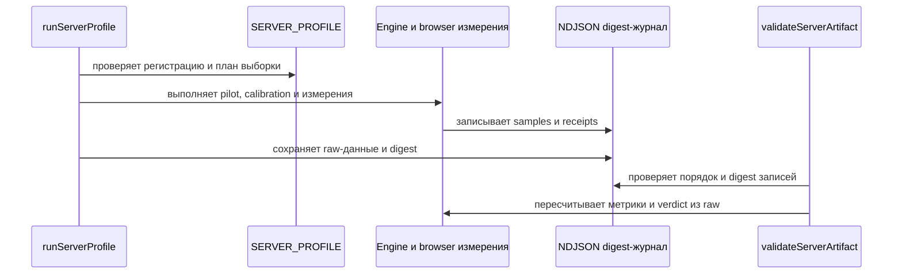

<!-- This is an auto-generated comment: summarize by coderabbit.ai -->
<!-- review_stack_entry_start -->

Navigate logical layers of code changes, visualize relationships, and explore their blast radius.

<!-- review_stack_entry_end -->
<!-- walkthrough_start -->

📝 Walkthrough

## Walkthrough

Изменения охватывают жизненный цикл `MotionValue` и behaviors, передачу анимации между live- и compositor-режимами, сборку browser-рецептов из production tarball и проверки benchmark-данных. Добавлены ручной PROFILE-01, серверный профиль измерений и ограничение суммарной длины декодируемых строк.

### Changes

**Жизненный цикл анимаций и compositor handoff**

|Layer / File(s)|Summary|
|---|---|
|**Владение MotionValue и behaviors**   `src/motion-value.ts`, `src/behaviors/index.ts`, `src/internal/motion-defaults.ts`, `src/tokens/index.ts`, `test/motion-value-*.test.ts`, `test/behaviors-*.test.ts`, `test/fixtures/resource-package-probe.mjs`, `test/resource-actual-package-retention.test.ts`, `CHANGELOG.md`, `README.md`|После `destroy()` вызовы `MotionValue` становятся no-op. Общая база behaviors управляет runner, подписчиками и callback. Общие дефолты пружин используются behaviors и токенами; добавлены проверки terminal-состояний и retention для установленного пакета.|
|**Передача live-анимации compositor**   `src/compositor/core.ts`, `src/compositor/sample.ts`, `test/compositor-return-to-native.test.ts`, `docs/compositor.md`, `CHANGELOG.md`|Добавлен `handoffToCompositor`. Контроллер использует значение и скорость live-владельца для native successor. После commit он освобождает donor; при неподдержанном пути сохраняет live-анимацию.|
|**Проверки compositor в браузере**   `browser/resource-actual-package.spec.ts`|Добавлены 10 000 циклов start, retarget и handoff для `CompositorSpring` из собранного пакета. Проверяются terminal-состояние и оставшиеся native effects.|

**PROFILE-01: базовый size-вектор**

|Layer / File(s)|Summary|
|---|---|
|**Регистрация протокола и Git provenance**   `bench/profile/profile-01-preregistration.mjs`, `bench/profile/profile-git-proof.mjs`, `test/profile-measurement.test.ts`|Добавлены замороженная регистрация PROFILE_01, digest, проверка полного совпадения протокола и Git-доказательства checkout.|
|**Измерение и проверка артефакта**   `bench/profile/probe-profile-01.mjs`, `bench/profile/profile-measurement.mjs`, `bench/profile/validate-profile-01.mjs`, `test/profile-measurement.test.ts`|Добавлены измерение old-vector, replay-проверка и fail-closed валидация raw-артефакта.|
|**Ручной CI запуск**   `.github/workflows/ci.yml`, `.github/workflows/profile-01.yml`, `test/ci-workflow-contract.test.ts`|Добавлены ручной вход `profile_baseline` и условный запуск workflow. Workflow проверяет измерение и validator, затем публикует raw-артефакт, в том числе после отказа.|

**Серверный профиль измерений**

|Layer / File(s)|Summary|
|---|---|
|**Регистрация, часы и план выборки**   `bench/profile/server-profile-registration.mjs`, `bench/profile/server-thread-cpu-clock.*`, `bench/profile/native-clock/*`, `docs/server-profile.md`, `test/server-profile-contract.test.ts`|Добавлены регистрация `SERVER_PROFILE`, модель часов, native CPU getter и правила планирования выборки. Документация описывает условия измерения и области `UNPROVEN`.|
|**Runner и измерительные стадии**   `bench/profile/server-profile-runner.mjs`, `bench/profile/server-profile-retention.mjs`, `docs/server-profile.md`, `test/server-profile-contract.test.ts`|Runner проверяет ресурсы и provenance, выполняет engine- и browser-измерения, controls и отдельную retention-проверку. Ошибки и доступные частичные данные сохраняются.|
|**Проверка samples, артефакта и журнала**   `bench/profile/server-profile-contract.mjs`, `docs/server-profile.md`, `test/server-profile-contract.test.ts`|Контракт проверяет raw-данные, clock и semantic witnesses, расчёты, provenance и digest-журнал. Добавлены потоковые сериализация и разбор крупных артефактов.|

**Benchmark-свидетельства и методология**

|Layer / File(s)|Summary|
|---|---|
|**Onset, checkpoints и статистические границы**   `bench/compare/bench.mjs`, `bench/compare/methodology.mjs`, `test/benchmark-methodology.test.ts`, `test/benchmark-report-contract.test.ts`, `test/server-profile-contract.test.ts`|Семантические проверки собирают onset и несколько временных checkpoints. Добавлены проверка stock C batch, RLE-компактация и точные биномиальные границы.|
|**Lifecycle raw-трассы и benchmark runner**   `scripts/bench-transform-support.mjs`, `scripts/bench-support.mjs`, `scripts/bench.mjs`, `test/bench-transform-pair.test.ts`|Замеры сохраняют временные интервалы, scheduler timeline и CSS-трассы. Валидатор повторно проверяет raw-данные и сохраняет сведения об ошибках измерения и очистки. Сценарий `MotionValue` использует общий benchmark helper.|

**Browser-рецепты из npm tarball**

|Layer / File(s)|Summary|
|---|---|
|**Упаковка и сборка recipe-пакета**   `browser/fixtures/scope-recipes.mjs`, `browser/fixtures/packed-recipes.d.ts`, `browser/fixtures/compile-artifacts.mjs`, `browser/fixtures/reorder-recipe.mjs`, `tsconfig.browser.json`, `test/animate-scope-recipes.test.ts`|Сборка проверяет npm tarball и использует распакованный пакет для browser и SSR bundle. Добавлены recipe-экспорты, гидратация и объявления типов artifact-импортов.|
|**Рецепты и browser-сценарии**   `docs/recipes.md`, `browser/compositor-recipes.spec.ts`, `browser/journey-live-view.spec.ts`, `browser/presence-transition.spec.ts`, `browser/reorder.spec.ts`, `test/journey-package-consumers.test.ts`|Добавлены sheet и pager-рецепты. Browser-сценарии используют scope-recipes artifact; проверки охватывают взаимодействия, фокус, reduced motion и lifecycle.|

**Лимит строк wire-формата**

|Layer / File(s)|Summary|
|---|---|
|**Проверка бюджета строк**   `scripts/motion-program-wire.ts`, `test/motion-program-wire-v1.test.ts`|Декодер ограничивает суммарное число UTF-16 code units. Тесты проверяют превышение лимита и допустимое граничное значение.|

<!-- change_assessment_start -->
**Priority:** ➖ Normal

**Estimated code review effort:** 5 (Critical) | ~120 minutes

<!-- change_assessment_commit:"f6476ae990254f606faf97f80afe41965bec2fb2" -->

<!-- change_assessment_end -->

### Sequence Diagram(s)

<!-- fixed_issue_severity[Low] -->

<!-- walkthrough_end -->
<!-- final_review_risk_start -->
**Merge Risk:** _🔵 Low_ · up to `f6476`
<!-- final_review_risk_coverage:{"sourceCommitId":"f6476ae990254f606faf97f80afe41965bec2fb2","coveredCommitId":"f6476ae990254f606faf97f80afe41965bec2fb2","kind":"reviewed"} -->

Sheet and pager cleanup can leave an element styled differently after it is destroyed. This is a bounded issue that can be fixed before merge or accepted for follow-up.
<!-- final_review_risk_end -->
<!-- pre_merge_checks_walkthrough_start -->

---

<!-- pre_merge_checks_override_start -->
> [!CAUTION]
> ## Pre-merge checks failed
> 
> Please resolve all errors before merging. Addressing warnings is optional.
> 
> - [ ] <!-- {"checkboxId":"override-pre-merge-checks"} --> Ignore
<!-- pre_merge_checks_override_end -->

### ❌ Failed checks (1 error, 2 warnings)

|               Check name              | Status     | Explanation                                                                                                                                                                                               | Resolution                                                                                                                                                                                                                                        |
| :-----------------------------------: | :--------- | :-------------------------------------------------------------------------------------------------------------------------------------------------------------------------------------------------------- | :------------------------------------------------------------------------------------------------------------------------------------------------------------------------------------------------------------------------------------------------ |
|                 тесты                 | ❌ Error    | Тесты хорошо покрывают часть runtime-классов: reentry behaviors, live/native handoff, lifecycle и server-profile validators имеют отрицательные сценарии и deliberate sabotage. Но критичный новый nativ… | Добавьте исполняемый Linux x64 integration test для `prepareServerThreadCpuClock` и `readServerThreadCpuEndpoint`. Тест должен собрать addon из закреплённых C/header-файлов, выполнить реальное чтение, проверить `CLOCK_THREAD_CPUTIME_ID`, PI… |
|              архитектура              | ⚠️ Warning | В PR добавлена архитектурная граница с несколькими обязанностями. `bench/profile/server-profile-contract.mjs` стал модулем на 963 строки с 25 экспортами. Он одновременно содержит чистую проверку sampl… | Разделить PROFILE-01 на чистое ядро и адаптеры. Оставить в чистом модуле только регистрацию, валидацию samples, статистические расчёты и проверку хронологии на уже разобранных значениях. Перенести JSON/NDJSON parsing, streaming serializatio… |
| промежуточные документы (напр. планы) | ⚠️ Warning | В PR добавлены промежуточные документы работы над продуктом в репозиторий продукта. `docs/server-profile.md` прямо описывает «частный инструмент» PROFILE-01, правила регистрации, выборки, provenance и… | Перенесите документацию PROFILE-01, native-clock, планы измерений, ревью, исследования и связанные raw/evidence-артефакты в `agents-config`. Оставьте в репозитории продукта только окончательную документацию публичного продукта, оформленную … |

✅ Passed checks (6 passed)

|          Check name          | Status   | Explanation                                                                                                                                                                                               |
| :--------------------------: | :------- | :-------------------------------------------------------------------------------------------------------------------------------------------------------------------------------------------------------- |
|          Title check         | ✅ Passed | Заголовок написан на русском языке и точно отражает ключевые изменения: сохранение владения движением и проверку полной стоимости MotionValue. Он не вводит в заблуждение, хотя не перечисляет все втори… |
|       Description check      | ✅ Passed | Описание подробно раскрывает пользовательский результат, контракт, доказательства, производительность, риски, ограничения, документацию и состояние релиза. Основные сведения из шаблона присутствуют, н… |
|      Linked Issues check     | ✅ Passed | Check skipped because no linked issues were found for this pull request.                                                                                                                                  |
|  Out of Scope Changes check  | ✅ Passed | Check skipped because no linked issues were found for this pull request.                                                                                                                                  |
| краткие русские документации | ✅ Passed | Проверка пройдена. Изменённые справочники и README написаны на русском языке; технические идентификаторы и общепринятые термины сохранены. Ссылки на файлы документации действительны. Runnable-рецепты … |
|           Diataxis           | ✅ Passed | PASS: классификация документации сохранена и дополнена. `docs/server-profile.md` и `bench/profile/native-clock/README.md` явно помечены как «справка (Diátaxis)». `docs/recipes.md` помечен как практиче… |

Full details: архитектура

**Explanation**

В PR добавлена архитектурная граница с несколькими обязанностями. `bench/profile/server-profile-contract.mjs` стал модулем на 963 строки с 25 экспортами. Он одновременно содержит чистую проверку samples и artifact, импортирует `node:fs`, `node:path`, `node:url`, реализует `writeServerArtifact`, `parseServerJsonBytes`, `parseServerJournalBytes` и содержит CLI с чтением файлов и `process.argv` (строки 1–11, 741–808, 952–963). Поэтому ядро проверки напрямую связано с хранением, сериализацией и транспортом CLI. Это нарушает требование отделять ядро от эффектов и делает интерфейс модуля сложным. Дополнительно `exactBinomialOrderStatisticBounds` добавлена в общий `bench/compare/methodology.mjs`, но единственный production-потребитель находится в `bench/profile/server-profile-contract.mjs`; это преждевременная абстракция до второго доказанного потребителя. Остальные изменения владения в `src` используют явного владельца и не дают отдельного основания для отказа.

**Resolution**

Разделить PROFILE-01 на чистое ядро и адаптеры. Оставить в чистом модуле только регистрацию, валидацию samples, статистические расчёты и проверку хронологии на уже разобранных значениях. Перенести JSON/NDJSON parsing, streaming serialization, hashing-to-file и `writeServerArtifact` в отдельный serialization/storage adapter. Перенести `process.argv`, чтение файлов и вывод результата в отдельный CLI adapter. Передавать в ядро данные и функции через явный небольшой контракт. Переместить `exactBinomialOrderStatisticBounds` из общего `bench/compare/methodology.mjs` в модуль PROFILE-01 или оставить локальной функцией до появления второго production-потребителя; экспортировать её только после второго доказанного потребителя. Добавить типизированные ошибки с кодами для отказов границ и адаптеров, чтобы CLI не восстанавливал тип ошибки по строке сообщения.

Full details: тесты

**Explanation**

Тесты хорошо покрывают часть runtime-классов: reentry behaviors, live/native handoff, lifecycle и server-profile validators имеют отрицательные сценарии и deliberate sabotage. Но критичный новый native CPU getter не доказан. `test/server-profile-contract.test.ts` подменяет `readServerThreadCpuEndpoint` через `vi.spyOn` и использует синтетические endpoints. Поиск по репозиторию не выявил теста, который компилирует и запускает `bench/profile/server-thread-cpu-clock.c`; `profile-01.yml` запускает только `probe-profile-01.mjs`, а `runServerProfile` не вызывается тестами или workflow. Поэтому дефект в `clock_gettime`, PID/TID, timespec validation или ABI может пройти текущие тесты. Это нарушает требование доказуемого функционала и anti-theater условия.

**Resolution**

Добавьте исполняемый Linux x64 integration test для `prepareServerThreadCpuClock` и `readServerThreadCpuEndpoint`. Тест должен собрать addon из закреплённых C/header-файлов, выполнить реальное чтение, проверить `CLOCK_THREAD_CPUTIME_ID`, PID/TID текущего потока, canonical seconds/nanoseconds, монотонность и ошибки подготовки. Добавьте deliberate sabotage или mutation нативного пути, который обязан сделать тест красным. Подключите этот тест к обязательному CI-гейту.

Full details: промежуточные документы (напр. планы)

**Explanation**

В PR добавлены промежуточные документы работы над продуктом в репозиторий продукта. `docs/server-profile.md` прямо описывает «частный инструмент» PROFILE-01, правила регистрации, выборки, provenance и независимой проверки. `bench/profile/native-clock/README.md` документирует частный CPU-счётчик, который не входит в npm-пакет. Это исследовательская и производственная документация, а не документация самого публичного продукта. Пометка `Роль: справка (Diátaxis)` не изменяет назначение этих документов. Пользовательские `docs/compositor.md` и `docs/recipes.md` имеют продуктовые роли, но не устраняют отдельное нарушение.

**Resolution**

Перенесите документацию PROFILE-01, native-clock, планы измерений, ревью, исследования и связанные raw/evidence-артефакты в `agents-config`. Оставьте в репозитории продукта только окончательную документацию публичного продукта, оформленную по Diátaxis. Удалите из продуктового репозитория `docs/server-profile.md` и `bench/profile/native-clock/README.md` либо замените их короткими ссылками на единственный источник в `agents-config`. Обновите ссылки и CI так, чтобы они не создавали вторую точку истины.

<!-- pre_merge_checks_walkthrough_end -->

- [ ] <!-- {"checkboxId":"585bb3f6-faf5-4dbf-96d2-74e382adf19a"} --> Fix all pre-merge checks with AI
<!-- finishing_touch_checkbox_start -->

✨ Finishing Touches

📝 Generate docstrings

- [ ] <!-- {"checkboxId":"3e1879ae-f29b-4d0d-8e06-d12b7ba33d98"} --> Commit to this branch
- [ ] <!-- {"checkboxId":"7962f53c-55bc-4827-bfbf-6a18da830691"} --> Create a new PR

🧪 Generate unit tests (beta)

- [ ] <!-- {"checkboxId": "6ba7b810-9dad-11d1-80b4-00c04fd430c8", "radioGroupId": "utg-output-choice-group-unknown_comment_id"} --> Commit to this branch
- [ ] <!-- {"checkboxId": "f47ac10b-58cc-4372-a567-0e02b2c3d479", "radioGroupId": "utg-output-choice-group-unknown_comment_id"} --> Create a new PR

<!-- finishing_touch_checkbox_end -->

<!-- autopilot:start -->
- [ ] <!-- {"checkboxId":"2708ad07-9f24-4260-9c11-7dc76a49f2e3"} --> <strong title="Keep fixing CodeRabbit findings and required CI, and resolving merge conflicts">Autopilot</strong> · Keep fixing CodeRabbit findings and required CI, and resolving merge conflicts

> Autopilot is currently an internal CodeRabbit preview.
<!-- autopilot:end -->
<!-- tips_start -->

---

Comment `@coderabbitai help` to get the list of available commands.

<!-- tips_end -->