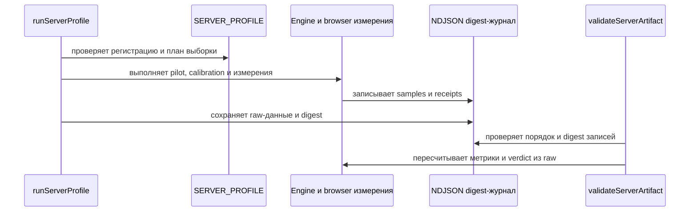

<!-- This is an auto-generated comment: summarize by coderabbit.ai -->
<!-- review_stack_entry_start -->

Navigate logical layers of code changes, visualize relationships, and explore their blast radius.

<!-- review_stack_entry_end -->
<!-- This is an auto-generated comment: review paused by coderabbit.ai -->

> [!NOTE]
> ## Reviews paused
> 
> It looks like this branch is under active development. To avoid overwhelming you with review comments due to an influx of new commits, CodeRabbit has automatically paused this review. You can configure this behavior by changing the `reviews.auto_review.auto_pause_after_reviewed_commits` setting.
> 
> Use the following commands to manage reviews:
> - `@coderabbitai resume` to resume automatic reviews.
> - `@coderabbitai review` to trigger a single review.
> 
> Use the checkboxes below for quick actions:
> - [ ] <!-- {"checkboxId":"7f6cc2e2-2e4e-497a-8c31-c9e4573e93d1"} --> ▶️ Resume reviews
> - [ ] <!-- {"checkboxId":"e9bb8d72-00e8-4f67-9cb2-caf3b22574fe"} --> 🔍 Trigger review

<!-- end of auto-generated comment: review paused by coderabbit.ai -->
<!-- recent_review_start -->

No actionable comments were generated in the recent review. 🎉

ℹ️ Recent review info

⚙️ Run configuration

**Configuration used**: Organization UI

**Review profile**: ASSERTIVE

**Plan**: Team

**Run ID**: `e426dab8-9f99-4366-ae9f-90e0887cc28b`

📥 Commits

Reviewing files that changed from the base of the PR and between f6476ae990254f606faf97f80afe41965bec2fb2 and fe092331360837fd7f63d71a4b7f867ba849ebd4.

📒 Files selected for processing (7)

* `.github/workflows/ci.yml`
* `browser/compositor-recipes.spec.ts`
* `docs/recipes.md`
* `test/ci-workflow-contract.test.ts`
* `test/fixtures/server-thread-cpu-clock-check.mjs`
* `test/fixtures/server-thread-cpu-clock-host.c`
* `test/server-profile-contract.test.ts`

**Included review availability:** This review used your included allowance. 0 included reviews remain after this review. Your included PR review attempts over the past 7 days set your current allowance at 1 review per hour.

---

<!-- recent_review_end -->
<!-- walkthrough_start -->

📝 Walkthrough

## Walkthrough

Изменения обновляют жизненный цикл `MotionValue` и behaviors, добавляют compositor handoff, browser-рецепты из production tarball и benchmark-проверки. Добавлены профили измерений PROFILE-01 и server profile. Декодер wire-формата также ограничивает суммарную длину строк.

### Changes

**Жизненный цикл анимаций и compositor handoff**

|Layer / File(s)|Summary|
|---|---|
|**Владение MotionValue и behaviors**   `src/motion-value.ts`, `src/behaviors/index.ts`, `src/internal/motion-defaults.ts`, `src/tokens/index.ts`, `test/motion-value-*.test.ts`, `test/behaviors-*.test.ts`, `test/fixtures/resource-package-probe.mjs`, `test/resource-actual-package-retention.test.ts`, `CHANGELOG.md`, `README.md`|`MotionValue` после `destroy()` прекращает обработку вызовов. Общая база behaviors управляет runner, подписчиками и callback. Добавлены проверки terminal-состояний и retention установленного пакета.|
|**Передача live-анимации compositor**   `src/compositor/core.ts`, `src/compositor/sample.ts`, `test/compositor-return-to-native.test.ts`, `docs/compositor.md`, `CHANGELOG.md`|Добавлен `handoffToCompositor`. Контроллер использует значение и скорость live-владельца для native successor. После commit он освобождает donor; при неподдержанном пути сохраняет live-анимацию.|
|**Проверки compositor в браузере**   `browser/resource-actual-package.spec.ts`|Добавлены 10 000 циклов start, retarget и handoff для `CompositorSpring` из собранного пакета. Проверяются terminal-состояние и оставшиеся native effects.|

**PROFILE-01: базовый size-вектор**

|Layer / File(s)|Summary|
|---|---|
|**Регистрация протокола и Git provenance**   `bench/profile/profile-01-preregistration.mjs`, `bench/profile/profile-git-proof.mjs`, `test/profile-measurement.test.ts`|Добавлены замороженная регистрация PROFILE_01, digest, проверка полного совпадения протокола и Git-доказательства checkout.|
|**Измерение и проверка артефакта**   `bench/profile/probe-profile-01.mjs`, `bench/profile/profile-measurement.mjs`, `bench/profile/validate-profile-01.mjs`, `test/profile-measurement.test.ts`|Добавлены измерение old-vector, replay-проверка и fail-closed валидация raw-артефакта.|
|**Ручной запуск и workflow-проверки**   `.github/workflows/ci.yml`, `.github/workflows/profile-01.yml`, `test/ci-workflow-contract.test.ts`|Добавлен ручной вход `profile_baseline` и условный запуск workflow. Workflow проверяет измерение и validator, затем публикует raw-артефакт, в том числе после отказа.|

**Серверный профиль измерений**

|Layer / File(s)|Summary|
|---|---|
|**Регистрация, часы и план выборки**   `bench/profile/server-profile-registration.mjs`, `bench/profile/server-thread-cpu-clock.*`, `bench/profile/native-clock/*`, `docs/server-profile.md`, `test/server-profile-contract.test.ts`|Добавлены регистрация `SERVER_PROFILE`, модель часов, native CPU getter и правила планирования выборки. Документация описывает условия измерения и границы интерпретации.|
|**Runner и измерительные стадии**   `bench/profile/server-profile-runner.mjs`, `bench/profile/server-profile-retention.mjs`, `docs/server-profile.md`, `test/server-profile-contract.test.ts`|Runner проверяет ресурсы и provenance, выполняет engine- и browser-измерения, controls и отдельную retention-проверку. Ошибки и доступные частичные данные сохраняются.|
|**Проверка samples, артефакта и журнала**   `bench/profile/server-profile-contract.mjs`, `docs/server-profile.md`, `test/server-profile-contract.test.ts`|Контракт проверяет raw-данные, clock- и semantic-witnesses, расчёты, provenance и digest-журнал. Добавлены потоковая сериализация и разбор артефактов.|

**Benchmark-свидетельства и методология**

|Layer / File(s)|Summary|
|---|---|
|**Onset, checkpoints и статистические границы**   `bench/compare/bench.mjs`, `bench/compare/methodology.mjs`, `test/benchmark-methodology.test.ts`, `test/benchmark-report-contract.test.ts`, `test/server-profile-contract.test.ts`|Семантические проверки собирают onset и несколько временных checkpoints. Добавлены проверка stock C batch, RLE-компактация и точные биномиальные границы.|
|**Lifecycle raw-трассы и benchmark runner**   `scripts/bench-transform-support.mjs`, `scripts/bench-support.mjs`, `scripts/bench.mjs`, `test/bench-transform-pair.test.ts`|Замеры сохраняют интервалы, scheduler timeline и CSS-трассы. Валидатор повторно проверяет raw-данные и сохраняет сведения об ошибках измерения и очистки. Сценарий `MotionValue` использует общий benchmark helper.|

**Browser-рецепты из npm tarball**

|Layer / File(s)|Summary|
|---|---|
|**Упаковка и сборка recipe-пакета**   `browser/fixtures/scope-recipes.mjs`, `browser/fixtures/packed-recipes.d.ts`, `browser/fixtures/compile-artifacts.mjs`, `browser/fixtures/reorder-recipe.mjs`, `tsconfig.browser.json`, `test/animate-scope-recipes.test.ts`|Сборка проверяет npm tarball и использует распакованный пакет для browser- и SSR bundle. Добавлены recipe-экспорты, гидратация и объявления типов artifact-импортов.|
|**Рецепты и browser-сценарии**   `docs/recipes.md`, `browser/compositor-recipes.spec.ts`, `browser/journey-live-view.spec.ts`, `browser/presence-transition.spec.ts`, `browser/reorder.spec.ts`, `test/journey-package-consumers.test.ts`|Добавлены sheet- и pager-рецепты. Browser-сценарии проверяют взаимодействия, фокус, reduced motion и lifecycle.|

**Лимит строк wire-формата**

|Layer / File(s)|Summary|
|---|---|
|**Проверка бюджета строк**   `scripts/motion-program-wire.ts`, `test/motion-program-wire-v1.test.ts`|Декодер ограничивает суммарное число UTF-16 code units. Тесты проверяют превышение лимита и допустимое граничное значение.|

<!-- change_assessment_start -->
**Priority:** ➖ Normal

**Estimated code review effort:** 5 (Critical) | ~120 minutes

<!-- change_assessment_commit:"fe092331360837fd7f63d71a4b7f867ba849ebd4" -->

<!-- change_assessment_end -->

### Sequence Diagram(s)

<!-- walkthrough_end -->
<!-- final_review_risk_start -->
**Merge Risk:** _⚪ Minimal_ · up to `fe092`
<!-- final_review_risk_coverage:{"sourceCommitId":"fe092331360837fd7f63d71a4b7f867ba849ebd4","coveredCommitId":"fe092331360837fd7f63d71a4b7f867ba849ebd4","kind":"reviewed"} -->

No identified issue blocks merging after normal checks.
<!-- final_review_risk_end -->
<!-- pre_merge_checks_walkthrough_start -->

🚥 Pre-merge checks | ✅ 8 | ❌ 1

### ❌ Failed checks (1 warning)

|  Check name | Status     | Explanation                                                                                                                                                                                               | Resolution                                                                                                                                                                                                                                        |
| :---------: | :--------- | :-------------------------------------------------------------------------------------------------------------------------------------------------------------------------------------------------------- | :------------------------------------------------------------------------------------------------------------------------------------------------------------------------------------------------------------------------------------------------ |
| архитектура | ⚠️ Warning | Нарушена граница между контрактом профиля и хранением/транспортом. Новый `bench/profile/server-profile-contract.mjs` одновременно содержит правила валидации и прямые эффекты: импортирует `node:fs`, `n… | Разделить новый профиль на вертикальные модули с простыми контрактами. Оставить в чистом `server-profile-contract.mjs` только типизированные представления и детерминированные функции проверки, планирования, статистики и digest по переданным… |

✅ Passed checks (8 passed)

|               Check name              | Status   | Explanation                                                                                                                                                                                               |
| :-----------------------------------: | :------- | :-------------------------------------------------------------------------------------------------------------------------------------------------------------------------------------------------------- |
|          Linked Issues check          | ✅ Passed | Check skipped because no linked issues were found for this pull request.                                                                                                                                  |
|       Out of Scope Changes check      | ✅ Passed | Check skipped because no linked issues were found for this pull request.                                                                                                                                  |
|      краткие русские документации     | ✅ Passed | Проверка пройдена. Новые и изменённые пояснения в `README.md`, `CHANGELOG.md`, `docs/*.md` и `bench/profile/native-clock/README.md` написаны на русском; английские фрагменты ограничены идентификаторам… |
|                Diataxis               | ✅ Passed | Документация PR классифицирована по ролям Diátaxis. `docs/recipes.md` обозначен как практика и содержит исполняемые рецепты. `docs/server-profile.md` и `bench/profile/native-clock/README.md` обозначен… |
|                 тесты                 | ✅ Passed | Тесты дают предметные оракулы и отрицательные проверки. Новые unit-тесты покрывают late callback, destroy/cancel, reduced-motion, live/native handoff, reentrant intent и terminal MotionValue. Browser-… |
| промежуточные документы (напр. планы) | ✅ Passed | Проверенный diff не добавляет в репозиторий планы, ревью, отчёты или каталоги промежуточных evidence-артефактов. Новый `docs/server-profile.md` оформлен как справка Diátaxis, описывает действующий кон… |
|              Title check              | ✅ Passed | Заголовок на русском языке и точно отражает два центральных направления изменений: сохранение владения движением и проверку полной стоимости MotionValue.                                                 |
|           Description check           | ✅ Passed | Описание содержит подробные сведения о пользовательском результате, контракте, архитектуре, измерительной методологии, рисках, доказательствах, документации и ограничениях. Формат не повторяет заголов… |

Full details: архитектура

**Explanation**

Нарушена граница между контрактом профиля и хранением/транспортом. Новый `bench/profile/server-profile-contract.mjs` одновременно содержит правила валидации и прямые эффекты: импортирует `node:fs`, `node:path`, `node:url` и `node:crypto` (строки 1–11), пишет файл в `writeServerArtifact` (741–752), разбирает файловые carriers (756–821) и сам является CLI, читая `process.argv`, raw и journal (952–963). `server-profile-runner.mjs` импортирует из этого же модуля и валидаторы, и `writeServerArtifact` (строки 18–19, 683). Файл полностью добавлен этим PR, поэтому причинность подтверждена diff. Это не чистое ядро: модель и правила admission связаны с файловым хранением, JSON/NDJSON-транспортом и CLI.

**Resolution**

Разделить новый профиль на вертикальные модули с простыми контрактами. Оставить в чистом `server-profile-contract.mjs` только типизированные представления и детерминированные функции проверки, планирования, статистики и digest по переданным значениям/байтам. Вынести `writeServerArtifact`, `parseServerJsonBytes`, `parseServerJournalBytes` и файловый digest в отдельный `server-profile-artifact-io.mjs`. Вынести чтение `process.argv`, файлов и вывод результата в отдельный `validate-server-profile-cli.mjs`. Вынести запись NDJSON-журнала в адаптер runner-а или отдельный `server-profile-journal-io.mjs`; передавать в доменный код уже разобранные записи и явный интерфейс журнала. Удалить из чистого контракта импорты `node:fs`, `node:path`, `node:url` и CLI-блок. Добавить тесты, которые импортируют чистый контракт без Node filesystem/CLI и отдельно проверяют адаптеры хранения.

<!-- pre_merge_checks_walkthrough_end -->
<!-- finishing_touch_checkbox_start -->

✨ Finishing Touches

📝 Generate docstrings

- [ ] <!-- {"checkboxId":"3e1879ae-f29b-4d0d-8e06-d12b7ba33d98"} --> Commit to this branch
- [ ] <!-- {"checkboxId":"7962f53c-55bc-4827-bfbf-6a18da830691"} --> Create a new PR

🧪 Generate unit tests (beta)

- [ ] <!-- {"checkboxId": "6ba7b810-9dad-11d1-80b4-00c04fd430c8", "radioGroupId": "utg-output-choice-group-unknown_comment_id"} --> Commit to this branch
- [ ] <!-- {"checkboxId": "f47ac10b-58cc-4372-a567-0e02b2c3d479", "radioGroupId": "utg-output-choice-group-unknown_comment_id"} --> Create a new PR

<!-- finishing_touch_checkbox_end -->

<!-- autopilot:start -->
- [ ] <!-- {"checkboxId":"2708ad07-9f24-4260-9c11-7dc76a49f2e3"} --> <strong title="Keep fixing CodeRabbit findings and required CI, and resolving merge conflicts">Autopilot</strong> · Keep fixing CodeRabbit findings and required CI, and resolving merge conflicts

> Autopilot is currently an internal CodeRabbit preview.
<!-- autopilot:end -->
<!-- tips_start -->

---

Comment `@coderabbitai help` to get the list of available commands.

<!-- tips_end -->