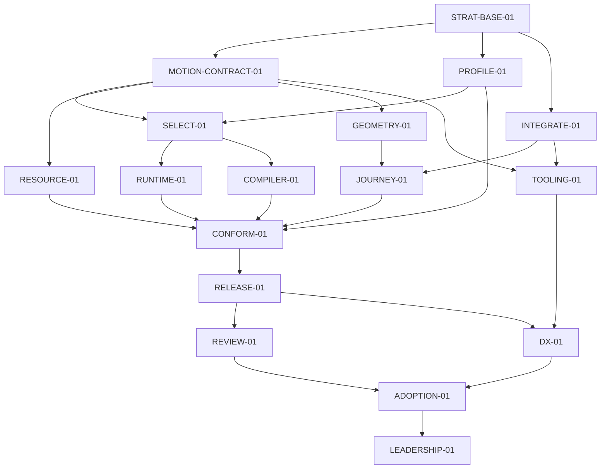

# Lab Motion — r12: воспроизводимая серверная приёмка

**Evidence cutoff:** `2026-10-01T02:18:39Z`; версии источников перечислены в §2.

**Diátaxis:** справочник. Формат и допуск — [SPEC](../SPEC.md) и
[PARALLEL](../PARALLEL.md). Пока `ACTIVE.md` указывает r11, этот документ —
подготовленный преемник, не разрешение исполнения или свидетельство завершения.
Действующий CLAIM и активация r11 этим файлом не меняются.

Английские заголовки разделов, `Node status`, поля `Evidence cutoff`, `Node`,
`Status`, `Exit evidence` и значения статусов заданы [SPEC](../SPEC.md) и
[парсером плана](../tools/plan-lint.mjs); они сохранены как поля формата.

## 0. Delta

Пользователь 2026-10-01 поручил полностью довести Lab Colors и Lab Motion по
планам до производственного качества и уточнил: Android недоступен, мощный
iPhone не представляет целевую нагрузку; нужен содержательный серверный аналог
проверки. r12 заменяет обязательный набор телефонов PROFILE-01 измерением
библиотеки и реальных браузерных потребителей на закреплённом Linux-сервере.
Покупка оборудования и использование телефона владельца не нужны этой приёмке.

Первый законченный результат — совместимый пакет для шести сценариев r11,
проверенные численные, ресурсные и размерные свойства и воспроизводимое сравнение
серверной стоимости. Полученные выводы относятся к зарегистрированным серверу,
браузерам, версиям и сценариям. Физическая частота экрана, автономность телефона,
тепловое поведение, человеческое предпочтение и рыночное лидерство не выводятся
из серверных результатов.

Выбран существующий путь: `bench/compare` владеет сравнением, статистикой,
семантическими контрольными сценариями и происхождением данных; `bench/profile`
связывает регистрацию, калибровку и результат. Старый размерный гейт остаётся
владельцем пределов. Второй стенд, уровень исполнения или параллельный решатель
не создаются. Сильная альтернатива — телефонная лаборатория — полезна для будущего
утверждения о мобильном устройстве, но не требуется серверной приёмке. Условие
пересмотра: нужно именно такое утверждение либо зарегистрированный стенд
не различает обязательное изменение стоимости.

### Сохранение обязательств

| Источник | Статус сохранения | Защищаемое свойство и доказательство |
|---|---|---|
| r11 §0/§4 и включённые r1–r10 | preserved | Все применимые API, контракты решателя, времени и владения, ABI компилятора, N/N−1, пределы, враждебные входы, повторный вход, завершение и численные контракты; прежний корпус остаётся обязательным |
| r11 M-01/M-02/M-03/M-06/M-07 | preserved | Шесть независимых потребителей, прежняя стоимость, устранение ненужного исполнения, ноль собственной покадровой работы нативного автономного участка, непрерывность и освобождение ресурсов |
| r11 M-04: физические Android/iOS и пропущенные кадры экрана | inapplicable-with-witness | Новая заказанная область — серверная. Проверяется время работы на сервере и своевременность изменения состояния; утверждение об экране или энергии остаётся недоказанным и переоткрывается отдельным требованием |
| r11 M-05 и G-PERF | preserved | Сопоставимая семантика, сильнейший участник сравнения, A/A, намеренное 2×work, статистика по независимым прогонам, все исходные данные, верхняя граница p95 ≤1,05; серверная область результата обозначается явно |
| r11 M-08…M-10, DX/ADOPTION/LEADERSHIP | preserved | Будущие утверждения о людях и реальном применении сохраняют собственные доказательства; они не подменяются агентом или сервером и уже в r11 не блокируют пригодный промежуточный пакет |
| r11 §5: все 17 Node ID и RELEASE-01 | preserved | RELEASE-01 предоставляет совместимый артефакт Lab UI/Icons, не обещание мирового лидерства; входящая ссылка Lab UI сохраняет смысл |
| r11 G-PLAN/G-DELIVERY и запрет продуктового merge/release | preserved | Новый указатель, CLAIM и активация — штатные отдельные переходы с проверками и рецензированием точного коммита; этот кандидат не разрешает merge/auto-merge, npm release или deploy |

## 1. Objective and acceptance

Потребитель получает один настоящий набор версий пакета и может применять движение
без компилятора, редактора и AI. Доменная логика приложения остаётся у приложения:
Motion владеет численным состоянием, временем и эффектом, а точки привязки, индекс,
принадлежность к бизнес-сущности и ощущение движения задаёт потребитель. Новое
частное поведение не подменяет общий закон передачи управления между живым
и нативным исполнением.

Инженерная приёмка готова, когда выполнены условия:

1. Два независимых потребителя каждого семейства r11 работают с одним tarball:
   карточка/подробности и панель/источник; список и сетка; sheet и pager.
   Изменение размера, направления и содержимого, RTL, фокус, клавиатура,
   reduced-motion, ошибки среды, повторный вход, прерывание и очистка при
   завершении различаются проверками.
2. Прежние публичные API, малые исполнители, полный граф и численные и ресурсные
   защиты сохранены. Nano ≤1024 B gzip, compiled runtime ≤341 B, Surface ≤1024 B,
   общий признанный compiled initial+total ≤5000 B. Все остальные действующие
   клетки берутся из `scripts/size-gate.mjs` и точной исходной версии, не из выбора
   меньшего удобного поднабора. CSS, данные и ленивые части входят в полный размер.
3. PROFILE-01 фиксирует до A/B версии исходников, сборки, файла зависимостей,
   инструментов и пакета, измерительную среду, сопоставимые нагрузки, независимые
   прогоны, числа наблюдений, seed, порядок, правило остановки, поправку на
   множественные проверки и пороги. Строка «N выберем позже» не готовый исполнимый
   профиль. Нулевой пилот имеет отдельный исходный источник; его результат
   не меняет порог кандидата.
4. На тех же нагрузках стенд проходит A/A и обнаруживает намеренное 2×work.
   Он сохраняет ошибки и исходные данные, отличает прошедшее время, время на вызов
   и делитель, устаревший источник, пропущенные наблюдения и несовпадение семантики.
   Невалидная калибровка даёт UNPROVEN соответствующей временной клетке,
   а не успешный допуск или NO-GO механизма.
5. CI точного источника, независимое рецензирование, настоящий tarball,
   экспорты, Node22/24, SSR/hydration и применимые потребители на фреймворках
   проходят. Завершение узла имеет конкретную идентичность доказательства;
   локальный GREEN не подменяет доставку.

### Измерения с конкретным решением

| ID | Серверная область и исход |
|---|---|
| M-01 | Все шесть пользовательских сценариев и старые сопоставимые нагрузки проходят без второго хранилища или движка и без роста защищённых клеток |
| M-02 | Контрольные сценарии статического, смешанного и динамического исполнения доказывают устранение ненужной работы и ABI; пределы tiny/compiled/union из условия 2 неизменны |
| M-03 | После нативной фиксации нет собственных обратных вызовов и выделений памяти; в покое нет таймеров или кадров Motion; изменённая семантическая роль действует, неизменная не перезапускается |
| M-04 | Реальная серверная работа 100 активных скалярных каналов и полных пользовательских сценариев: распределения начала, смены цели, обновления и завершения, стоимость обратных вызовов библиотеки и отдельно браузера, раскладки и отрисовки. Цель собственного p99 ≤0,5 ms/update сохраняется как серверная цель. Если наблюдение не разрешает p99 или отделение собственной работы, соответствующее утверждение UNPROVEN. 60/120 Hz задают только условные бюджеты 16,67/8,33 ms, не частоту физического экрана |
| M-05 | Две тяжёлые сцены разных семейств заранее закреплены. Цель верхней 95% границы candidate/best ≤0,50 по доминирующей устранимой стоимости; остальные защищённые клетки p95 имеют верхнюю границу ≤1,05. Нулевую стоимость исходного контрольного сценария не используют как делитель: сравниваются поведение и другая содержательная метрика |
| M-06 | Цель принимается до следующего доступного обновления; ноль устаревших эффектов после завершения; поддержанный полный вектор скорости и прежний независимый численный эталон. Цель 0,1 CSS px не ослабляет прежний принятый 0,25 CSS px |
| M-07 | 10 000 циклов создания, обновления, прерывания и освобождения: после границы завершения ноль эффектов, слушателей, заданий и ссылок на компоненты; удержанные байты в заранее закреплённой разрешимой области; GC только в отдельном доказательстве удержания памяти |
| M-08…M-10 | Человеческие показатели DX, изменения и предпочтения r11 остаются будущей приёмкой DX/LEADERSHIP; сервер их не оценивает |

Невыполненная цель выигрыша M-04/M-05 записывается как разрыв до целевого результата.
Пригодный пакет допускается по сохранённым контрактам и защитам как в r11;
сравнительный выигрыш и LEADERSHIP не объявляются. Регрессия защищённого свойства
блокирует пакет независимо от удобства API или других улучшений.

## 2. Facts / Evidence

| Факт на 2026-10-01 | Первичный источник | Следствие |
|---|---|---|
| Действующая r11 активна; PROFILE in progress, RESOURCE/JOURNEY ready | agents-config `aa868277c462ac033c255ea7c264a649ed3d0345`, ACTIVE/r11/CLAIM | Текущий допуск не переносится автоматически в r12 |
| Основная ветка Motion `0b6f537e148b7dadadfb9e3ce7c446d014975958` | Свежий клон и наблюдение основной ветки GitHub | Новый совмещённый набор версий проверяется отдельно |
| #454 `d20d0e42d66eec13668066cef244ccd88acdd611` измеряет old-vector, но aa/ab отвергает | `bench/profile/probe-profile-01.mjs`, неизменяемый коммит PR | Старый размерный результат не означает временную калибровку; нужно закончить существующий владеющий модуль |
| Старый PROFILE фиксирует часть MDE/N только строками, мобильные клетки остаются UNPROVEN | `bench/profile/profile-01-preregistration.mjs` того же коммита | Серверная регистрация должна стать исполнимым пакетом до наблюдений |
| Основной сравнивающий стенд уже имеет происхождение данных, статистику парных прогонов, контрольные сценарии и независимое воспроизведение | `bench/compare/*`, основная ветка `0b6f537e` | Эти владельцы используются повторно, их обязательные контрольные сценарии не удаляются |
| Новые фабрики поведения композитора #456 не приняты для merge | Draft #456, коммит `4cf175d3c9818f73339c2aae17cd790873ddb8f0` | Код кандидата изучается; общий скалярный владелец и рецепты потребителей предпочтительны; старый CI относится только к старому набору версий |

## 3. Assumptions

- **ASM-01:** зарегистрированная серверная среда различает исходный допуск p95
  5% и намеренное 2×work. Опровержение: калибровка не проходит. Меняется только
  доказанно неисправный измерительный путь, затем новая регистрация до A/B.
- **ASM-02:** одна семантика нагрузки достижима у сравниваемых участников.
  Опровержение: контрольный сценарий не сохраняет жизненный цикл, прерывание
  или геометрию; клетка исключается из сравнительного утверждения с конкретным
  свидетелем, не выигрывается более слабым поведением.
- **ASM-03:** общий существующий решатель/CompositorSpring достаточен передачи
  управления между живым и нативным исполнением двух независимых потребителей.
  Опровержение: контрпример вектора или владения; правится общий контракт,
  не вводится второй отслеживатель или хранилище.
- **ASM-04:** доказательство источника и среды остаётся действительным. Дрейф
  исходников, файла зависимостей, компилятора, браузера, CPU, квоты, нагрузки
  или режима измерения инвалидирует зависимые наблюдения. Серверный результат
  не переносится на другое оборудование по имени CPU.

## 4. Invariants

- **INV-01:** r11 §4 INV-01…INV-12 и их точные статусы сохранения обязательств
  предшественника сохранены во всей незаменённой области; номера r11 разрешаются
  вместе с ревизией.
- **INV-02:** один владелец чисел, времени и поверхности; сохранены целостная
  роль, конечность и знаковый ноль, защита от устаревания, повторного входа,
  ошибок среды и эффектов после завершения, различия данных, событий и геометрии.
- **INV-03:** ранние пределы действуют до обхода, чтения геттеров и эффектов среды;
  некорректный вход и отмена не оставляют ресурсов. Старые защиты не ослабляются.
- **INV-04:** происхождение данных связывает исходники, реальные байты tarball,
  нагрузку, среду и исходные данные. Отказ измерения сохраняется; чужой SHA,
  пропуск или повтор не становится PASS.
- **INV-05:** серверный CPU, прошедшее время по часам, отрисовка браузера, память, обратные
  вызовы, начальный и полный размер имеют разные делители. Все обязательные
  условия проверяются, улучшение одной метрики не компенсирует другую красную.
- **INV-06:** ограничение CPU не модель телефона. Программные часы не экран,
  заглушка Node не композитор браузера, трассировка не исследование с людьми,
  серверный WebKit не iOS.
- **INV-07:** исправный контрольный сценарий достижим; намеренный дефект различается.
  Плохая калибровка не лечится повтором до успеха, повышением допуска или таймаута.
- **INV-08:** текущее исполнение r11, CLAIM, разрешения, чужие ссылки Git и main
  не меняются публикацией кандидата r12; продуктовый merge/release/deploy
  требует адресного допуска.

## 5. DAG

Сохранён причинный граф r11. PROFILE теперь выпускает серверный набор версий
протокола; независимые RESOURCE/JOURNEY и изолированная подготовка продолжаются.
Физическое оборудование и человеческая выборка не являются предусловиями
инженерного пакета.

### Node status

Новые результаты этой публикацией не присваиваются. Завершённые узлы сохраняют
прежние идентичности в своей доказанной области. Новый PROFILE ready означает
возможность получить отдельный допуск после штатной активации r12, не перенос
действующего исполнения PROFILE из r11.

| Node | Status | Exit evidence |
|---|---|---|
| STRAT-BASE-01 | done | 7cac8d3ecb26e05acc4de10555a8e3ee6849edec |
| MOTION-CONTRACT-01 | done | 7fe1dd1c4c58d0bfa674fd1a10cd9705b8fa7947 |
| PROFILE-01 | ready | Исполнимая серверная регистрация и сохранённый old-vector; точные версии источника, сервера и браузера; A/A и намеренное 2×work, независимое воспроизведение и затронутые клетки |
| INTEGRATE-01 | done | 257d2b7b93397e79dcb2a2891fada4c39e8db15b |
| SELECT-01 | blocked by PROFILE-01 | Пререгистрированное решение удалить, переиспользовать или специализировать; сопоставимые контрольные сценарии, опровержение, измеримая полная цена; разрыв до цели не подменяет регрессию |
| RUNTIME-01 | blocked by SELECT-01 | Общий владелец чисел и времени и передача управления между живым и нативным исполнением без второго уровня исполнения или хранилища; сохранённый оптимизированный вектор потребителя |
| COMPILER-01 | blocked by SELECT-01 | Статическое, смешанное и динамическое понижение, устранение ненужного исполнения, порядок вычислений, ошибки, source-map, частный ABI и все старые бюджеты |
| RESOURCE-01 | ready | Ранние пределы, враждебные входы, модели, фаззинг и мутационные проверки, удержание ресурсов после завершения в настоящем пакете и нативное/GPU владение в доступной области |
| GEOMETRY-01 | done | 82249006ff37d01f823572c1b559e50de76f3e7f |
| JOURNEY-01 | ready | Шесть независимых потребителей настоящего tarball трёх семейств и все применимые контрольные сценарии прерывания, содержимого, размера, RTL, фокуса, reduced-motion и no-motion |
| CONFORM-01 | blocked by RUNTIME-01, COMPILER-01, RESOURCE-01, JOURNEY-01, PROFILE-01 | Совмещённый набор версий проходит семантические, численные, браузерные, визуальные, ресурсные и прежние стоимостные защиты; M-01…M-07 содержат результат или точный разрыв до цели |
| RELEASE-01 | blocked by CONFORM-01 | Настоящий tarball, экспорты, Node22/24/N/N−1, набор версий исполнения и компилятора, проверенная документация и пригодный результат для потребителя; без автоматического publish/deploy |
| REVIEW-01 | blocked by RELEASE-01 | Независимые вердикты по числам, API, производительности и последствиям второго порядка для точного набора версий, честные пределы утверждений; при невалидном ASM пересмотр затронутых последующих узлов |
| TOOLING-01 | done | [Интеграция #440 → #441](evidence/source-integration-20260928.md) |
| DX-01 | blocked by RELEASE-01 | Пререгистрированные независимые человеческие/AI группы и слепые визуальные задания r11; все отказы и контрольные сценарии no-motion; M-08…M-10 |
| ADOPTION-01 | blocked by REVIEW-01, DX-01 | Три реальные производственные приложения, два внешних потребителя, три минорных выпуска и история миграции, безопасности и отката r11 |
| LEADERSHIP-01 | blocked by ADOPTION-01 | Все применимые M-01…M-10 одновременно доказаны в объявленной области; контрольные сценарии сильнейшего участника сравнения и прежнего Lab |

### Исполнимые пакеты и необходимые рёбра

PROFILE читает исходники, исходную версию сравнения и измерительный контракт,
пишет только существующие владеющие модули bench/profile и доказательства.
До наблюдений закрепляет архитектуру CPU, модель и топологию, квоту и cpuset,
ОС и ядро, сборки Node, инструментов и браузеров, режим, viewport/DPR и содержимое,
политику питания и нагрузки и часы. Изоляция и наблюдаемая нагрузка проверяются
до допуска. Неизвестное число наблюдений или некалиброванная временная клетка
не выпускает временной допуск. Стабильный краткий свидетель и хеши исходных
данных сохраняются так, чтобы срок хранения Actions не удалял единственное
доказательство.

SELECT получает PROFILE, потому что без достаточной разрешимости измерения
выбор по стоимости случаен; подготовка альтернатив доступна заранее. RUNTIME
и COMPILER получают выбранный пакет с контрактом и опровержением, а RESOURCE/JOURNEY
не зависят от численного сравнительного выигрыша. CONFORM требует все пять явных
условий, чтобы не потерять ресурсы, реальных потребителей или измеренный источник.
RELEASE получает совмещённый артефакт; DX/ADOPTION не блокируют его. Дрейф
исходников, нагрузки или среды инвалидирует только затронутые зависимости.

RUNTIME усиливает существующий CompositorSpring, решатель и базис; снимок
и скорость живого владельца передаются в тот же сериализованный артефакт.
Привязка, индекс и границы остаются у клиента. Компилятор сохраняет статическую,
смешанную и динамическую семантику и не вводит публичный IR/VM без доказанной
недостаточности существующего владельца. Каждый существенный пакет имеет исправный
контрольный сценарий, предметный RED, конечный исход отказа, отмены и повторного
входа и изолированное рецензирование точного источника. Восстановление — отмена
только своего эффекта и новое намерение с актуального владельца; устаревший
обратный вызов не может отменить или завершить новое движение.

## 6. Gates

- **G-PLAN:** кандидат r12 не меняет r11. Перед сменой действующей ревизии отдельно
  разрешаются текущий CLAIM, точные байты новой ревизии, входящие ссылки,
  обязательные проверки и рецензирование и штатные разрешение и активация по SPEC.
  Старые ревизии неизменны; генератор и проверка systemmap используются штатно.
- **G-CONTRACT:** старый независимый корпус численных проверок, проверок свойств и модельных
  проверок и исправные контрольные сценарии сохранены. RED должен обнаружить
  выбранный достижимый дефект, включая `throw undefined`, очистку соседних
  владельцев, передачу общего дескриптора и вложенное намерение.
- **G-PERF:** наследуется r11 G-PERF полностью в серверной области. Фиксируются
  порядок парных независимых прогонов, seed/N и правило остановки; семейное
  95% покрытие, A/A/2×work, сохранение отказов, отсутствие принудительной GC
  во временном измерении. Исполнитель не повышает прежнюю верхнюю границу p95
  1,05 и не подбирает порог после результатов.
- **G-COMPOSE:** обязательные Chromium/Firefox/WebKit, настоящий tarball, Node22/24,
  жизненный цикл vanilla/Solid/React, StrictMode/SSR/hydration, прежние Vue/Svelte,
  ShadowRoot, смена родителя, размера и доступность по области r11. Неустановленный
  браузер не считается прошедшим; отрисовщик/DPR и визуальный эталон фиксируются.
- **G-DELIVERY:** действующий граф CI точного коммита, все обязательные проверки,
  независимые оси корректности и последствий второго порядка и содержательный
  CodeRabbit, где подключён; ограничение частоты не рецензирование. Изолированный
  commit/PR не main/release.
- **G-FIELD:** r11 G-DX и ADOPTION сохранены для заявленных результатов людей
  и реального применения. Для инженерного пакета требуется открытая честная
  граница их отсутствия; чужая выборка, агентский рассказ и серверное измерение
  их не заменяют.

## 7. Rollback

Непринятый кандидат откатывается в собственной ветке по принадлежащим ей путям
или через revert; чужие worktrees, ссылки Git, PR и основной код сохраняются.
До переключения ACTIVE r11 остаётся действующей. Ошибка нового источника или
измерения сохраняет исходные данные и блокирует только затронутое утверждение.
Принятый впоследствии продуктовый коммит откатывается отдельным защищённым
revert PR с полным затронутым CI и N/N−1. Установленный набор версий пакета,
исполнения и компилятора возвращается прежним файлом зависимостей; существующая
версия не перепубликовывается. Отмена живого или нативного исполнения проверяет
фактического владельца: таймаут или потерянный ACK не удостоверяет откат.

## 8. Smells / CAPA

| Важность | Нарушение | Различающая защита |
|---|---|---|
| Критично | Сервер назван телефоном либо симулированный шаг — кадром экрана | Явная область и схема результата, отдельные часы и делители |
| Критично | Old-vector, хеш или количество названы временным допуском | A/A, 2×work и независимое воспроизведение настоящих наблюдений |
| Критично | Ускорение скрывает потерянную скорость, устаревший эффект или более слабого участника сравнения | Сопоставимые проверки прерывания, эталон и исправные контрольные сценарии до временного допуска |
| Критично | Прежние байты, пределы или NI выросли ради удобного GREEN | Полный неизменённый вектор защит, ранний враждебный свидетель и проверка, связанная с источником |
| Высоко | Частная фабрика или хранилище выбраны вместо общего скалярного владельца | Два независимых потребителя через один численный механизм и механизм жизненного цикла |
| Высоко | Отказ контрольного сценария повторяется до успеха | Исходные данные сохранены; именованный дефект измерения и новая пререгистрация |
| Высоко | Люди, применение или лидерство закрыты результатом серверного CI | Отдельные доказательства реального применения и незавершённые DX/ADOPTION/LEADERSHIP |

## 9. Unknowns

- Серверный измерительный пакет и его калибровка ещё должны получить рецензирование
  точного источника и квитанции прогонов. #454 old-vector не закрывает этот вопрос.
  Временной допуск выдаётся только в реально разрешённой клетке.
- Общая передача live→native управления, совмещённые проверки удержания ресурсов
  и пользовательских сценариев и эквивалентность компилятора требуют подтверждения
  нового совмещённого пакета. Старые изолированные PR не сумма доказательств.
- M-04/M-05 сравнительное преимущество неизвестно до зарегистрированного опыта;
  недостигнутый выигрыш не скрывается пригодностью промежуточного артефакта.
- Утверждения об экране, энергии и тепловом поведении телефона вне серверной приёмки;
  их будущий запрос потребует подходящих устройств и доказательств в отдельной области.
- Человеческий DX, предпочтения, реальные производственные приложения, внешние
  потребители и история выпусков остаются неполученными до соответствующих
  первичных данных.
- Source merge/npm release/deploy не разрешены этой ревизией. Публикация
  и активация r12 требуют штатных переходов после разрешения текущего CLAIM.
