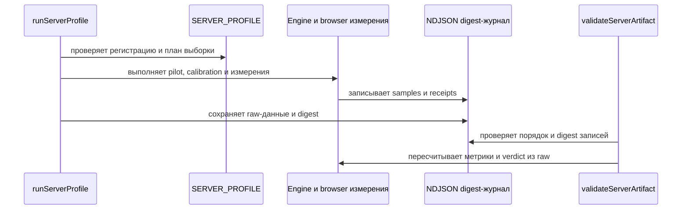

<!-- This is an auto-generated comment: summarize by coderabbit.ai -->
<!-- review_stack_entry_start -->

Navigate logical layers of code changes, visualize relationships, and explore their blast radius.

<!-- review_stack_entry_end -->
<!-- recent_review_start -->

No actionable comments were generated in the recent review. 🎉

ℹ️ Recent review info

⚙️ Run configuration

**Configuration used**: Organization UI

**Review profile**: ASSERTIVE

**Plan**: Team

**Run ID**: `ddaf04de-6d07-4911-bc0b-af3ea0ca94eb`

📥 Commits

Reviewing files that changed from the base of the PR and between 185f02c2a85972a531627e14b7e0207e27855f95 and 088fbc605c95fd6a6a7620301a450d6388386997.

📒 Files selected for processing (13)

* `bench/profile/native-clock/LICENSE`
* `bench/profile/native-clock/README.md`
* `bench/profile/native-clock/include/js_native_api.h`
* `bench/profile/native-clock/include/js_native_api_types.h`
* `bench/profile/native-clock/include/node_api.h`
* `bench/profile/native-clock/include/node_api_types.h`
* `bench/profile/server-profile-contract.mjs`
* `bench/profile/server-profile-registration.mjs`
* `bench/profile/server-profile-runner.mjs`
* `bench/profile/server-thread-cpu-clock.c`
* `bench/profile/server-thread-cpu-clock.mjs`
* `docs/server-profile.md`
* `test/server-profile-contract.test.ts`

**Included review availability:** This review used your included allowance. 0 included reviews remain after this review. Your included PR review attempts over the past 7 days set your current allowance at 1 review per hour.

---

<!-- recent_review_end -->
<!-- walkthrough_start -->

📝 Walkthrough

## Walkthrough

Изменения охватывают жизненный цикл `MotionValue` и behaviors, передачу анимации между live- и compositor-режимами, сборку browser-рецептов из production tarball и проверки benchmark-данных. Добавлены ручной PROFILE-01, серверный профиль измерений и проверка суммарного лимита строк wire-формата.

### Changes

**Жизненный цикл анимаций и compositor handoff**

|Layer / File(s)|Summary|
|---|---|
|**Владение MotionValue и behaviors**   `src/motion-value.ts`, `src/behaviors/index.ts`, `src/internal/motion-defaults.ts`, `src/tokens/index.ts`, `test/motion-value-*.test.ts`, `test/behaviors-*.test.ts`, `test/fixtures/resource-package-probe.mjs`, `test/resource-actual-package-retention.test.ts`, `CHANGELOG.md`, `README.md`|После `destroy()` вызовы `MotionValue` становятся no-op. Общая база behaviors управляет runner, подписчиками и callback. Общие дефолты пружин используются behaviors и токенами; добавлены проверки terminal-состояний и retention для установленного пакета.|
|**Передача live-анимации compositor**   `src/compositor/core.ts`, `src/compositor/sample.ts`, `test/compositor-return-to-native.test.ts`, `docs/compositor.md`, `CHANGELOG.md`|Добавлен `handoffToCompositor`. Контроллер использует значение и скорость live-владельца для native successor. После commit он освобождает donor; при неподдержанном пути сохраняет live-анимацию.|
|**Проверки compositor в браузере**   `browser/resource-actual-package.spec.ts`|Добавлены 10 000 циклов start, retarget и handoff для `CompositorSpring` из собранного пакета. Проверяются terminal-состояние и оставшиеся native effects.|

**PROFILE-01: базовый size-вектор**

|Layer / File(s)|Summary|
|---|---|
|**Регистрация протокола и Git provenance**   `bench/profile/profile-01-preregistration.mjs`, `bench/profile/profile-git-proof.mjs`, `test/profile-measurement.test.ts`|Добавлены замороженная регистрация PROFILE_01, digest, проверка полного совпадения протокола и Git-доказательства checkout.|
|**Измерение и проверка артефакта**   `bench/profile/probe-profile-01.mjs`, `bench/profile/profile-measurement.mjs`, `bench/profile/validate-profile-01.mjs`, `test/profile-measurement.test.ts`|Добавлены измерение old-vector, replay-проверка и fail-closed валидация raw-артефакта.|
|**Ручной CI запуск**   `.github/workflows/ci.yml`, `.github/workflows/profile-01.yml`, `test/ci-workflow-contract.test.ts`|Добавлены ручной вход `profile_baseline` и условный запуск workflow. Workflow проверяет измерение и validator, затем публикует raw-артефакт, в том числе после отказа.|

**Серверный профиль измерений**

|Layer / File(s)|Summary|
|---|---|
|**Регистрация, часы и план выборки**   `bench/profile/server-profile-registration.mjs`, `bench/profile/server-thread-cpu-clock.*`, `bench/profile/native-clock/*`, `docs/server-profile.md`, `test/server-profile-contract.test.ts`|Добавлены регистрация `SERVER_PROFILE`, модель часов, native CPU getter и правила планирования выборки. Документация описывает условия измерения и области `UNPROVEN`.|
|**Runner и измерительные стадии**   `bench/profile/server-profile-runner.mjs`, `bench/profile/server-profile-retention.mjs`, `docs/server-profile.md`, `test/server-profile-contract.test.ts`|Runner проверяет ресурсы и provenance, выполняет engine- и browser-измерения, controls и отдельную retention-проверку. Ошибки и доступные частичные данные сохраняются.|
|**Проверка samples, артефакта и журнала**   `bench/profile/server-profile-contract.mjs`, `docs/server-profile.md`, `test/server-profile-contract.test.ts`|Контракт проверяет raw-данные, clock и semantic witnesses, расчёты, provenance и digest-журнал. Добавлены потоковые сериализация и разбор крупных артефактов.|

**Benchmark-свидетельства и методология**

|Layer / File(s)|Summary|
|---|---|
|**Onset, checkpoints и статистические границы**   `bench/compare/bench.mjs`, `bench/compare/methodology.mjs`, `test/benchmark-methodology.test.ts`, `test/benchmark-report-contract.test.ts`, `test/server-profile-contract.test.ts`|Семантические проверки собирают onset и несколько временных checkpoints. Добавлены проверка stock C batch, RLE-компактация и точные биномиальные границы.|
|**Lifecycle raw-трассы и benchmark runner**   `scripts/bench-transform-support.mjs`, `scripts/bench-support.mjs`, `scripts/bench.mjs`, `test/bench-transform-pair.test.ts`|Замеры сохраняют временные интервалы, scheduler timeline и CSS-трассы. Валидатор повторно проверяет raw-данные и сохраняет сведения об ошибках измерения и очистки. Сценарий `MotionValue` использует общий benchmark helper.|

**Browser-рецепты из npm tarball**

|Layer / File(s)|Summary|
|---|---|
|**Упаковка и сборка recipe-пакета**   `browser/fixtures/scope-recipes.mjs`, `browser/fixtures/packed-recipes.d.ts`, `browser/fixtures/compile-artifacts.mjs`, `browser/fixtures/reorder-recipe.mjs`, `tsconfig.browser.json`, `test/animate-scope-recipes.test.ts`|Сборка проверяет npm tarball и использует распакованный пакет для browser и SSR bundle. Добавлены recipe-экспорты, гидратация и объявления типов artifact-импортов.|
|**Рецепты и browser-сценарии**   `docs/recipes.md`, `browser/compositor-recipes.spec.ts`, `browser/journey-live-view.spec.ts`, `browser/presence-transition.spec.ts`, `browser/reorder.spec.ts`, `test/journey-package-consumers.test.ts`|Добавлены sheet и pager-рецепты. Browser-сценарии используют scope-recipes artifact; проверки охватывают взаимодействия, фокус, reduced motion и lifecycle.|

**Лимит строк wire-формата**

|Layer / File(s)|Summary|
|---|---|
|**Проверка бюджета строк**   `scripts/motion-program-wire.ts`, `test/motion-program-wire-v1.test.ts`|Декодер ограничивает суммарное число UTF-16 code units. Тесты проверяют превышение лимита и допустимое граничное значение.|

<!-- change_assessment_start -->
**Priority:** ➖ Normal

**Estimated code review effort:** 5 (Critical) | ~120 minutes

<!-- change_assessment_commit:"088fbc605c95fd6a6a7620301a450d6388386997" -->

<!-- change_assessment_end -->

### Sequence Diagram(s)

<!-- walkthrough_end -->
<!-- final_review_risk_start -->
**Merge Risk:** _⚪ Minimal_ · up to `088fb`
<!-- final_review_risk_coverage:{"sourceCommitId":"088fbc605c95fd6a6a7620301a450d6388386997","coveredCommitId":"088fbc605c95fd6a6a7620301a450d6388386997","kind":"reviewed"} -->

The changes add a private server measurement profile, a native CPU clock getter, and contract validation. No outstanding defects affecting the library's runtime behavior were found. The known environment preconditions are checked before measurement starts.
<!-- final_review_risk_end -->
<!-- pre_merge_checks_walkthrough_start -->

---

<!-- pre_merge_checks_override_start -->
> [!CAUTION]
> ## Pre-merge checks failed
> 
> Please resolve all errors before merging. Addressing warnings is optional.
> 
> - [ ] <!-- {"checkboxId":"override-pre-merge-checks"} --> Ignore
<!-- pre_merge_checks_override_end -->

### ❌ Failed checks (1 error, 2 warnings)

|               Check name              | Status     | Explanation                                                                                                                                                                                               | Resolution                                                                                                                                                                                                                                        |
| :-----------------------------------: | :--------- | :-------------------------------------------------------------------------------------------------------------------------------------------------------------------------------------------------------- | :------------------------------------------------------------------------------------------------------------------------------------------------------------------------------------------------------------------------------------------------ |
|      краткие русские документации     | ❌ Error    | Документация не соответствует требованию русского и краткого изложения. Новые `docs/server-profile.md` и `bench/profile/native-clock/README.md` содержат много английской прозы: `parallel suites`, `leg… | Переписать добавленные пояснения на русском языке. Оставить английскими только идентификаторы, команды и общепринятые технические термины. Исправить пробелы и единообразно оформить единицы измерения. Сократить `docs/server-profile.md` до пр… |
|              архитектура              | ⚠️ Warning | Внесено нарушение границы ядра в новом `bench/profile/server-profile-contract.mjs`. Один модуль объединяет чистую проверку профиля и статистику с хранением и транспортом: импортирует `node:fs`, `node:… | Разделить pure contract и внешний адаптер. Оставить в `server-profile-contract.mjs` только типизированные значения профиля, чистые проверки, статистику и сериализацию в канонические chunks/bytes без `node:fs`, `node:path`, `process` и CLI. … |
| промежуточные документы (напр. планы) | ⚠️ Warning | PR добавляет промежуточную документацию в репозиторий продукта. `docs/server-profile.md` описывает внутренний PROFILE-01: pilot, A/A, A/B, preregistration, admission, resource controls, raw-артефакты … | Удалить `docs/server-profile.md` и `bench/profile/native-clock/README.md` из репозитория продукта и перенести их в `agents-config` как единственную точку истины для PROFILE-01 и исследовательских материалов. Провести инвентаризацию связанны… |

✅ Passed checks (6 passed)

|         Check name         | Status   | Explanation                                                                                                                                                                                               |
| :------------------------: | :------- | :-------------------------------------------------------------------------------------------------------------------------------------------------------------------------------------------------------- |
|     Linked Issues check    | ✅ Passed | Check skipped because no linked issues were found for this pull request.                                                                                                                                  |
| Out of Scope Changes check | ✅ Passed | Check skipped because no linked issues were found for this pull request.                                                                                                                                  |
|          Diataxis          | ✅ Passed | PASS. Изменённая документация классифицирована по Diátaxis: `docs/recipes.md` обозначен как практика, `docs/compositor.md`, `docs/server-profile.md` и `bench/profile/native-clock/README.md` — как спра… |
|            тесты           | ✅ Passed | Тесты покрывают классы, а не один сценарий. `test/behaviors-late-callback-owner.test.ts` проверяет Dismiss и Pull в обычном и reduced-режимах, включая `destroy`, `cancel`, getter reentry и `this`. Сущ… |
|         Title check        | ✅ Passed | Заголовок написан на русском языке и точно отражает ключевые изменения: сохранение владения движением и проверку полной стоимости MotionValue.                                                            |
|      Description check     | ✅ Passed | Описание подробно раскрывает пользовательский результат, контракт, архитектуру, производительность, доказательства, ограничения и текущие незавершённые проверки. Формат шаблона и отдельные чекбоксы не… |

Full details: краткие русские документации

**Explanation**

Документация не соответствует требованию русского и краткого изложения. Новые `docs/server-profile.md` и `bench/profile/native-clock/README.md` содержат много английской прозы: `parallel suites`, `legacy engine`, `browser scenes`, `Exact SHA256`, `actual binary`, `Forced GC`. В `docs/server-profile.md` также есть плотные записи без пробелов: `содержит11`, `экран60/120Гц`, `N292…1024`, `2×2000`. `docs/recipes.md` дополнена 306 строками, включая два больших вручную поддерживаемых рецепта. При этом extraction pipeline синхронизирует только исполняемые блоки, а не поясняющий текст.

**Resolution**

Переписать добавленные пояснения на русском языке. Оставить английскими только идентификаторы, команды и общепринятые технические термины. Исправить пробелы и единообразно оформить единицы измерения. Сократить `docs/server-profile.md` до процедуры, ограничений и ссылок на `SERVER_PROFILE`; числовые параметры генерировать из кода. В `docs/recipes.md` оставить минимальные runnable-примеры и краткие пояснения.

Full details: архитектура

**Explanation**

Внесено нарушение границы ядра в новом `bench/profile/server-profile-contract.mjs`. Один модуль объединяет чистую проверку профиля и статистику с хранением и транспортом: импортирует `node:fs`, `node:path`, `node:url`, имеет `writeServerArtifact`, `parseServerJsonBytes`, `parseServerJournalBytes` и исполняет CLI через `process.argv`/`process.stdout`. `server-profile-runner.mjs` напрямую импортирует из этого модуля и валидаторы, и файловый writer. Поэтому контракт профиля знает о storage/CLI, а внешний эффект не находится на краю. Дополнительно модуль принимает сырые объекты и проверяет их через `invariant`, который выбрасывает обычный `Error`, вместо типизированного результата разбора. Файл добавлен этим PR, поэтому нарушение имеет прямую причинность.

**Resolution**

Разделить pure contract и внешний адаптер. Оставить в `server-profile-contract.mjs` только типизированные значения профиля, чистые проверки, статистику и сериализацию в канонические chunks/bytes без `node:fs`, `node:path`, `process` и CLI. Вынести `writeServerArtifact`, чтение файлов, NDJSON/JSON carrier и CLI в отдельный `server-profile-artifact-io.mjs` или в validator/runner. На границе выполнить parse в явный типизированный carrier и возвращать типизированные ошибки разбора; не передавать сырые частично проверенные объекты в чистые функции. Передавать writer/reader через простой интерфейс или вызывать адаптер только из runner и CLI.

Full details: промежуточные документы (напр. планы)

**Explanation**

PR добавляет промежуточную документацию в репозиторий продукта. `docs/server-profile.md` описывает внутренний PROFILE-01: pilot, A/A, A/B, preregistration, admission, resource controls, raw-артефакты и исторические exploratory-данные. Это документация исследовательской и измерительной работы, а не документация публичного продукта. Пометка `Роль: справка (Diátaxis)` не меняет содержание. `bench/profile/native-clock/README.md` также описывает внутренний CPU getter и его сборку для `server-profile`. В отличие от этого, изменённые `docs/compositor.md` и `docs/recipes.md` содержат продуктовый reference и runnable-рецепты. Нарушение внесено изменениями PR: оба внутренних документа добавлены в диапазоне review.

**Resolution**

Удалить `docs/server-profile.md` и `bench/profile/native-clock/README.md` из репозитория продукта и перенести их в `agents-config` как единственную точку истины для PROFILE-01 и исследовательских материалов. Провести инвентаризацию связанных benchmark/profile-документов и перенести в `agents-config` все документы о preregistration, pilot, A/A/A/B, admission, raw-артефактах и внутренних измерениях. В репозитории продукта оставить только окончательную документацию самого API в подходящих категориях Diátaxis; при необходимости добавить ссылку на внешний документ без дублирования его содержания.

<!-- pre_merge_checks_walkthrough_end -->

- [ ] <!-- {"checkboxId":"585bb3f6-faf5-4dbf-96d2-74e382adf19a"} --> Fix all pre-merge checks with AI
<!-- finishing_touch_checkbox_start -->

✨ Finishing Touches

📝 Generate docstrings

- [ ] <!-- {"checkboxId":"3e1879ae-f29b-4d0d-8e06-d12b7ba33d98"} --> Commit to this branch
- [ ] <!-- {"checkboxId":"7962f53c-55bc-4827-bfbf-6a18da830691"} --> Create a new PR

🧪 Generate unit tests (beta)

- [ ] <!-- {"checkboxId": "6ba7b810-9dad-11d1-80b4-00c04fd430c8", "radioGroupId": "utg-output-choice-group-unknown_comment_id"} --> Commit to this branch
- [ ] <!-- {"checkboxId": "f47ac10b-58cc-4372-a567-0e02b2c3d479", "radioGroupId": "utg-output-choice-group-unknown_comment_id"} --> Create a new PR

<!-- finishing_touch_checkbox_end -->

<!-- autopilot:start -->
- [ ] <!-- {"checkboxId":"2708ad07-9f24-4260-9c11-7dc76a49f2e3"} --> <strong title="Keep fixing CodeRabbit findings and required CI, and resolving merge conflicts">Autopilot</strong> · Keep fixing CodeRabbit findings and required CI, and resolving merge conflicts

> Autopilot is currently an internal CodeRabbit preview.
<!-- autopilot:end -->
<!-- tips_start -->

---

Comment `@coderabbitai help` to get the list of available commands.

<!-- tips_end -->