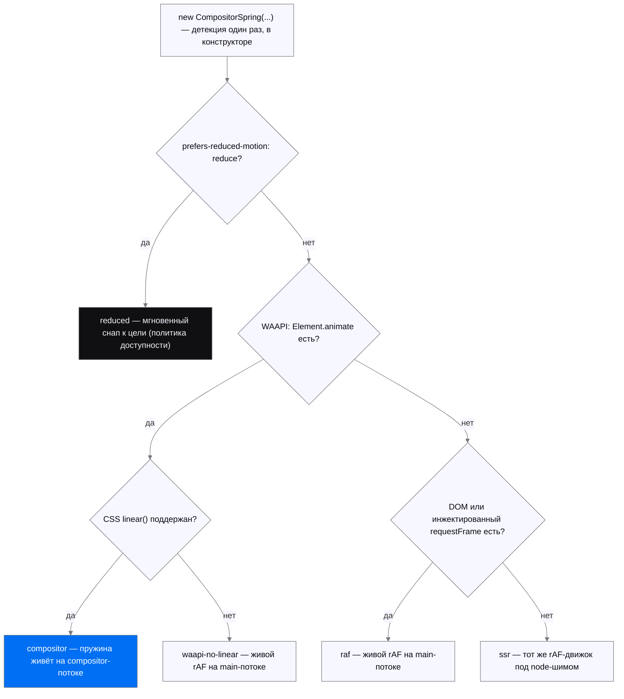

# @labpics/motion

Headless-движок анимаций дизайн-системы Labpics: чистая математика движения
(пружины, кадры, тайминги) **без единой runtime-зависимости**. Ядро не знает про
DOM — рендер делает ваш колбэк, время приходит через инжектируемый `requestFrame`.

Три вещи, которые нужно понять сразу:

1. **Всё — субпути.** Корневой экспорт + 31 субпуть (`exports` в `package.json`);
   в бандл попадает только импортированное (`sideEffects: false`).
2. **Две фазы движения.** Интерактив и follow-фаза (палец ведёт значение) — на
   main-потоке (`MotionValue`, `drive`, `…/gestures`). Автономные переходы и
   release-фаза — compositor-путь (`…/compositor`, `…/waapi`): пружина
   компилируется в CSS `linear()` и живёт на compositor-потоке, main-поток не
   будится до завершения. Подробно — в разделе «Compositor-путь».
3. **Гарантии запечатаны тестами.** `NaN`/`Infinity` никогда не попадают в CSS
   (fuzz-гейты в CI), `prefers-reduced-motion` меняет ХАРАКТЕР движения, а не
   выключает его грубо, публичная поверхность запинена api-surface тестами.

## Установка

Пакет пока не опубликован в npm (публикация — отдельное решение). До этого —
установка из тарбола (git-install не поддержан: `dist/` собирается, в гите его нет):

```bash
cd lab-motion && pnpm build && pnpm pack   # → labpics-motion-<версия>.tgz
cd ваш-проект && pnpm add /путь/к/labpics-motion-<версия>.tgz
```

Требования: Node ≥ 18. Runtime-зависимостей нет; фреймворк для биндинга — optional
peer, ставится у потребителя (peer объявлены для 8 фреймворков; `./wc` не требует
ничего). Целостность артефакта проверяет `pnpm pack:smoke`: тарбол → чистый
проект → импорт всех субпутей.

## Быстрый старт

### Пружина к значению (ядро)

```typescript
import { MotionValue } from '@labpics/motion';

const x = new MotionValue({ initial: 0, spring: { mass: 1, stiffness: 200, damping: 20 } });
x.onChange((v) => { el.style.transform = `translateX(${v}px)`; });
x.setTarget(240);   // плавно едем; повторный setTarget подхватит скорость без рывка
```

### Управляемая анимация (scrub)

```typescript
import { createDriver } from '@labpics/motion/driver';

const anim = createDriver({ from: 0, to: 1, spring: { mass: 1, stiffness: 200, damping: 24 },
  onStep: (v) => { el.style.opacity = String(v); } });
anim.pause();
anim.seek(0.5);
await anim; // thenable
```

### Автономный переход на compositor-потоке

```typescript
import { CompositorSpring, compileSpringLinear } from '@labpics/motion/compositor';

// Чистый компилятор (SSR-safe): пружина → адаптивный CSS linear().
const easing = compileSpringLinear({ mass: 1, stiffness: 170, damping: 26 });
el.style.transition = `transform 0.9s ${easing}`;

// Контроллер: коммитит план в Element.animate(); без WAAPI — байт-паритетный
// main-thread fallback. Подробности и fallback-матрица — ниже.
const panel = new CompositorSpring({
  spring: { mass: 1, stiffness: 170, damping: 26 },
  property: 'transform', from: 0, to: 240,
  target: el, format: (v) => `translateX(${v}px)`,
  apply: (val) => { el.style.transform = String(val); }, // только на fallback-пути
});
panel.start();
```

Больше примеров (drag, FLIP, presence, scroll-scrub, value-mapping) — в разделе
«Примеры» после карты субпутей.

## Как устроен движок

Слои снизу вверх: чистая физика не знает про DOM и фреймворки; значения гонят
драйверы на main-потоке через единый rAF-шедулер — либо пружина целиком уезжает
на compositor-поток (синий узел):


## Карта субпутей

Импорт — `@labpics/motion` (ядро) или `@labpics/motion/<субпуть>`.

**Ядро и управление**

| Импорт | Что даёт |
|---|---|
| `@labpics/motion` | `spring` (аналитический closed-form солвер), `tween`, `drive` (декларативный запуск), `MotionValue` (реактивное значение со smooth-pickup), `MotionParamError` |
| `…/driver` | Scrubbable-контроллер: `play/pause/reverse/seek/timeScale/progress` + thenable |
| `…/frame` | Единый frame-шедулер: `createFrameLoop` / синглтон `frame` — один rAF на кадр, фазы read→update→render против layout-thrash, SSR-safe; `asRequestFrame(loop)` сажает `MotionValue`/`drive` на общий кадр. **Биндинги используют его по умолчанию** (как shared-ticker у Framer Motion/GSAP); инжекция своего `requestFrame` переопределяет |

**Математика значений**

| Импорт | Что даёт |
|---|---|
| `…/easing` | Каталог кривых: named-кривые, `cubicBezier`, `steps`, кастомные функции |
| `…/value` | CSS-значения: парсинг/интерполяция единиц (px/%/deg/rem/vh), цветов (hex/rgb/hsl), transform-компонент, `var()`, относительных значений |
| `…/utils` | Value-mapping примитивы (headless-ядро Framer Motion / GSAP): `mapRange`, `interpolate` (N-стоповый маппер: клампинг, per-segment easing, кастомный `mixer`), `clamp`, `wrap`, `snap`, `mix`, `pipe`. Каррируемые config-first, финитность гарантирована |
| `…/spring` | Эргономика пружин: `fromBounce` (duration+bounce ∈ [−1,1], канон SwiftUI ⊇ Motion [0,1]), `fromVisualDuration`, `springPresets` (канон react-spring), `springAsEasing` |

**Композиция движения**

| Импорт | Что даёт |
|---|---|
| `…/keyframes` | Ключевые кадры: массивы, offsets, per-keyframe easing, repeat/reverse/yoyo |
| `…/timeline` | Оркестрация: `createTimeline` — сегменты, `seek/progress/totalDuration`, thenable |
| `…/stagger` | Каскадные задержки: списки и 2D-сетки, from/направления/easing |
| `…/decay` | Инерция: аналитическое затухание (drag-momentum, инерционный скролл) |
| `…/presets` | Словарь generic-движений «от смысла» (иконки): 10 фабрик (`pulse`, `blink`, `wiggle`, `spin`, `breathe`, `pop`, `bounceY`, `drift`, `fadeSlide`, `drawOn`), мультитрековые кейфреймы, `runPreset` с виртуальным временем, `presetToWaapi` |
| `…/svg` | SVG: `parsePath`/`pathLength`, draw-математика штриха (`drawPath`), движение вдоль пути (`createMotionPath`) |
| `…/svg-morph` | Морфинг путей: `interpolatePath(dFrom, dTo)` — точный режим при совпадающей структуре, ресэмплинг с выравниванием при разной |

**Взаимодействие и layout**

| Импорт | Что даёт |
|---|---|
| `…/gestures` | `createPress` (tap + клавиатурный путь Enter/Space), `createHover`, `createPan`, `createDrag` (границы + rubber-band + инерция + reduced-motion) |
| `…/scroll` | Прогресс страницы/target-с-офсетами (семантика Motion), in-view машина, скорость, scrub-клей к timeline |
| `…/presence` | Enter/exit lifecycle: «доиграй exit-анимацию → потом убирай из DOM», прерывания, `swapPresence` (wait/sync) |
| `…/flip` | Layout-анимация FLIP: инверсия first→last, пружинный «доезд», коррекция scale-искажений (`correctRadius`, `counterScale`) |
| `…/auto` | Zero-config FLIP: `autoAnimate(parent)` — add/remove/move детей анимируются сами; reduced-motion меняет характер (move→снап), не выключает |
| `…/a11y` | `createMotionConfig` — политика reduced-motion (`system`/`always`/`never`), меняет характер анимации, не выключает |

**Compositor-путь и токены** (подробно — в следующем разделе)

| Импорт | Что даёт |
|---|---|
| `…/waapi` | Низкоуровневый мост: `compileWaapi`/`animateWaapi` (кейфреймы движка → нативный `Element.animate`), `easingToLinear` (любой easing → CSS `linear()`), `supportsWaapi` |
| `…/compositor` | Compositor-компилятор пружин: `compileSpringLinear`, `CompositorSpring` (переход с ретаргетом и хендоффом), composited stagger, fallback-матрица. См. «Compositor-путь» |
| `…/tokens` | Motion-токены: `duration`, `easing`, `spring`, `staggerGap`, `distanceScale`. См. «Motion-токены» |

**Биндинги** (9; peer-фреймворк ставит потребитель)

| Импорт | Что даёт |
|---|---|
| `…/react` | `useSpring`, `useMotionValue` |
| `…/preact` | `useSpring`, `useMotionValue` (зеркало react-биндинга поверх `preact/hooks`) |
| `…/solid` | `createSpring`, `createMotionValue` (сигналы, авто-уборка через `onCleanup`) |
| `…/vue` | `useSpring`, `useMotionValue`, директива `vMotion` |
| `…/svelte` | `springStore` |
| `…/angular` | Angular (v16+): `injectSpring`, `injectMotionValue` (Signals + DestroyRef) |
| `…/qwik` | `useSpring` — управление сигналом `target` (резюм-safe), MotionValue = noSerialize, пересоздаётся на клиенте |
| `…/lit` | `MotionController` (ReactiveController), `LabMotionSpringElement` |
| `…/wc` | Vanilla web-component `<lab-spring>` без зависимостей — путь для Astro/Stencil/HTML-first стеков |

## Примеры

### Drag с инерцией

```typescript
import { createDrag } from '@labpics/motion/gestures';

const drag = createDrag({
  bounds: { x: { min: 0, max: 300 } },
  matchMedia: window.matchMedia.bind(window),
  requestFrame: requestAnimationFrame.bind(window),
  onStep: (x, y) => { el.style.transform = `translate(${x}px, ${y}px)`; },
});
el.addEventListener('pointerdown', (e) => {
  el.setPointerCapture(e.pointerId);
  drag.pointerDown({ x: e.clientX, y: e.clientY, t: e.timeStamp / 1000 });
});
el.addEventListener('pointermove', (e) => drag.pointerMove({ x: e.clientX, y: e.clientY, t: e.timeStamp / 1000 }));
el.addEventListener('pointerup', (e) => drag.pointerUp({ x: e.clientX, y: e.clientY, t: e.timeStamp / 1000 }));
```

### FLIP (layout-анимация)

```typescript
import { createFlip } from '@labpics/motion/flip';

const fl = createFlip({
  requestFrame: requestAnimationFrame.bind(window),
  onStep: (t) => { el.style.transform = `translate(${t.tx}px, ${t.ty}px) scale(${t.sx}, ${t.sy})`; },
  onRest: () => { el.style.transform = ''; },
});
const first = el.getBoundingClientRect();
// ... DOM переставлен (порядок/размер/класс изменился) ...
fl.play(first, el.getBoundingClientRect()); // элемент «доезжает» пружиной
```

### Появление/уход (presence)

```typescript
import { drive } from '@labpics/motion';
import { createPresence } from '@labpics/motion/presence';

const spring = { mass: 1, stiffness: 200, damping: 24 };
const p = createPresence({
  onExitStart: (done) => {
    drive({ from: 1, to: 0, spring, onStep: (v) => { el.style.opacity = String(v); } }).then(done);
  },
  onGone: () => el.remove(), // убрать из DOM только после exit-анимации
});
p.exit();
```

### Скролл-прогресс → таймлайн

```typescript
import { createScrollObserver, scrubBinding } from '@labpics/motion/scroll';
import { createTimeline } from '@labpics/motion/timeline';

const tl = createTimeline({ segments: [{ from: 0, to: 1, duration: 2 }] });
const observer = createScrollObserver({ onProgress: scrubBinding(tl) });
window.addEventListener('scroll', (e) => observer.update({
  pos: scrollY, contentLength: document.body.scrollHeight,
  viewportLength: innerHeight, t: e.timeStamp / 1000,
}));
```

### Value-mapping (utils)

```typescript
import { mapRange, interpolate, clamp, wrap, pipe } from '@labpics/motion/utils';

mapRange(0, 100, 0, 1, 50);              // 0.5 — ремап диапазона (канон GSAP mapRange)
const fade = interpolate([0, 100, 200], [0, 1, 0]); // N-стоповый маппер (канон Framer transform)
fade(50);                                // 0.5 — кусочно-линейно между стопами
const hue = wrap(0, 360);                // циклический wrap в полуинтервал [0, 360)
hue(370);                                // 10
const toProgress = pipe(clamp(0, 300), (x) => x / 300); // композиция слева-направо
```

## Compositor-путь

### Фазовая модель: когда какой путь

Путать фазы — класс дефекта:

- **Compositor (`…/compositor`, `…/waapi`)** — автономные переходы, settle и
  release-фаза жеста. Fire-and-forget: скомпилировать `linear()` →
  `Element.animate`. Пружина живёт на compositor-потоке (переживает фризы
  main-потока), main-поток не будится до завершения.
- **Main-поток (`drive` / `MotionValue` / `…/gestures`)** — интерактив и
  follow-фаза (палец ведёт значение, будущая траектория неизвестна).
- **Прерывание compositor-анимации** — редкое ONE-SHOT событие
  (`CompositorSpring.retarget`): cancel + аналитическое чтение (value, velocity) +
  новая кривая. **Непрерывный ретаргет каждый кадр (gesture-follow через
  cancel+re-emit) — задокументированный АНТИПАТТЕРН**: для follow берите main-поток.
- **`will-change`** — bounded-дисциплина у потребителя: включать точечно перед
  переходом и снимать после завершения, не «на всякий случай».

### CompositorSpring: ретаргет и хендофф

Публичный API один на всех тирах (см. fallback-матрицу ниже); гарантия
C¹-непрерывности (позиция И скорость без разрыва) — на любом пути.

```typescript
import { CompositorSpring } from '@labpics/motion/compositor';

const panel = new CompositorSpring({
  spring: { mass: 1, stiffness: 170, damping: 26 },
  property: 'transform', from: 0, to: 240,
  target: el, format: (v) => `translateX(${v}px)`,
  apply: (val) => { el.style.transform = String(val); }, // только на fallback-пути
});
panel.start();

// ДИСКРЕТНОЕ прерывание (смена цели): O(1) чтение value+velocity замкнутой формой
// (без getComputedStyle) → новая кривая с непрерывной скоростью (C¹).
panel.retarget(120);

// ХЕНДОФФ compositor→live: траектория перестала быть автономной (палец перехватил
// значение — follow-фаза). Снимок → живая rAF-пружина продолжает без разрыва.
const live = panel.handoffToLive();      // продолжить к текущей цели, ИЛИ
const live2 = panel.handoffToLive(300);  // сразу к новой цели с сохранённой скоростью
```

Число стопов `linear()`-кривой ВЫВОДИТСЯ из перцептивного бюджета ошибки
(критическая пружина ~32 стопа, bouncy ~69 — против фиксированных ~40–100 у
Motion/MDN). Компиляция кэшируется (`createSpringLinearCache`, LRU).

### Composited stagger (каскад группы)

Задержки каждого элемента — нативный WAAPI-`delay` поверх ОДНОЙ запечённой
`linear()`-кривой (общий LRU-кэш: идентичная пружина → cache hit). **Per-frame
cost каскада — ноль** (его гоняет браузер); стоимость планирования — одноразовая,
при `start()`.

```typescript
import { CompositorStaggerGroup, compileStaggerPlan } from '@labpics/motion/compositor';

// Чистый планировщик (SSR-safe): общая кривая + per-element задержки (headless).
const plan = compileStaggerPlan({
  spring: { mass: 1, stiffness: 170, damping: 26 },
  property: 'opacity', from: 0, to: 1,
  count: 5, gap: 40, staggerFrom: 'first',   // → delays [0, 40, 80, 120, 160] мс
});

// Контроллер группы: N целей делят кривую, каждый стартует со своей задержкой.
const list = new CompositorStaggerGroup({
  spring: { mass: 1, stiffness: 170, damping: 26 },
  property: 'transform', from: 24, to: 0,
  targets: rows,                              // N Element'ов; count = rows.length
  gap: 40, staggerFrom: 'center',
  format: (v) => `translateY(${v}px)`,
  apply: (i, v) => { rows[i].style.transform = String(v); }, // только fallback-путь
});
list.start();                                 // каскад: N Element.animate с delay[i]
```

Граница per-group vs per-element (честно): каскад (`start`) — per-GROUP (это и
есть composited-выигрыш); `retarget(i, to)` / `retargetAll(to)` — per-ELEMENT,
без пере-каскада (ретаргет — дискретное прерывание, не новый парад);
`handoffToLive(i, to?)` отдаёт ОДИН элемент в живую rAF-пружину, группового
хендоффа нет. Флаг `reducedMotion` схлопывает задержки в 0 — элементы анимируются,
но одновременно (character-switch, не hard-off).

### Fallback-матрица

`CompositorSpring` прозрачно деградирует: публичный API и C¹-гарантия одни и те
же на любом тире, меняется лишь движок под капотом. Детекция — один раз в
конструкторе (feature-detect без UA-снифинга; проба CSS `linear()` кэширована на
реалм). Фактический тир доступен как диагностическое поле `CompositorSpring.tier`.

Выбор тира — в порядке precedence: доступность (`reduced`) перекрывает любой
доступный движок, дальше решают WAAPI и CSS `linear()`:



| Тир | Условие | Движок / поведение | Что теряем |
|---|---|---|---|
| `compositor` | WAAPI + CSS `linear()` | План коммитится в `Element.animate()`; пружина живёт на compositor-потоке | — (полный путь) |
| `waapi-no-linear` | WAAPI есть, `linear()` нет (браузеры до 12.2023) | Живой rAF (`MotionValue`) на main-потоке — `linear()` не донёс бы пружинную кривую off-main | Off-main-thread резидентность: анимация чувствительна к фризам |
| `raf` | Нет `Element.animate` | Живой rAF (`MotionValue`) на main-потоке | То же, что выше |
| `reduced` | `prefers-reduced-motion: reduce` | **Мгновенный снап** к цели: значение эмитится один раз, без анимации | Всякое движение (осознанно — политика доступности) |
| `ssr` | Нет DOM и нет инжектированного `requestFrame` | Тот же rAF-движок под node-шимом; импорт и конструктор не трогают `window`/`document` | Off-main-thread; на сервере кадры не рисуются |

Честные границы: (1) все не-`compositor` тиры кроме `reduced` идут в ОДИН живой
rAF-движок — ярлыки различают ПРИЧИНУ (телеметрия), поведение идентично;
(2) детекция одноразовая — WAAPI/`linear()` за жизнь контроллера не
переопрашиваются; (3) на `waapi-no-linear`/`raf` анимация делит main-поток.

Политика reduced-motion — мгновенный снап к финальному значению, ЕДИНАЯ для всего
пакета (`drive`/`keyframes`/`presets` тоже резолвятся в финал сразу): один
характер, ноль дрифта. Детекция reduce — один раз на входе; смена системного
предпочтения в полёте не подхватывается.

Диагностика: `resolveCompositorTier({ target?, matchMedia?, requestFrame? })` —
узнать тир без конструирования контроллера; `supportsLinearEasing()` —
кэшированная проба `linear()`; `supportsCompositor(target?)` — булев предикат.

### Латентность (справочно)

`pnpm bench:latency`, main-thread, Node v24 — машинозависимо, гейтом НЕ является:

| путь | p50 | p95 | p99 |
|---|---|---|---|
| `readCompositorSpring` (аналитический снимок) | ~100 ns | ~200 ns | ~300 ns |
| `CompositorSpring.retarget` (read+cancel+рекомпиляция+re-emit) | ~20 µs | ~30 µs | ~54 µs |
| `handoffToLive` (снимок → live `MotionValue`) | ~200 ns | ~200 ns | ~200 ns |
| `CompositorSpring.handoffToLive` (полный) | ~300 ns | ~400 ns | ~700 ns |

Хендофф-p99 ≈ 0.02% кадра при 240 Hz; доминанта ретаргета — перекомпиляция кривой
(промах кэша при новой скорости). `compileStaggerPlan` p50 ≈ 14 µs и плоско по
N=10/50/200; `CompositorStaggerGroup.start` растёт линейно с N.

**Границы замера.** Стенд меряет ТОЛЬКО main-thread cost (Node, против `dist`).
Compositor-резидентность и input→photon **не наблюдаемы из JS** — достоверно
только реальным Chrome + tracing (`cc.animation` в DevTools Performance), вне
CI-скоупа.

**Почему ретаргет — не мутация `playbackRate`/`currentTime`** (гипотеза research,
опровергнута): по W3C Web Animations L1 (§4.4.4, §4.4.15) и MDN обе операции живут
в timing model и не трогают `KeyframeEffect` — `playbackRate` лишь скаляр скорости
вдоль запечённой кривой, `currentTime` — seek по ней. Ретаргет пружины требует
НОВОЙ точки равновесия и нового профиля скорости из текущих (pos, vel) — это новый
`KeyframeEffect`. Поэтому cancel + рекомпиляция через кэш + re-emit — необходимы,
а не упущенная оптимизация.

## Motion-токены

Типобезопасный словарь примитивов движения (`as const`, tree-shakeable по
семействам). Это ФУНДАМЕНТ, а не вся ДС: семантики ролей («кнопка-ховер») здесь
нет — роль→токен маппит потребитель (labui). Дефолты не кричащие (в духе Apple
spring-first / Fluent 2 / Material 3): критично-задемпфированные пружины и мягкие
изинги, bounce — opt-in. Значения запинены тестами как контракт.

```typescript
import { duration, easing, spring, staggerGap, distanceScale } from '@labpics/motion/tokens';

duration.normal;        // 250 (мс): дефолтный UI-переход
easing.entrance.css;    // 'cubic-bezier(0, 0, 0.2, 1)' — для CSS/WAAPI/compositor
easing.entrance.fn;     // EasingFn — для ./keyframes / ./stagger
spring.default;         // { mass: 1, stiffness: 170, damping: 26 } — для ./compositor
staggerGap.normal;      // 40 (мс): шаг каскада для compileStaggerPlan({ gap })

// Дистанс-скейл: чем дальше путь, тем дольше движение (единообразная скорость).
distanceScale(200);     // 275 (мс) в дефолтной полосе 0→400px ↦ fast(150)→slow(400)
```

Гарантия размера — субпуть-изоляция (`sideEffects: false`): не импортируешь
`./tokens` — платишь ноль, ядро не растёт (проверено size-гейтом). Весь субпуть
~1.1 KB gz.

## Сравнение размеров (публичная таблица, шаг 5 плана)

Формат — как motion.dev/docs/gsap-vs-motion, но с честными пометками (vendor-published + наши воспроизводимые замеры `pnpm size` 2026-07-09).

**Строки:** ядро+пружина / stagger / timeline / animate (one-liner) / compositor и т.д.

| Фича                  | @labpics/motion (наш)          | Motion (vendor)             | GSAP (vendor)      | anime.js (vendor) |
|-----------------------|--------------------------------|-----------------------------|--------------------|-------------------|
| ядро + пружина        | 2.13 KB gz (core) + 1.64 KB (spring) | 2.6 KB (mini)              | ~23–26.6 KB core  | ~12 KB           |
| stagger               | 0.74 KB gz                     | bundled                     | bundled            | bundled          |
| timeline              | 1.45 KB gz                     | —                           | bundled            | bundled          |
| animate (one-liner)   | 10.15 KB gz / **10865 B** import-cost | 2.6 KB mini / 18 KB full   | ~23+ KB            | ~11–12 KB        |
| compositor            | 6.21 KB gz                     | hybrid                      | main-thread        | WAAPI частично   |

**Ключ:** ядро с физикой пружины 2.13 KB vs Motion mini 2.6 KB. animate ~10.8 KB (паритет anime, легче full Motion/GSAP).

Наши: `pnpm build && pnpm size` в worktree (esbuild+gz level-9). Vendor: motion.dev (2026-07), bundlephobia факты. Полные цифры + методология — `docs/benchmark.md`.

## Инварианты (гарантии потребителю)

- **Zero-deps**: в `package.json` нет поля `dependencies` — фреймворки только как
  optional peer у биндингов.
- **CSS-safe**: движок никогда не отдаёт `NaN`/`Infinity` — числовые слои
  прогоняются property-fuzz на 10 000 входов, а сам spring-солвер — отдельным
  seeded-fuzz по рабочему боксу валидного пространства (mass/stiffness/damping/t,
  включая нижние края).
- **Детерминизм**: время только через инжектируемый `requestFrame` — бит-в-бит
  воспроизводимые прогоны.
- **SSR-safe**: импорт любого субпутя не трогает `window`/`document`.
- **A11y**: `prefers-reduced-motion` переключает характер (снап/фейд), не
  отключает движение грубо.
- **Запинённый контракт**: публичная поверхность математических субпутей и `lit`
  зафиксирована api-surface-pin тестами (в обе стороны: пропавший И лишний
  экспорт — красный тест).

## Разработка и гейты качества

```bash
pnpm install --frozen-lockfile
pnpm typecheck
pnpm build      # → dist/* (tsup)
pnpm test       # vitest
pnpm size       # размерный гейт (gz всех субпутей + сценарный import-cost)
pnpm pack:smoke # целостность тарбола у потребителя
pnpm bench      # ns/операцию горячих путей против dist (нужен pnpm build)
```

Перф-путь аналитический (O(1) на кадр, closed-form солвер). Числа `pnpm bench` —
справочные (машинозависимы); запечатан детерминированный инвариант работы
(`test/perf-hot-path.test.ts`: число кадров до сходимости = вызовов солвера,
машинонезависим).

**Размерный гейт** (`scripts/size-gate.mjs`) — две метрики, обе жёсткие:
шипнутый gz каждого субпутя (список выводится из `exports` автоматически) и
сценарный import-cost (esbuild bundle+minify против dist — ловит регрессию
tree-shakeability). Пороги — регрессионные потолки, не цели: ядро 2190 байт gz,
любой прочий субпуть 4608, точечные — `./utils` 1400, `./tokens` 1250,
`./compositor` 6380.

**CI на каждый PR**: typecheck → build → test → fuzz-гейт финитности
(overflow/солвер/easing) → size → pack-smoke. **Еженедельно** (или вручную) —
mutation-тестирование core-физики (Stryker; прогон падает при mutation score
ниже break-порога 76).

## Отвергнутые пути (контрфакты, НЕ реализованы)

Отвергнуты с доказательствами — документируем, чтобы не переизобретать:

- **WASM/SIMD для одиночных пружин** — прямой замер precompute-контрфакта дал
  −24.6% регрессию (19.4→24.2 ns/кадр): V8 инлайнит мономорфный closed-form
  солвер, граница JS↔WASM дороже сэкономленной арифметики. (SIMD ~1.7–4.5× —
  только большие батчи, не одиночная DOM-анимация.)
- **GPU compute (WebGPU)** — не может писать в DOM без readback-stall; выигрыш
  только для canvas/WebGL при 10k+ объектов.
- **Движок в Web Worker + SharedArrayBuffer** — не снижает input→photon для DOM
  (+hop `postMessage`); SAB требует COOP/COEP, ломающих сторонние embed'ы.
- **Анимация CSS custom properties как «compositor-путь»** — `@property`/`var()`
  не ускоряются на compositor и триггерят style-invalidation каждый тик.

Числа справочны и машинозависимы (`pnpm bench`); проверяемый seal — тесты
(граница ошибки реконструкции ≤ tolerance, байт-паритет fallback, C¹-непрерывность).

## Ошибки

```typescript
import { MotionParamError } from '@labpics/motion';

try {
  spring({ mass: -1, stiffness: 100, damping: 10 }, 0);
} catch (e) {
  if (e instanceof MotionParamError) console.error(e.message);
}
```

## Лицензия

MIT
