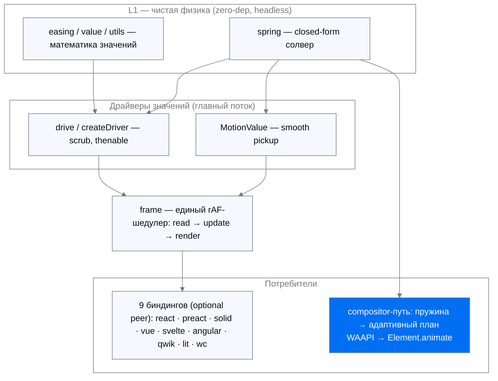
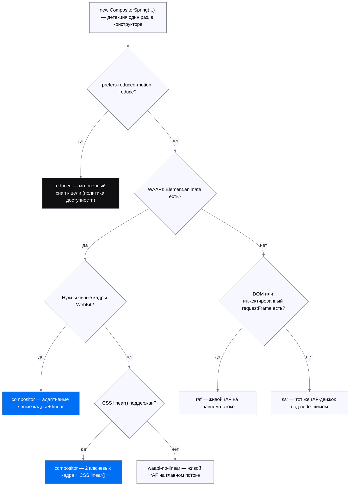

# @labpics/motion

Headless-движок анимаций дизайн-системы Labpics: чистая математика движения
(пружины, кадры, тайминги) **без единой runtime-зависимости**. Ядро не знает про
DOM — рендер делает ваш колбэк, время приходит через инжектируемый `requestFrame`.

Три вещи, которые нужно понять сразу:

1. **Всё — субпути.** Корневой экспорт + 39 субпутей (40 входов `exports` в
   `package.json`); точный `sideEffects`-allowlist сохраняет только авто-регистрацию
   web components, остальные неиспользуемые субпути вырезаются.
2. **Две фазы движения.** Интерактив и фаза слежения (палец ведёт значение) — на
   главном потоке (`MotionValue`, `drive`, `…/gestures`). Автономные переходы и
   release-фаза — compositor-путь (`…/compositor`, `…/waapi`): пружина
   компилируется в адаптивный WAAPI-план и живёт на compositor-потоке: CSS
   `linear()` в Chromium/Firefox, явные ключевые кадры с обычным `linear` в
   WebKit. Главный поток не будится до завершения. Подробно — в разделе
   «Compositor-путь».
3. **Гарантии запечатаны тестами.** `NaN`/`Infinity` никогда не попадают в CSS
   (fuzz-гейты в CI), `prefers-reduced-motion` меняет ХАРАКТЕР движения, а не
   выключает его грубо, публичная поверхность запинена api-surface тестами.

## Установка

Установите опубликованную версию из npm:

```bash
pnpm add @labpics/motion
```

Для разработки из исходников используйте тарбол: `pnpm build && pnpm pack`, затем
`pnpm add /путь/к/labpics-motion-<версия>.tgz`. Git-установка не поддерживается:
`dist/` собирается и не хранится в репозитории.

Требования: Node ≥ 22. Runtime-зависимостей нет; фреймворк для биндинга — optional
peer, ставится у потребителя (peer объявлены для 8 фреймворков; `./wc` не требует
ничего). Целостность артефакта проверяет `pnpm pack:smoke`: тарбол → чистый
проект → ESM/CJS-импорт всех входов без обязательного peer и проверка файлов
каждой export-ветки. `pnpm pack:compat` дополнительно проверяет TypeScript/Vite,
SSR, tree shaking и точный минимальный Preact peer.

## Быстрый старт

### Пружина к значению (ядро)

```typescript
import { MotionValue } from '@labpics/motion';

const x = new MotionValue({ initial: 0, spring: { mass: 1, stiffness: 200, damping: 20 } });
x.onChange((v) => { el.style.transform = `translateX(${v}px)`; });
x.setTarget(240);   // плавно едем; повторный setTarget подхватит скорость без рывка
```

### Управляемая анимация (scrub)

```typescript
import { createDriver } from '@labpics/motion/driver';

const anim = createDriver({ from: 0, to: 1, spring: { mass: 1, stiffness: 200, damping: 24 },
  onStep: (v) => { el.style.opacity = String(v); } });
anim.pause();
anim.seek(0.5);
await anim; // thenable
```

### Автономный переход на compositor-потоке

Для короткого platform-trusted one-liner без fallback и defensive host-границы:

```typescript
import { animate } from '@labpics/motion/nano';

const moves = animate('.card', { translate: '240px', rotate: 8, opacity: 1 }, {
  spring: { mass: 1, stiffness: 170, damping: 26 },
  stagger: 40,
});
moves[0]?.pause(); // каждый элемент — нативный Animation
await moves.finished;
```

`./nano` — to-only WAAPI-вход под жёстким гейтом 1 КБ gzip. Числа —
миллисекунды; `translate/scale/rotate` — целые нативные CSS longhand-каналы,
цвета/фильтры/единицы интерполирует браузер. `nano` не трактует CSS `x/y` как
оси `translate` и не читает layout, чтобы угадывать вторую ось; transform-
шортхенды `x/y` принадлежат полному `./animate`. Нужны нативные `Element.animate`,
`Animation.commitStyles` и CSS `linear()`; скрытого rAF-fallback, C1-подхвата и
защиты от hostile/polyfill-host здесь нет. Физические параметры должны задавать
конечную затухающую пружину; длительность и плотность `linear()` выводятся из её
полюсов и допуска реконструкции, без wall-clock cap. Кривая выше общего
compiler-ceiling отклоняется до синхронной материализации; полный `./animate`
исполняет такой случай живым solver. Для defensive-границы, C1-подхвата и
fallback также используйте `./animate`.

```typescript
import { CompositorSpring, compileSpringLinear } from '@labpics/motion/compositor';

// Чистый компилятор (SSR-safe): пружина → адаптивный CSS linear().
const easing = compileSpringLinear({ mass: 1, stiffness: 170, damping: 26 });
el.style.transition = `transform 0.9s ${easing}`;

// Контроллер: коммитит план в Element.animate(); без WAAPI — байт-паритетный
// main-thread fallback. Подробности и fallback-матрица — ниже.
const panel = new CompositorSpring({
  spring: { mass: 1, stiffness: 170, damping: 26 },
  property: 'transform', from: 0, to: 240,
  target: el, format: (v) => `translateX(${v}px)`,
  apply: (val) => { el.style.transform = String(val); }, // только на fallback-пути
});
panel.start();
```

Если нужен минимальный нативный вызов без запасного движка:

```typescript
import { springTo } from '@labpics/motion/animate/native';

const move = springTo(el, { x: [0, 240], opacity: [0, 1] });
await move.finished;
```

`springTo` принимает только явные пары `[from, to]` для `x`, `y`, `scale`,
`rotate`, `opacity` и запускает отдельную `Element.animate()` для каждого
присутствующего CSS-канала цели. Поэтому transform и opacity вытесняются
независимо. Нужен WAAPI; Chromium/Firefox также требуют CSS `linear()`, а WebKit
получает явные адаптивные ключевые кадры. Без нужной возможности функция падает
синхронно. При reduced-motion она сразу ставит финальный кадр. Для запасного пути
используйте `…/animate`. Повторная смена владельца уже внутри
компенсационной host-записи завершается `LM157`: синхронный путь бросает
ошибку, а `finished` естественно завершившегося WAAPI-эффекта отклоняется.

Больше примеров (drag, FLIP, presence, scroll-scrub, value-mapping) — в разделе
«Примеры» после карты субпутей.

## Как устроен движок

Слои снизу вверх: чистая физика не знает про DOM и фреймворки; значения гонят
драйверы на главном потоке через единый rAF-планировщик — либо пружина целиком уезжает
на compositor-поток (синий узел):



## Карта субпутей

Импорт — `@labpics/motion` (ядро) или `@labpics/motion/<субпуть>`.

**Ядро и управление**

| Импорт | Что даёт |
|---|---|
| `@labpics/motion` | `spring` (аналитический closed-form солвер), `tween`, `drive` (декларативный запуск), `MotionValue` (реактивное значение со smooth-pickup), `MotionParamError` |
| `…/driver` | Scrubbable-контроллер: `play/pause/reverse/seek/timeScale/progress` + thenable |
| `…/frame` | Единый frame-шедулер: `createFrameLoop` / синглтон `frame` — один rAF на кадр, фазы read→update→render против layout-thrash, SSR-safe; `asRequestFrame(loop)` сажает `MotionValue`/`drive` на общий кадр. **Биндинги используют его по умолчанию** (как shared-ticker у Framer Motion/GSAP); инжекция своего `requestFrame` переопределяет |
| `…/nano` | **Platform-trusted WAAPI to-only ≤ 1 КБ gzip**: spring/tween, целые `translate/scale/rotate` longhand-каналы, любые нативно-анимируемые CSS-свойства, `delay`/`stagger`, reduced-motion и сами `Animation` как контролы. Без layout-read, независимых `x/y`, rAF-fallback, C1-подхвата и hostile-host обещаний |
| `…/animate` | Фасад-one-liner: `animate(target, props, options)` — цели по каналам (`x`/`y`/`scale`/`rotate`, `opacity`, CSS-свойства), режим `{ spring }` или `{ duration, ease }`, `delay`/`stagger`, контролы `{ finished, play, pause, seek, cancel, stop }`. Это полный DX-срез; ядро от него не растёт |
| `…/animate/mini` | **Лёгкий срез (≤ 5 KB gz)**: transform-шортхенды, `opacity`, CSS-переменные, spring/tween, `delay`/`stagger`, контролы и reduced-motion снап. Внутри движок разделён на кодеки и адаптер цели, но публичный набор mini фиксирован. Цветовые CSS-значения и compositor-offload остаются в `./animate` |
| `…/animate/native` | **Нативная пружина ≤ 3.5 KB gzip**: `springTo(target, { x: [0, 240] })`, только явные пары transform/opacity, отдельный WAAPI-эффект на независимый CSS-канал и раздельное вытеснение, мгновенный финал при reduced-motion. Chromium/Firefox требуют CSS `linear()`, WebKit использует адаптивные ключевые кадры; скрытого rAF-пути нет |

**Математика значений**

| Импорт | Что даёт |
|---|---|
| `…/easing` | Каталог кривых: named-кривые, `cubicBezier`, `steps`, кастомные функции |
| `…/value` | CSS-значения: парсинг/интерполяция единиц (px/%/deg/rem/vh), цветов (hex/rgb/hsl), transform-компонент, `var()`, относительных значений |
| `…/utils` | Value-mapping примитивы (headless-ядро Framer Motion / GSAP): `mapRange`, `interpolate` (N-стоповый маппер: клампинг, per-segment easing, кастомный `mixer`), `clamp`, `wrap`, `snap`, `mix`, `pipe`. Каррируемые config-first, финитность гарантирована |
| `…/spring` | Эргономика пружин: `fromBounce` (duration+bounce ∈ [−1,1], канон SwiftUI ⊇ Motion [0,1]), `fromVisualDuration`, `springPresets` (канон react-spring), `springAsEasing` |

**Композиция движения**

| Импорт | Что даёт |
|---|---|
| `…/keyframes` | Ключевые кадры: массивы, offsets, per-keyframe easing, repeat/reverse/yoyo |
| `…/timeline` | Оркестрация: `createTimeline` — сегменты, `seek/progress/totalDuration`, thenable |
| `…/stagger` | Каскадные задержки: списки и 2D-сетки, from/направления/easing |
| `…/decay` | Инерция: аналитическое затухание (drag-momentum, инерционный скролл) |
| `…/presets` | Словарь generic-движений «от смысла» (иконки): 10 фабрик (`pulse`, `blink`, `wiggle`, `spin`, `breathe`, `pop`, `bounceY`, `drift`, `fadeSlide`, `drawOn`), мультитрековые кейфреймы, `runPreset` с виртуальным временем, `presetToWaapi`; текстовые/числовые сахара — `splitText`/`typewriterAt`/`scrambleAt`, `formatNumber` (Intl) + `tickerCells`, раннеры `runTypewriter`/`runScramble`/`runNumber` |
| `…/svg` | SVG: `parsePath`/`pathLength`, draw-математика штриха (`drawPath`), движение вдоль пути (`createMotionPath`) |
| `…/svg-morph` | Морфинг путей: `interpolatePath(dFrom, dTo)` — точный режим при совпадающей структуре, ресэмплинг с выравниванием при разной |

**Взаимодействие и layout**

| Импорт | Что даёт |
|---|---|
| `…/gestures` | `createPress` (tap + клавиатурный путь Enter/Space), `createHover`, `createPan`, `createDrag` (границы + rubber-band + инерция + reduced-motion) |
| `…/behaviors` | Headless state machines типовых мобильных взаимодействий поверх `./gestures`/`./decay`/пружины ядра: `createBottomSheet` (snap-точки + выбор по положению+скорости), `createDragDismiss` (порог по смещению/скорости + направление), `createCarousel` (единый clock позиции+индекса, RTL/вертикаль), `createPullToRefresh` (резистентный overscroll + pending). Единый контракт `BehaviorState { value, velocity, phase }`; `cancel`/`destroy`, reduced-motion меняет характер. Подробно — раздел «Behaviors-путь» |
| `…/scroll` | Прогресс страницы/target-с-офсетами (семантика Motion), in-view машина, скорость, scrub-клей к timeline |
| `…/presence` | Enter/exit lifecycle: «доиграй exit-анимацию → потом убирай из DOM», прерывания, `swapPresence` (wait/sync) |
| `…/flip` | Layout-анимация FLIP: инверсия first→last, пружинный «доезд», коррекция scale-искажений (`correctRadius`, `counterScale`) |
| `…/projection` | Вложенный FLIP-движок (жанр Framer projection): дерево узлов — transform родителя НЕ искажает детей и border-radius; `projectAt` (чистая математика), `createProjection` (headless-драйвер: одна пружина, velocity continuity при перехвате, `seek`/`release` под жест), `createDomProjection` (capture → мутация DOM → play). Подробно — раздел «Projection-путь» |
| `…/smart` | Smart-animate поверх `./projection` (жанр Figma smart-animate / shared-element): диф двух снимков дерева по строке-ключу `data-motion-key` → matched/entered/exited/skipped; `captureSmart`/`smartTransition` (capture → мутация → animate), `resolveSmartTier`. matched едут FLIP'ом (continuity переживает пересоздание узла), entered — fade-in, exited — ghost-протокол; reduced = смена характера. Подробно — раздел «Smart-путь» |
| `…/auto` | Zero-config FLIP: `autoAnimate(parent)` — add/remove/move детей анимируются сами; reduced-motion меняет характер (move→снап), не выключает |
| `…/a11y` | `createMotionConfig` — политика reduced-motion (`system`/`always`/`never`), меняет характер анимации, не выключает |

**Compositor-путь и токены** (подробно — в следующем разделе)

| Импорт | Что даёт |
|---|---|
| `…/waapi` | Низкоуровневый мост: `compileWaapi`/`animateWaapi` (кейфреймы движка → нативный `Element.animate`), `easingToLinear` (любой easing → CSS `linear()`), `supportsWaapi` |
| `…/compositor` | Базовый compositor-компилятор: `compileSpringLinear`, `compileSpringPlan`, `CompositorSpring`, ретаргет, хендофф и fallback-матрица |
| `…/compositor/stagger` | Самодостаточный групповой compositor-фасад: `compileStaggerPlan`, `CompositorStaggerGroup` и связанные `compileSpringPlan`/`CompositorSpring` из одного entry |
| `…/tokens` | Motion-токены: `duration`, `easing`, `spring`, `staggerGap`, `distanceScale`. См. «Motion-токены» |

**Биндинги** (9; peer-фреймворк ставит потребитель)

| Импорт | Что даёт |
|---|---|
| `…/react` | `useSpring`, `useMotionValue`, `useMotionStyle` (effect-binding: пишет в `style` через ref без render на кадр — аналог `vMotion`), `useReducedMotion` (реактивное системное `prefers-reduced-motion`, hydration-safe) |
| `…/preact` | `useSpring`, `useMotionValue` (зеркало react-биндинга поверх `preact/hooks`) |
| `…/solid` | `createSpring`, `createMotionValue` (сигналы, авто-уборка через `onCleanup`) |
| `…/vue` | `useSpring`, `useMotionValue`, директива `vMotion` |
| `…/svelte` | `springStore` |
| `…/angular` | Angular (v16+): `injectSpring`, `injectMotionValue` (Signals + DestroyRef) |
| `…/qwik` | `useSpring` — управление сигналом `target` (резюм-safe), MotionValue = noSerialize, пересоздаётся на клиенте |
| `…/lit` | `MotionController` (ReactiveController), `LabMotionSpringElement` |
| `…/wc` | Vanilla web-component `<lab-spring>` без зависимостей — путь для Astro/Stencil/HTML-first стеков |

## Примеры

### Drag с инерцией

```typescript
import { createDrag } from '@labpics/motion/gestures';

const drag = createDrag({
  bounds: { x: { min: 0, max: 300 } },
  matchMedia: window.matchMedia.bind(window),
  requestFrame: requestAnimationFrame.bind(window),
  onStep: (x, y) => { el.style.transform = `translate(${x}px, ${y}px)`; },
});
el.addEventListener('pointerdown', (e) => {
  el.setPointerCapture(e.pointerId);
  drag.pointerDown({ x: e.clientX, y: e.clientY, t: e.timeStamp / 1000 });
});
el.addEventListener('pointermove', (e) => drag.pointerMove({ x: e.clientX, y: e.clientY, t: e.timeStamp / 1000 }));
el.addEventListener('pointerup', (e) => drag.pointerUp({ x: e.clientX, y: e.clientY, t: e.timeStamp / 1000 }));
```

Захват элемента, летящего compositor-анимацией: контроллер снимает фактические
serialized position/right-slope по `Animation.currentTime` без style/layout-read.
Жест наследует этот импульс, а не аналитическую аппроксимацию:

```typescript
// Продолжение примера drag выше; controller — CompositorSpring этого элемента.
el.addEventListener('pointerdown', (e) => {
  const live = controller.handoffToLive(); // отменяет Animation после snapshot
  const vx = live.velocity;
  live.destroy();                         // дальше владельцем становится gesture
  drag.pointerDown({ x: e.clientX, y: e.clientY, t: e.timeStamp / 1000 }, { vx });
});
```

### FLIP (layout-анимация)

```typescript
import { createFlip } from '@labpics/motion/flip';

const fl = createFlip({
  requestFrame: requestAnimationFrame.bind(window),
  onStep: (t) => { el.style.transform = `translate(${t.tx}px, ${t.ty}px) scale(${t.sx}, ${t.sy})`; },
  onRest: () => { el.style.transform = ''; },
});
const first = el.getBoundingClientRect();
// ... DOM переставлен (порядок/размер/класс изменился) ...
fl.play(first, el.getBoundingClientRect()); // элемент «доезжает» пружиной
```

### Появление/уход (presence)

```typescript
import { drive } from '@labpics/motion';
import { createPresence } from '@labpics/motion/presence';

const spring = { mass: 1, stiffness: 200, damping: 24 };
const p = createPresence({
  onExitStart: (done) => {
    drive({ from: 1, to: 0, spring, onStep: (v) => { el.style.opacity = String(v); } }).then(done);
  },
  onGone: () => el.remove(), // убрать из DOM только после exit-анимации
});
p.exit();
```

Прерывание с наследованием импульса (C¹, #93): `capture` регистрирует живой
снимок текущего рана, `interrupted` отдаёт его новой фазе — enter во время
exit продолжает движение из текущих (value, velocity), а не телепортом:

```typescript
import { MotionValue } from '@labpics/motion';

const p = createPresence({
  onExitStart: (done, from, capture) => {
    const mv = new MotionValue({
      initial: from?.value ?? 1, initialVelocity: from?.velocity ?? 0,
      spring, clamp: false, // честный довыбег на стыке
    });
    mv.onChange((v) => {
      el.style.opacity = String(v);
      // Оседание: финальный эмит — ровно цель (settle-снап), скорость в покое 0.
      // Без done() фаза не завершится и onGone не сработает.
      if (v === 0 && mv.velocity === 0) done();
    });
    mv.setTarget(0);
    capture(() => ({ value: mv.value, velocity: mv.velocity }));
  },
  onEnterStart: (done, from, capture) => { /* тот же паттерн: цель 1, done при v === 1 */ },
});
p.exit();
p.enter(); // передумали: reversed continuation из точки и скорости exit-рана
```

### Скролл-прогресс → таймлайн

```typescript
import { createScrollObserver, scrubBinding } from '@labpics/motion/scroll';
import { createTimeline } from '@labpics/motion/timeline';

const tl = createTimeline({ segments: [{ from: 0, to: 1, duration: 2 }] });
const observer = createScrollObserver({ onProgress: scrubBinding(tl) });
window.addEventListener('scroll', (e) => observer.update({
  pos: scrollY, contentLength: document.body.scrollHeight,
  viewportLength: innerHeight, t: e.timeStamp / 1000,
}));
```

### Value-mapping (utils)

```typescript
import { mapRange, interpolate, clamp, wrap, pipe } from '@labpics/motion/utils';

mapRange(0, 100, 0, 1, 50);              // 0.5 — ремап диапазона (канон GSAP mapRange)
const fade = interpolate([0, 100, 200], [0, 1, 0]); // N-стоповый маппер (канон Framer transform)
fade(50);                                // 0.5 — кусочно-линейно между стопами
const hue = wrap(0, 360);                // циклический wrap в полуинтервал [0, 360)
hue(370);                                // 10
const toProgress = pipe(clamp(0, 300), (x) => x / 300); // композиция слева-направо
```

## Compositor-путь

### Фазовая модель: когда какой путь

Путать фазы — класс дефекта:

- **Compositor (`…/compositor`, `…/waapi`)** — автономные переходы, settle и
  release-фаза жеста. Автономный запуск: скомпилировать адаптивную кривую →
  `Element.animate`. Chromium/Firefox исполняют её как CSS `linear()`, WebKit —
  как явные ключевые кадры с обычным `linear`. Пружина переживает блокировки
  главного потока и не планирует на нём покадровую работу.
- **Main-поток (`drive` / `MotionValue` / `…/gestures`)** — интерактив и
  follow-фаза (палец ведёт значение, будущая траектория неизвестна).
- **Прерывание compositor-анимации** — редкое ONE-SHOT событие
  (`CompositorSpring.retarget`): serialized snapshot по native currentTime + cancel +
  новая кривая. **Непрерывный ретаргет каждый кадр (gesture-follow через
  cancel+re-emit) — задокументированный АНТИПАТТЕРН**: для слежения берите главный поток.
- **`will-change`** — ограниченная дисциплина у потребителя: включать точечно перед
  переходом и снимать после завершения, не «на всякий случай».

### CompositorSpring: ретаргет и хендофф

Публичный API один на всех тирах. В effect-space numeric/affine-канала при
default `fill:'both'` прерывание точно продолжает position и правый slope
кусочно-линейного сегмента. На самом stop-kink производная неоднозначна — выбран
правый сегмент. Это не обещание rendered-pixel C¹ для clamping, non-affine
`format`, меняющегося underlying/composite или custom fill вне active interval.

```typescript
import { CompositorSpring } from '@labpics/motion/compositor';

const panel = new CompositorSpring({
  spring: { mass: 1, stiffness: 170, damping: 26 },
  property: 'transform', from: 0, to: 240,
  target: el, format: (v) => `translateX(${v}px)`,
  apply: (val) => { el.style.transform = String(val); }, // только на fallback-пути
});
panel.start();

// ДИСКРЕТНОЕ прерывание: O(log K) snapshot execution-stops без style/layout-read.
panel.retarget(120);

// ХЕНДОФФ compositor→live: траектория перестала быть автономной (палец перехватил
// значение — follow-фаза). Снимок → живая rAF-пружина продолжает без разрыва.
const live = panel.handoffToLive();      // продолжить к текущей цели, ИЛИ
const live2 = panel.handoffToLive(300);  // сразу к новой цели с сохранённой скоростью
```

Число raw diagnostic-узлов не фиксировано, а выводится из бюджета реконструкции
(допуск `DEFAULT_TOLERANCE`, адаптивная сетка + упрощение): жёстче пружина —
короче кривая. Один exact-key bounded LRU хранит execution artifact
`{ linear(), serialized samples }`: Chromium исполняет строку, WebKit строит из
тех же numeric samples явные кадры, snapshot сэмплирует их бинарным поиском.

### Composited stagger (каскад группы)

Задержки каждого элемента — нативный WAAPI-`delay` поверх ОДНОЙ запечённой
кривой: общей строки `linear()` в Chromium/Firefox или общего набора узлов в
WebKit. Группа строит сетку/RDP ровно один раз независимо от N; ограниченный cache
переиспользует результат. **Покадровая стоимость каскада — ноль**: его исполняет
браузер, планирование одноразово.

```typescript
import {
  CompositorSpring,
  CompositorStaggerGroup,
  compileSpringPlan,
  compileStaggerPlan,
} from '@labpics/motion/compositor/stagger';

// Чистый планировщик (SSR-safe): общая кривая + per-element задержки (headless).
const plan = compileStaggerPlan({
  spring: { mass: 1, stiffness: 170, damping: 26 },
  property: 'opacity', from: 0, to: 1,
  count: 5, gap: 40, staggerFrom: 'first',   // → delays [0, 40, 80, 120, 160] мс
});

// Контроллер группы: N целей делят кривую, каждый стартует со своей задержкой.
const list = new CompositorStaggerGroup({
  spring: { mass: 1, stiffness: 170, damping: 26 },
  property: 'transform', from: 24, to: 0,
  targets: rows,                              // N Element'ов; count = rows.length
  gap: 40, staggerFrom: 'center',
  format: (v) => `translateY(${v}px)`,
  apply: (i, v) => { rows[i].style.transform = String(v); }, // только fallback-путь
});
list.start();                                 // каскад: N Element.animate с delay[i]
```

Если одиночный и групповой контроллеры нужны вместе, импортируйте оба из
`…/compositor/stagger`: смешивание двух compositor-entry дублирует предсобранное
ядро в приложении. Без групп используйте меньший `…/compositor`.

Граница per-group vs per-element (честно): каскад (`start`) — per-GROUP (это и
есть composited-выигрыш); `retarget(i, to)` / `retargetAll(to)` — per-ELEMENT,
без пере-каскада (ретаргет — дискретное прерывание, не новый парад);
`handoffToLive(i, to?)` отдаёт ОДИН элемент в живую rAF-пружину, группового
хендоффа нет. Флаг `reducedMotion` схлопывает задержки в 0 — элементы анимируются,
но одновременно (character-switch, не hard-off).

### Fallback-матрица

`CompositorSpring` прозрачно деградирует: публичный API один, а точная
effect-space гарантия ограничена условиями выше; меняется движок под капотом. Тир определяется
возможностями один раз в конструкторе. Отдельно форма исполняемого плана один раз
на реалм учитывает WebKit через узкий `navigator.vendor + AppleWebKit` шов:
независимость многостопового `linear()` от главного потока не наблюдаема через
API возможностей, а синтаксическая
поддержка даёт ложноположительный ответ. Фактический тир доступен как
диагностическое поле `CompositorSpring.tier`.

Выбор тира — в порядке precedence: доступность (`reduced`) перекрывает любой
доступный движок, дальше решают WAAPI, локальное правило WebKit и CSS `linear()`:



| Тир | Условие | Движок / поведение | Что теряем |
|---|---|---|---|
| `compositor` | WAAPI + (явные кадры WebKit **или** CSS `linear()`) | WebKit: адаптивные явные кадры; Chromium/Firefox: два кадра + CSS `linear()`. Оба пути не зависят от главного потока | — (полный путь) |
| `waapi-no-linear` | Не-WebKit: WAAPI есть, CSS `linear()` нет | Живой rAF (`MotionValue`) на главном потоке — доступной независимой формы пружинной кривой нет | Анимация чувствительна к блокировкам главного потока |
| `raf` | Нет `Element.animate` | Живой rAF (`MotionValue`) на главном потоке | То же, что выше |
| `reduced` | `prefers-reduced-motion: reduce` | **Мгновенный снап** к цели: значение эмитится один раз, без анимации | Всякое движение (осознанно — политика доступности) |
| `ssr` | Нет DOM и нет инжектированного `requestFrame` | Тот же rAF-движок под Node-обвязкой; импорт и конструктор не трогают `window`/`document` | На сервере кадры не рисуются |

Честные границы: (1) все не-`compositor` тиры кроме `reduced` идут в ОДИН живой
rAF-движок — ярлыки различают ПРИЧИНУ (телеметрия), поведение идентично;
(2) детекция одноразовая — WAAPI/`linear()` за жизнь контроллера и WebKit-policy
за жизнь реалма не переопрашиваются; (3) на `waapi-no-linear`/`raf` анимация
делит главный поток.

Политика reduced-motion — мгновенный снап к финальному значению, ЕДИНАЯ для всего
пакета (`drive`/`keyframes`/`presets` тоже резолвятся в финал сразу): один
характер, ноль дрифта. Детекция reduce — один раз на входе; смена системного
предпочтения в полёте не подхватывается.

Диагностика: `resolveCompositorTier({ target?, matchMedia?, requestFrame? })` —
узнать тир без конструирования контроллера; `supportsLinearEasing()` —
кэшированная проба `linear()`; `supportsCompositor(target?)` — булев предикат.

### Browser support

Тир выражен возможностями среды: WAAPI, CSS `linear()`, reduced-motion. Есть одно
локальное исключение для ФОРМЫ исполняемого плана: `navigator.vendor +
AppleWebKit` выбирает явные ключевые кадры. Это не маршрутизация по версии
браузера, а обход непроверяемой независимости от главного потока: WebKit
принимает многостоповый `linear()`, но во время блокировки не продвигает его.
Всё правило сосредоточено в одном мемоизированном шве; остальные ветки
проверяются через API возможностей.

| Среда | Статус | Основание |
|---|---|---|
| Chromium (Chrome/Edge) | Полный `compositor`-путь | WAAPI + CSS `linear()` |
| Firefox | Полный `compositor`-путь | WAAPI + CSS `linear()` |
| WebKit (Safari и браузеры iOS) | Полный `compositor`-путь | WAAPI + адаптивные явные ключевые кадры; многостоповый `linear()` не используется |
| Не-WebKit без CSS `linear()` | `waapi-no-linear` → живой rAF | доступной off-main формы пружинной кривой нет |
| Без `Element.animate` | `raf` → живой rAF | нет WAAPI |
| SSR / Node ≥ 22 | `ssr` → импорт SSR-safe, кадры не рисуются | нет DOM; см. `pack:compat` |

`prefers-reduced-motion: reduce` уважается на любом движке (мгновенный снап,
единая политика пакета). Два уровня и их согласование:
- **отдельная анимация** (`CompositorSpring`/`drive`/`keyframes`/…) читает
  предпочтение ОДИН раз при старте — уже запущенная анимация НЕ переигрывается
  при смене системного предпочтения (см. «read once» выше);
- **`createMotionConfig`** (subpath `./a11y`) держит ЖИВУЮ подписку и уведомляет
  о смене предпочтения — это влияет на анимации, запускаемые ПОСЛЕ смены (когда
  потребитель перечитывает конфиг), а не на уже идущие. Противоречия нет: живая
  подписка — про будущие запуски, «read once» — про текущий.

**Явно НЕ поддержано (документировано, не маскируется fallback'ом):**

- `./projection` (вложенный FLIP): `rotate`/`skew` и origin, отличный от `'0 0'`;
  `position: fixed`/`sticky` в дереве; вложенные scroll-контейнеры (компенсируется
  только window-scroll); **закрытые** shadow root'ы непрозрачны для composed-подъёма
  (**открытые** — прозрачны). Чужой inline/CSS-`transform` на треканном узле искажает
  замер (matrix-декомпозиция — не-цель v1).
- Compositor-путь — для автономных переходов и release-фазы; **покадровый**
  `retarget` при слежении за жестом — антипаттерн (эта фаза живёт на главном потоке,
  `./gestures` + `MotionValue`).

**Conformance-слой.** Serialized effect сверяется с аналитическим солвером в
пределах tolerance, а Chromium/Firefox/WebKit — между собой в `browser/*.spec.ts`.
Локально:
`pnpm test:browser` (только Chromium, opt-in — в дефолтный `pnpm test` не входит,
у vitest-гейта нет браузеров). Полная матрица Chromium/Firefox/WebKit — на CI
(`.github/workflows/browser.yml`), **обязательна для PR, затрагивающих platform
adapters** (`compositor`/`gestures`/`waapi`/`projection`/`animate`/`presence`/`flip`/`a11y`).

Независимость WebKit-пути от главного потока дополнительно проверяет видеостенд
`bench/compare/webkit-freeze.mjs`: во время блокировки на 900 мс синий
контроль WAAPI задаёт окно измерения, контрфакт с многостоповым `linear()`
замирает, а исполняемый план с явными кадрами обязан продолжать менять экранную
позицию.
Запуск: `cd bench/compare && node webkit-freeze.mjs` после корневого `pnpm build`.
Consumer-контракт тарбола (ESM/CJS/TypeScript/Vite/SSR + Node ≥ 22): `pnpm pack:compat`.

### Латентность (справочно)

`pnpm bench:latency` измеряет p50/p95/p99 одноразовых compositor-операций.
`pnpm bench:ceiling` измеряет массовый старт и один кадр для N=1/100/1000,
показывает долю бюджета 120/240 Гц и жёстко проверяет машинонезависимый закон:
один native `requestFrame` на кадр независимо от числа целей, без idle wakeups.
Wall-clock числа машинозависимы и берутся только из свежего вывода команд.

**Границы замера.** Стенд меряет ТОЛЬКО main-thread cost (Node, против `dist`).
Compositor-резидентность и input→photon **не наблюдаемы из JS** — достоверно
только реальным Chrome + tracing (`cc.animation` в DevTools Performance), вне
CI-скоупа.

**Почему ретаргет — не мутация `playbackRate`/`currentTime`** (гипотеза research,
опровергнута): по W3C Web Animations L1 (§4.4.4, §4.4.15) и MDN обе операции живут
в timing model и не трогают `KeyframeEffect` — `playbackRate` лишь скаляр скорости
вдоль запечённой кривой, `currentTime` — seek по ней. Ретаргет пружины требует
НОВОЙ точки равновесия и нового профиля скорости из текущих (pos, vel) — это новый
`KeyframeEffect`. Поэтому cancel + рекомпиляция через кэш + re-emit — необходимы,
а не упущенная оптимизация.

## Projection-путь

Честный **вложенный** FLIP (`@labpics/motion/projection`). Обычный FLIP вешает
`translate+scale` на один элемент — вложенные потомки и border-radius на время
полёта искажаются. Projection-движок ведёт ДЕРЕВО узлов: каждый кадр локальный
transform ребёнка вычисляется замкнутой формой через визуальный бокс ближайшего
проецирующего предка, так что каждый узел рендерится ровно в свой
интерполированный бокс, а радиусы корректируются под кумулятивный масштаб
(`correctRadius` из `./flip` — живой вызов, не дубль).

```ts
import { createDomProjection } from '@labpics/motion/projection';

const proj = createDomProjection();
proj.capture([card, avatar, badge]); // avatar/badge — потомки card: дерево выводится само
moveCardToSidebar();                 // мутируйте DOM как угодно
proj.play();                         // card едет FLIP'ом; avatar/badge и радиусы НЕ искажаются
```

Ключевые свойства (все запинены тестами):

- **Слои**: `geometry` (чистая математика, SSR-safe, кандидат mutation-гейта) →
  `driver` (headless: инжектируемые `requestFrame`/`matchMedia`) → `dom`
  (тонкий адаптер: page-space замеры, composed-обход открытых shadow root'ов).
  Клятва «ядро не знает про DOM» сохранена: DOM трогает только адаптер.
- **Одна нормированная пружина на переход** — дерево едет «одним жестом»,
  tearing родитель/ребёнок исключён по построению; каждый кадр — замкнутая
  форма `solveSpring(params, t, v0)` с ЖИВЫМ v0.
- **Velocity continuity при перехвате**: повторный `play()`/`capture()` в полёте
  берёт текущие боксы аналитически (`V(p̂)`, ноль чтений DOM под transform) и
  пересеивает скорость `v0' = v̂/(1−p̂)` (точный C¹ всех каналов при неизменных
  целях — теорема, differential-тест; при изменённых — C¹ доминантного канала,
  потолок `V0_CAP`). Жест ведёт через `seek(p)`, отпускание — `release(v)`.
- **Граница переизмерения**: batch **clear → measure → start** — элемент никогда
  не меряется под нашим активным transform (класс бага «смешение layout и
  transform» закрыт по построению; журнал-тест).
- **`clamp: false` по умолчанию** — честный overshoot пружины уходит в кадры
  (осознанное отличие от легаси-дефолта `./flip`); размеры флорятся ≥ 0,
  публичный `progress` всегда в [0, 1].
- **Reduced-motion = смена характера**: снап в конечный layout одним кадром,
  ноль rAF; невалидная пружина бросает `MotionParamError` даже под reduce.
- **Деградации без NaN**: вырожденные боксы (display:none, 0×0), NaN/∞ в
  ректах, k→0 при overshoot — каждый кадр конечен (fuzz-гейт ≥10 000 деревьев
  в CI), `-0` схлопнут.

Не-цели v1 (честно): rotate/skew и не-`'0 0'` transform-origin (модель строго
осевая), `position: fixed/sticky`, компенсация вложенных scroll-контейнеров
(только window-scroll page-space), пер-узловые пружины, WAAPI/compositor-эмиссия
дерева (пер-кадровая коррекция `1/k(t)` нелинейна — v1 main-thread), интеграция
с реестром каналов `./animate`. Диф двух DOM-состояний по identity-ключу,
shared-element и ghost-протокол — субпуть `./smart` (раздел ниже).

## Smart-путь

Figma-подобный **smart-animate** поверх `./projection`
(`@labpics/motion/smart`). Projection даёт FLIP набора элементов, но требует
собрать этот набор вручную и знать «что во что превратилось». Smart закрывает
ровно это: ДВА снимка дерева по строковому identity-ключу (`data-motion-key`),
диф → `matched` / `entered` / `exited` / `skipped`, и оркестрация поверх ОДНОГО
projection-движка.

```ts
import { smartTransition } from '@labpics/motion/smart';

// пометьте узлы: <div data-motion-key="card-3">…</div>
const handle = smartTransition(container, () => {
  reorderAndSwapLayout(); // мутируйте DOM как угодно (sync или async)
});
await handle.finished;
```

Либо разнесённо: `const cap = captureSmart(container); mutate(); cap.animate()`.

Ключевые свойства (все запинены тестами):

- **Диф по строке-ключу**: перемещённый ключ → `matched` (едет FLIP'ом),
  новый → `entered` (fade-in без transform), ушедший из DOM → `exited`
  (ghost-протокол), уехавший в чужой контейнер или вырожденный → `skipped`.
  Дубликат ключа → ранний `MotionParamError`.
- **Continuity переживает ПЕРЕСОЗДАНИЕ узла**: id проекции = строка-ключ, а не
  ссылка на элемент. Повторный `captureSmart`/`animate` в полёте берёт
  аналитический `V(p̂)` (ноль чтений DOM под нашим transform) и пересеивает
  скорость — C¹ у драйвера `./projection`. Ре-рендер (тот же ключ, новый объект)
  не рвёт жест.
- **Единый clock**: matched-FLIP, enter- и exit-фейды едут одной нормированной
  пружиной — дерево движется как один жест.
- **Ghost-протокол exit**: узел реинсертится в root `absolute` на прежних
  page-координатах (padding-box), фейд 1→0, `removeChild` ДО резолва `finished`
  (терминальное действие раньше уведомлений). Реинкарнация ключа при живом ghost
  — ghost снимается, узел продолжает от его состояния без прыжка.
- **Reduced-motion = смена характера**: matched снапаются (ноль transform-записей),
  а enter/exit-фейды остаются ЖИВЫМИ; `tier` = `reduced`. `respectReducedMotion:
  false` игнорирует reduce. `resolveSmartTier` резолвит `reduced`/`projection`/`ssr`.
- **SSR-инертность**: на не-элементе `size` 0, `tier` `ssr`, `finished` резолвлен
  сразу — без чтения DOM на уровне модуля.
- **Деградации без NaN**: злые снапшоты (NaN/∞-ректы, битые радиусы, пересоздания,
  скролл, перехваты) — ни одного броска, ни одного нефинитного числа и ни одного
  `-0` в записях (fuzz-гейт ≥10 000 дифов в CI).

Не-цели v1 (честно): нативный View Transitions API (отдельная фаза; здесь
projection-путь + reduced + ssr), авто-детект мутаций (`MutationObserver`),
live-подписка на смену reduce в полёте, closed shadow roots, вложенные
scroll-контейнеры (наследуется от `./projection`).

## Behaviors-путь

Headless **state machines типовых мобильных взаимодействий**
(`@labpics/motion/behaviors`) поверх переиспользуемых примитивов: трекер скорости
из `./gestures`, проекция момента из `./decay`, пружинный солвер ядра, темп-токены
`./tokens`. Ничего из этого НЕ дублируется — субпуть только оркестрирует. Поведение
не знает про фреймворк/компонентную библиотеку: DOM-обвязка ниже — тонкий адаптер.

Общий контракт: `BehaviorState { value, velocity, phase }`, где
`phase ∈ 'idle' | 'follow' | 'release' | 'settle'`. Каждое поведение принимает
события ввода (`pointerDown`/`Move`/`Up`/`Cancel` с точкой `{ x, y, t }`, где `t` —
секунды, напр. `e.timeStamp / 1000`), отдаёт текущее состояние (`state`-геттер +
`subscribe`), поддерживает программные переходы и идемпотентные `cancel()` / `destroy()`.

Четыре поведения:

- **`createBottomSheet`** — snap-точки + выбор цели по положению И скорости
  (проекция момента через `./decay`), доводка пружиной без потери velocity (C¹),
  rubber-band за крайними snap, программный `snapTo(index)`, перехват новым
  pointer-down.
- **`createDragDismiss`** — порог по смещению ИЛИ скорости, настраиваемое
  направление, возврат с унаследованной скоростью при недостигнутом пороге,
  детерминизм при `pointerCancel` (всегда домой, без закрытия).
- **`createCarousel`** — ЕДИНЫЙ clock для позиции и индекса (index выводится из
  position каждый кадр), inertia с доводкой к странице, направление+velocity в
  выборе страницы, RTL и вертикаль, `goTo`/`next`/`prev`.
- **`createPullToRefresh`** — резистентный overscroll, порог активации, `pending`
  БЕЗ второго владельца позиции (удержание — тот же единственный runner), возврат
  пружиной после async-действия.

Runnable DOM-адаптер (bottom sheet — transform из headless-состояния):

```ts
import { createBottomSheet } from '@labpics/motion/behaviors';

const el = document.querySelector('.sheet') as HTMLElement;
const sheet = createBottomSheet({
  snapPoints: [0, 320, 640],       // px оффсеты закрыт/полу/раскрыт
  matchMedia: window.matchMedia.bind(window), // reduced-motion = снап
  onChange: (s) => {               // единственный канал вывода
    el.style.transform = `translateY(${s.value}px)`;
  },
});

el.addEventListener('pointerdown', (e) => {
  el.setPointerCapture(e.pointerId);
  sheet.pointerDown({ x: e.clientX, y: e.clientY, t: e.timeStamp / 1000 });
});
el.addEventListener('pointermove', (e) =>
  sheet.pointerMove({ x: e.clientX, y: e.clientY, t: e.timeStamp / 1000 }));
el.addEventListener('pointerup', (e) =>
  sheet.pointerUp({ x: e.clientX, y: e.clientY, t: e.timeStamp / 1000 }));
el.addEventListener('pointercancel', () => sheet.pointerCancel());

// программно раскрыть до верхнего snap (единый clock, C¹ из текущей скорости):
document.querySelector('.expand')?.addEventListener('click', () => sheet.snapTo(2));
```

Ключевые свойства (все запинены тестами):

- **Один clock (одна state machine)**: pointer / programmatic control не плодят
  параллельных loops — единый generation-токен гасит stale-кадры, активен максимум
  один runner. Перехват pointer-down во время доводки → `follow` без утечки цикла.
- **C¹ на стыке follow→release**: скорость момента отпускания наследуется доводкой
  (`v0n = velocity / range` в пружинном солвере) — как smooth-pickup у `MotionValue`.
- **Выбор цели по положению+скорости**: snap/страница выбираются по проекции момента
  через `./decay` (`.rest`) — быстрый флик перепрыгивает snap; property-тесты
  (seeded-LCG) пинят «ближайший к decay-landing» на диапазоне value+velocity.
- **Reduced-motion = смена характера**: пространственная доводка снапает в цель
  МГНОВЕННО (ни одного кадра), состояние и результат сохранены — не «выключение».
- **Финитность и SSR-safe**: `value`/`velocity` всегда конечны (никогда NaN/∞, `-0`
  схлопнут — fuzz-гейт злого ввода), импорт не трогает window/document; единственный
  платформенный шов — инжектируемый `requestFrame` (детерминизм тестов).
- **`cancel()`/`destroy()` идемпотентны**: `destroy` делает вход инертным.

## Motion-токены

Типобезопасный словарь примитивов движения (`as const`, tree-shakeable по
семействам). Это ФУНДАМЕНТ, а не вся ДС: семантики ролей («кнопка-ховер») здесь
нет — роль→токен маппит потребитель (labui). Физический словарь (длительности,
изинги, ДС-пружины `smooth`/`expressive`) зеркалирует SSOT motion-токенов labui
(`--lab-motion-*`, labui/docs/motion-tokens.md) — при пересечении имён значения
совпадают байт-в-байт. Дефолты не кричащие (в духе Apple spring-first / Fluent 2
/ Material 3): критично-задемпфированные пружины и мягкие изинги; overshoot —
ровно в двух opt-in токенах (`easing.emphasized`, `spring.expressive`/`bounce`).
Значения запинены тестами как контракт.

```typescript
import {
  duration, easing, spring, staggerGap, distanceScale, springFromDurationBounce,
} from '@labpics/motion/tokens';

duration.base;          // 200 (мс): дефолтный UI-переход
easing.decelerate.css;  // 'cubic-bezier(0, 0, 0, 1)' — для CSS/WAAPI/compositor
easing.decelerate.fn;   // EasingFn — для ./keyframes / ./stagger
spring.default;         // { mass: 1, stiffness: 170, damping: 26 } — для ./compositor
spring.expressive;      // ДС-пружина (0.5s, bounce 0.3): сдержанный overshoot ~4.6%
staggerGap.normal;      // 40 (мс): шаг каскада для compileStaggerPlan({ gap })

// Каноническая пара восприятия (SwiftUI-модель, SSOT ДС): (duration, bounce) →
// физпараметры; выход гарантированно принимается всеми путями движка.
springFromDurationBounce(0.35, 0); // { mass: 1, stiffness: ~322.3, damping: ~35.9 }

// Дистанс-скейл: чем дальше путь, тем дольше движение (единообразная скорость).
distanceScale(200);     // 200 (мс) в дефолтной полосе 0→400px ↦ fast(100)→slow(300)
```

Гарантия размера — субпуть-изоляция: `sideEffects`-allowlist содержит только
авто-регистрирующие `./wc` и `./lit`; не импортируешь `./tokens` — платишь ноль,
ядро не растёт (проверено size-гейтом).

## Сравнение размеров

Актуальные числа не копируются в Markdown: `pnpm size` воспроизводимо измеряет
все публичные входы и сценарный import-cost, а CI сравнивает результат с
регрессионными потолками. Gzip вычисляется закреплённым детерминированным кодеком;
сравнительный S6 использует тот же оракул, а системный Brotli привязан к
зафиксированному Node executable. Методология, источник сравнительного runtime-отчёта и
границы допустимых выводов описаны в [docs/benchmark.md](docs/benchmark.md).

## Миграция на `./animate/mini`

`./animate/mini` — one-liner-паритет с mini-слоями Motion JS и Anime.js.
Базовые сценарии переносятся почти строка-в-строку; отличия — там, где мы
детерминированнее (инжектируемое время, fail-fast на невалидном значении).

**Motion JS (`animate` mini) → `./animate/mini`**

| Motion JS | `@labpics/motion/animate/mini` | Заметка |
|---|---|---|
| `animate(el, { x: 100 })` | `animate(el, { x: 100 })` | transform-шортхенды идентичны |
| `animate(el, { opacity: [0, 1] })` | `animate(el, { opacity: [0, 1] })` | пара `[from, to]` — тот же смысл |
| `animate(el, { x: 100 }, { type: 'spring', stiffness: 200 })` | `animate(el, { x: 100 }, { spring: { mass: 1, stiffness: 200, damping: 20 } })` | пружина как `SpringParams` |
| `animate(el, { x: 100 }, { duration: 0.3 })` | `animate(el, { x: 100 }, { duration: 300 })` | **мс, не секунды** |
| `animate(el, { x: 100 }, { delay: 0.1 })` | `animate(el, { x: 100 }, { delay: 100 })` | мс |
| `animate('.item', …, { delay: stagger(0.05) })` | `animate('.item', …, { stagger: 50 })` | шаг-мс между целями |
| `const a = animate(…); a.pause(); a.play()` | то же | контролы `play/pause/seek/cancel/stop` |
| `a.finished.then(…)` | `a.finished` + `onComplete` | `finished` резолвится и на cancel; `onComplete` — только естественное оседание |
| `animate(el, { '--x': 100 })` | `animate(el, { '--x': ['0px', '100px'] })` | CSS-переменная с юнитом |

**Anime.js (v4) → `./animate/mini`**

| Anime.js | `@labpics/motion/animate/mini` | Заметка |
|---|---|---|
| `animate(el, { translateX: 100 })` | `animate(el, { x: 100 })` | `x`/`y` вместо `translateX/Y` |
| `animate(el, { scale: 1.2, rotate: 45 })` | `animate(el, { scale: 1.2, rotate: 45 })` | компоненты сливаются в одну `transform` |
| `animate(el, { opacity: [0, 1], duration: 300 })` | `animate(el, { opacity: [0, 1] }, { duration: 300 })` | опции — третий аргумент |
| `{ easing: 'easeInOutQuad' }` | `{ ease: (t) => … }` | функция `t∈[0,1]→прогресс` (каталог — `./easing`) |
| `{ delay: anime.stagger(50) }` | `{ stagger: 50 }` | шаг-мс |
| `anime({ targets, … })` | `animate(targets, props, options)` | цель — первый аргумент |

`./animate` работает с DOM-стилями, transform-шортхендами, числовыми и
цветовыми CSS-значениями. Массивы ключевых кадров, повторы и оркестрация имеют
отдельные публичные субпути `./keyframes` и `./timeline`. Публичного API для
регистрации произвольных кодеков или адаптеров целей пакет пока не предоставляет.

## Инварианты (гарантии потребителю)

- **Zero-deps**: в `package.json` нет поля `dependencies` — фреймворки только как
  optional peer у биндингов.
- **CSS-safe**: движок никогда не отдаёт `NaN`/`Infinity` — числовые слои
  прогоняются property-fuzz на 10 000 входов, а сам spring-солвер — отдельным
  seeded-fuzz по рабочему боксу валидного пространства (mass/stiffness/damping/t,
  включая нижние края).
- **Детерминизм**: время только через инжектируемый `requestFrame` — бит-в-бит
  воспроизводимые прогоны.
- **SSR-safe**: импорт любого субпутя не трогает `window`/`document`.
- **A11y**: `prefers-reduced-motion` переключает характер (снап/фейд), не
  отключает движение грубо.
- **Запинённый контракт**: публичная поверхность математических субпутей и `lit`
  зафиксирована api-surface-pin тестами (в обе стороны: пропавший И лишний
  экспорт — красный тест).

## Разработка и гейты качества

```bash
pnpm install --frozen-lockfile
pnpm typecheck
pnpm build      # → dist/* (tsup)
pnpm test       # docs-drift гейт + vitest
pnpm size       # размерный гейт (gz всех субпутей + сценарный import-cost)
pnpm pack:smoke # целостность тарбола у потребителя
pnpm pack:compat # ESM/CJS/TypeScript/Vite/SSR из реального тарбола
pnpm bench      # текущий checkout → свежий build → ns/операцию + provenance
pnpm bench:ceiling # engine-only p50/p95/p99 + структурный rAF-гейт
```

Перф-путь аналитический (O(1) на кадр, closed-form солвер). Числа `pnpm bench` —
справочные (машинозависимы); запечатан детерминированный инвариант работы
(`test/perf-hot-path.test.ts`: число кадров до сходимости = вызовов солвера,
машинонезависим).

**Размерный гейт** (`scripts/size-gate.mjs`) — две метрики, обе жёсткие:
шипнутый gz статического ESM-графа каждого субпутя (entry + recursive local
JavaScript imports + CSS `@import`; выход локального графа за `dist` запрещён;
список выводится из `exports` автоматически) и
сценарный import-cost (esbuild bundle+minify против dist — ловит регрессию
tree-shakeability). Пороги — регрессионные потолки, не цели; их SSOT находится
рядом с измерителем в `scripts/size-gate.mjs`. Этот же детерминированный gzip-
оракул из `scripts/compression-oracle.mjs` используется сравнительным S6;
системный Brotli остаётся вторым гейтом.

**CI на каждый PR**: typecheck → build → test → fuzz-гейт финитности
(overflow/солвер/easing/projection) → size → pack-smoke. **Еженедельно** (или вручную) —
mutation-тестирование core-физики (Stryker; прогон падает при mutation score
ниже break-порога 76).

## Отвергнутые пути (контрфакты, НЕ реализованы)

Отвергнуты с доказательствами — документируем, чтобы не переизобретать:

- **WASM/SIMD для одиночных DOM-пружин** — переход JS↔WASM не убирает DOM-
  запись и добавляет границу вызова; SIMD раскрывается на больших однородных
  батчах, а не на одной автономной анимации. Hot-path остаётся в JIT-доступном JS.
- **GPU compute (WebGPU)** — не может писать в DOM без readback-stall; выигрыш
  только для canvas/WebGL при 10k+ объектов.
- **Движок в Web Worker + SharedArrayBuffer** — не снижает input→photon для DOM
  (+hop `postMessage`); SAB требует COOP/COEP, ломающих сторонние embed'ы.
- **Анимация CSS custom properties как «compositor-путь»** — `@property`/`var()`
  не ускоряются на compositor и триггерят style-invalidation каждый тик.

Числа справочны и машинозависимы (`pnpm bench`); проверяемый seal — тесты
(interior error ≤ tolerance, CSS/WebKit parity, effect-space continuity вне kink).

## Ошибки

```typescript
import { MotionParamError, spring } from '@labpics/motion';

try {
  spring({ mass: -1, stiffness: 100, damping: 10 }, 0);
} catch (error) {
  if (error instanceof MotionParamError) {
    if (error.code === 'LM088') console.error('Масса должна быть больше нуля');
    else console.error(`Ошибка движения: ${error.code}`);
  }
}
```

Внутренние сообщения содержат только стабильный `LMddd`: входные значения в них
не отражаются. Ветвитесь по `error.code`, а причину и исправление берите из
[полного каталога кодов](docs/errors.md). Тип `MotionParamErrorCode` экспортируется
из корня. Совместимый `new MotionParamError('текст')` сохраняет переданный текст
и получает код `LM000`.

## Лицензия

MIT
